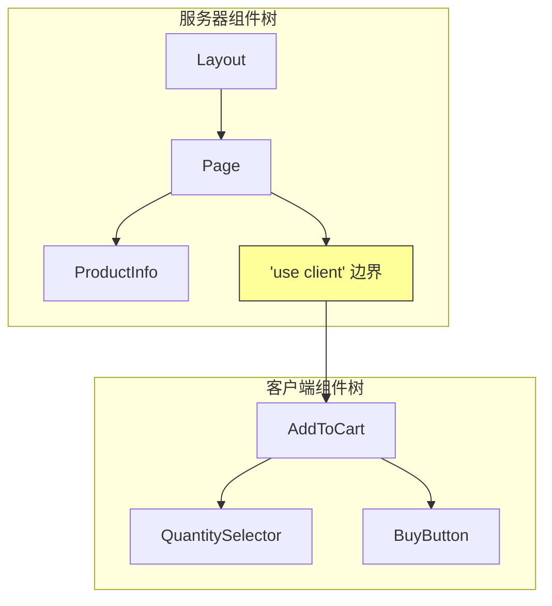

# 2.3.2 客户端边界与数据流

## 一句话破题

`'use client'` 不只是"让组件能用 useState"那么简单——它划定了一条边界，决定了哪些代码发送到浏览器，直接影响应用的性能和包体积。

## 边界的本质



### 关键规则

| 规则 | 说明 |
|------|------|
| 默认是服务器组件 | 不加 `'use client'` 就是 Server Component |
| 边界向下传染 | 客户端组件的子组件也是客户端组件 |
| 不能逆向导入 | 客户端组件不能 import 服务器组件 |
| Props 必须可序列化 | 跨边界传递的 props 要能 JSON 序列化 |

## 正确划分边界

### ❌ 错误：整个页面都是客户端组件

```typescript
// app/product/page.tsx
'use client'  // ❌ 太早声明！

export default function ProductPage() {
  const [quantity, setQuantity] = useState(1)
  
  return (
    <div>
      <ProductInfo />      {/* 本可以是服务器组件 */}
      <ProductImages />    {/* 本可以是服务器组件 */}
      <AddToCart quantity={quantity} setQuantity={setQuantity} />
    </div>
  )
}
```

### ✅ 正确：最小化客户端边界

```typescript
// app/product/page.tsx
// 没有 'use client'，是服务器组件
export default async function ProductPage({ params }) {
  const product = await getProduct(params.id)
  
  return (
    <div>
      <ProductInfo product={product} />    {/* 服务器组件 */}
      <ProductImages images={product.images} />  {/* 服务器组件 */}
      <AddToCart product={product} />      {/* 客户端组件 */}
    </div>
  )
}
```

```typescript
// components/add-to-cart.tsx
'use client'

export function AddToCart({ product }) {
  const [quantity, setQuantity] = useState(1)
  
  return (
    <div>
      <QuantitySelector value={quantity} onChange={setQuantity} />
      <BuyButton product={product} quantity={quantity} />
    </div>
  )
}
```

## Children 模式：突破边界限制

```typescript
// ❌ 客户端组件不能直接导入服务器组件
'use client'
import { ServerComponent } from './server-component'  // 错误！

// ✅ 通过 children 传递
// layout.tsx (服务器组件)
export default function Layout({ children }) {
  return (
    <ClientProvider>  {/* 客户端组件 */}
      {children}       {/* 可以是服务器组件 */}
    </ClientProvider>
  )
}
```

```typescript
// client-provider.tsx
'use client'

export function ClientProvider({ children }) {
  const [theme, setTheme] = useState('light')
  
  return (
    <ThemeContext.Provider value={{ theme, setTheme }}>
      {children}  {/* 服务器组件作为 children 传入 */}
    </ThemeContext.Provider>
  )
}
```

## Props 序列化问题

```typescript
// ❌ 函数不能跨边界传递
<ClientComponent onSubmit={async (data) => { ... }} />  // 错误！

// ✅ 使用 Server Actions
<ClientComponent action={submitAction} />  // Server Action 可以！
```

```typescript
// ❌ 复杂对象可能有问题
<ClientComponent data={new Map()} />  // Map 不能序列化

// ✅ 使用可序列化的数据
<ClientComponent data={Object.fromEntries(map)} />
```

## 性能对比

| 方案 | JS Bundle 大小 | 首屏速度 |
|------|---------------|----------|
| 全客户端 | 大（包含所有组件） | 慢 |
| 最小边界 | 小（只有交互组件） | 快 |

## 觉知：常见错误

### 1. 不必要的 `'use client'`

```typescript
// ❌ 纯展示组件不需要 'use client'
'use client'
export function ProductCard({ product }) {
  return <div>{product.name}</div>
}

// ✅ 移除 'use client'
export function ProductCard({ product }) {
  return <div>{product.name}</div>
}
```

### 2. 误解 "客户端组件也在服务器运行"

```typescript
'use client'
// 这个组件会在服务器预渲染，然后在客户端 hydrate
export function Counter() {
  console.log('这行在服务器和客户端都会执行')
  const [count, setCount] = useState(0)
  return <button onClick={() => setCount(c => c + 1)}>{count}</button>
}
```

## 本节小结

| 原则 | 说明 |
|------|------|
| 默认服务器 | 能用服务器组件就用服务器组件 |
| 最小边界 | `'use client'` 放在最需要的地方 |
| Children 模式 | 让服务器组件穿过客户端边界 |
| Props 序列化 | 跨边界数据必须可序列化 |
