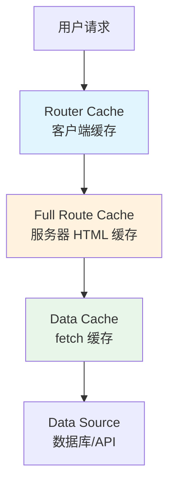

# 2.3.4 缓存策略详解

## 一句话破题

Next.js 有多层缓存机制，理解它们的工作方式和配置选项，是避免"数据不更新"这类玄学问题的关键。

## 缓存层级



| 缓存层 | 位置 | 作用 | 持续时间 |
|--------|------|------|----------|
| Router Cache | 客户端 | 缓存已访问页面 | 会话期间 |
| Full Route Cache | 服务器 | 缓存完整 HTML | 持久（除非重验证） |
| Data Cache | 服务器 | 缓存 fetch 响应 | 持久（除非重验证） |

## fetch 缓存控制

### 永久缓存（默认）

```typescript
// 默认行为：永久缓存
const data = await fetch('https://api.example.com/data')

// 等同于
const data = await fetch('https://api.example.com/data', {
  cache: 'force-cache'
})
```

### 不缓存（每次请求）

```typescript
const data = await fetch('https://api.example.com/data', {
  cache: 'no-store'
})
```

### 定时重验证（ISR）

```typescript
const data = await fetch('https://api.example.com/data', {
  next: { revalidate: 60 }  // 60 秒后重验证
})
```

### 标签重验证

```typescript
// 打标签
const data = await fetch('https://api.example.com/posts', {
  next: { tags: ['posts'] }
})

// 按标签重验证
import { revalidateTag } from 'next/cache'
revalidateTag('posts')
```

## 页面级缓存控制

```typescript
// app/posts/page.tsx

// 强制动态渲染（不缓存）
export const dynamic = 'force-dynamic'

// 强制静态渲染
export const dynamic = 'force-static'

// 设置 revalidate 时间
export const revalidate = 60

// 让 Next.js 自动判断（默认）
export const dynamic = 'auto'
```

## 重验证方式

### 基于时间

```typescript
// 每 60 秒重新生成
export const revalidate = 60
```

### 按需重验证

```typescript
// app/api/revalidate/route.ts
import { revalidatePath, revalidateTag } from 'next/cache'

export async function POST(request) {
  const { path, tag } = await request.json()
  
  if (path) {
    revalidatePath(path)  // 重验证路径
  }
  
  if (tag) {
    revalidateTag(tag)    // 重验证标签
  }
  
  return Response.json({ revalidated: true })
}
```

### Server Action 中重验证

```typescript
'use server'

import { revalidatePath } from 'next/cache'

export async function createPost(formData) {
  await db.post.create({ ... })
  
  revalidatePath('/posts')  // 创建后刷新列表
}
```

## 常见场景配置

| 场景 | 配置 |
|------|------|
| 博客文章 | `revalidate: 3600` |
| 商品价格 | `revalidate: 60` |
| 用户数据 | `cache: 'no-store'` |
| 静态内容 | 默认（永久缓存） |

## 觉知：常见问题

### 1. 数据不更新

```typescript
// ❌ 默认缓存，数据不会更新
const posts = await fetch('/api/posts')

// ✅ 方案 1：禁用缓存
const posts = await fetch('/api/posts', { cache: 'no-store' })

// ✅ 方案 2：定时重验证
const posts = await fetch('/api/posts', { next: { revalidate: 60 } })
```

### 2. 开发环境和生产环境行为不同

```typescript
// 开发环境默认禁用缓存！
// 生产环境需要显式配置
```

### 3. Router Cache 问题

```typescript
// 客户端 Router Cache 可能导致看到旧数据
// 解决方案：在 Server Action 后调用 revalidatePath
'use server'
export async function updatePost(id, data) {
  await db.post.update({ where: { id }, data })
  revalidatePath(`/posts/${id}`)
}
```

## 调试缓存

```typescript
// 在 fetch 后打印缓存状态
const res = await fetch(url)
console.log('Cache:', res.headers.get('x-nextjs-cache'))
// HIT = 缓存命中
// MISS = 缓存未命中
// STALE = 缓存过期，正在重验证
```

## 本节小结

| 缓存类型 | 控制方式 | 重验证方式 |
|----------|----------|------------|
| fetch 缓存 | `cache` / `next.revalidate` | `revalidateTag` |
| 页面缓存 | `dynamic` / `revalidate` | `revalidatePath` |
| Router 缓存 | 自动管理 | Server Action 后自动刷新 |
