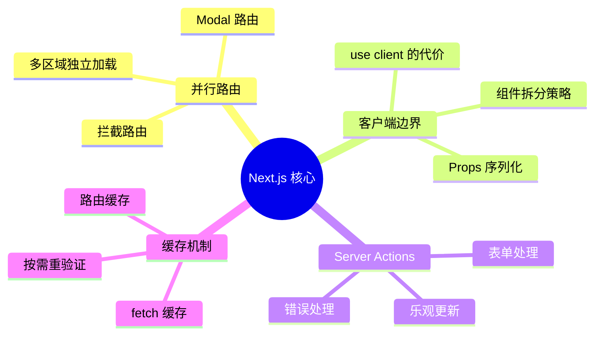
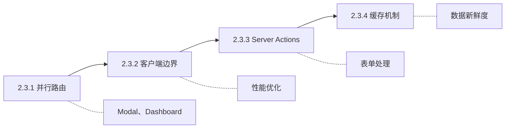

# 2.3 Next.js 核心概念深入

## 认知重构

Next.js 13+ 带来了革命性的 App Router，但很多开发者只是"会用"，却不"用对"。本章将深入探讨如何正确使用这些新特性，发挥它们的真正威力。

## 本章知识图谱

## 核心概念速查

| 特性 | 作用 | 典型场景 |
|------|------|----------|
| 并行路由 | 同一页面多个独立区域 | Dashboard、Modal |
| 拦截路由 | 软导航显示不同内容 | 图片预览、分享链接 |
| Client Boundary | 标记客户端组件边界 | 交互组件 |
| Server Actions | 服务器端函数调用 | 表单提交、数据变更 |
| fetch 缓存 | 请求级别缓存 | 数据获取优化 |
| revalidate | 增量更新缓存 | ISR、按需刷新 |

## 学习路径

## 本章导航

- **2.3.1 并行路由**：让弹窗也能有自己的 URL
- **2.3.2 客户端边界**：`'use client'` 的正确使用方式
- **2.3.3 Server Actions**：表单处理的最佳实践
- **2.3.4 缓存机制**：让数据既快又新
