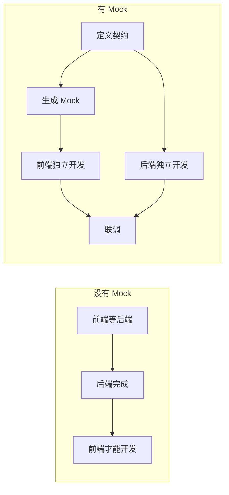

# 2.4.2 假数据也能开发——Mock 数据

## 一句话破题

Mock 数据让前端不需要等待后端接口就能开发——基于契约生成假数据，前端页面可以完整跑通，联调时只需切换数据源。

## 为什么需要 Mock



## Mock 方案选择

| 方案 | 优点 | 缺点 | 适用场景 |
|------|------|------|----------|
| 静态 JSON 文件 | 简单 | 不灵活 | 简单场景 |
| MSW | 拦截真实请求 | 需要配置 | 复杂项目 |
| Next.js API Routes | 与真实代码一致 | 需要写代码 | 全栈项目 |

## 方案一：静态 Mock 文件

### 目录结构

```
src/
├── mocks/
│   ├── users.json
│   └── posts.json
└── services/
    └── user.ts
```

### 简单实现

```typescript
// mocks/users.json
{
  "users": [
    {
      "id": "1",
      "name": "张三",
      "email": "zhangsan@example.com",
      "avatar": null,
      "createdAt": "2024-01-01T00:00:00Z"
    },
    {
      "id": "2",
      "name": "李四",
      "email": "lisi@example.com",
      "avatar": "https://example.com/avatar.jpg",
      "createdAt": "2024-01-02T00:00:00Z"
    }
  ],
  "total": 2
}
```

```typescript
// services/user.ts
import type { UsersListResponse } from '@/types/user'
import mockData from '@/mocks/users.json'

const USE_MOCK = process.env.NEXT_PUBLIC_USE_MOCK === 'true'

export async function getUsers(): Promise<UsersListResponse> {
  if (USE_MOCK) {
    // 模拟网络延迟
    await new Promise(resolve => setTimeout(resolve, 500))
    return {
      code: 200,
      message: '获取成功',
      data: mockData
    }
  }
  
  const res = await fetch('/api/users')
  return res.json()
}
```

## 方案二：使用 Faker.js 生成动态数据

### 安装

```bash
pnpm add -D @faker-js/faker
```

### 创建 Mock 工厂

```typescript
// mocks/factories/user.ts
import { faker } from '@faker-js/faker/locale/zh_CN'
import type { User } from '@/types/user'

export function createMockUser(overrides?: Partial<User>): User {
  return {
    id: faker.string.uuid(),
    name: faker.person.fullName(),
    email: faker.internet.email(),
    avatar: faker.image.avatar(),
    role: faker.helpers.arrayElement(['admin', 'user']),
    createdAt: faker.date.past().toISOString(),
    updatedAt: faker.date.recent().toISOString(),
    ...overrides,
  }
}

export function createMockUsers(count: number): User[] {
  return Array.from({ length: count }, () => createMockUser())
}
```

### 使用工厂

```typescript
// services/user.ts
import { createMockUsers } from '@/mocks/factories/user'
import type { UsersListResponse } from '@/types/user'

const USE_MOCK = process.env.NEXT_PUBLIC_USE_MOCK === 'true'

export async function getUsers(params?: { 
  page?: number 
  pageSize?: number 
}): Promise<UsersListResponse> {
  if (USE_MOCK) {
    await new Promise(resolve => setTimeout(resolve, 300))
    
    const page = params?.page ?? 1
    const pageSize = params?.pageSize ?? 10
    const total = 100
    
    return {
      code: 200,
      message: '获取成功',
      data: {
        users: createMockUsers(pageSize),
        total,
        page,
        pageSize,
      }
    }
  }
  
  const searchParams = new URLSearchParams()
  if (params?.page) searchParams.set('page', String(params.page))
  if (params?.pageSize) searchParams.set('pageSize', String(params.pageSize))
  
  const res = await fetch(`/api/users?${searchParams}`)
  return res.json()
}
```

## 方案三：MSW（Mock Service Worker）

MSW 在网络层拦截请求，最接近真实环境。

### 安装

```bash
pnpm add -D msw
```

### 配置 Handler

```typescript
// mocks/handlers.ts
import { http, HttpResponse } from 'msw'
import { createMockUser, createMockUsers } from './factories/user'

export const handlers = [
  // 获取用户列表
  http.get('/api/users', ({ request }) => {
    const url = new URL(request.url)
    const page = Number(url.searchParams.get('page')) || 1
    const pageSize = Number(url.searchParams.get('pageSize')) || 10
    
    return HttpResponse.json({
      code: 200,
      message: '获取成功',
      data: {
        users: createMockUsers(pageSize),
        total: 100,
        page,
        pageSize,
      }
    })
  }),
  
  // 创建用户
  http.post('/api/users', async ({ request }) => {
    const body = await request.json()
    
    return HttpResponse.json({
      code: 200,
      message: '创建成功',
      data: createMockUser(body as any),
    })
  }),
  
  // 获取单个用户
  http.get('/api/users/:id', ({ params }) => {
    return HttpResponse.json({
      code: 200,
      message: '获取成功',
      data: createMockUser({ id: params.id as string }),
    })
  }),
  
  // 模拟错误场景
  http.delete('/api/users/:id', ({ params }) => {
    if (params.id === 'error') {
      return HttpResponse.json(
        { code: 403, message: '无权限删除' },
        { status: 403 }
      )
    }
    
    return HttpResponse.json({
      code: 200,
      message: '删除成功',
    })
  }),
]
```

### 在开发环境启用

```typescript
// mocks/browser.ts
import { setupWorker } from 'msw/browser'
import { handlers } from './handlers'

export const worker = setupWorker(...handlers)
```

```typescript
// app/providers.tsx
'use client'

import { useEffect } from 'react'

export function Providers({ children }: { children: React.ReactNode }) {
  useEffect(() => {
    if (process.env.NODE_ENV === 'development') {
      import('@/mocks/browser').then(({ worker }) => {
        worker.start({ onUnhandledRequest: 'bypass' })
      })
    }
  }, [])
  
  return <>{children}</>
}
```

## 场景化 Mock

### 模拟不同状态

```typescript
// mocks/scenarios.ts
import { http, HttpResponse } from 'msw'

// 空列表场景
export const emptyListScenario = [
  http.get('/api/users', () => {
    return HttpResponse.json({
      code: 200,
      data: { users: [], total: 0, page: 1, pageSize: 10 }
    })
  }),
]

// 加载失败场景
export const errorScenario = [
  http.get('/api/users', () => {
    return HttpResponse.json(
      { code: 500, message: '服务器错误' },
      { status: 500 }
    )
  }),
]

// 慢网络场景
export const slowNetworkScenario = [
  http.get('/api/users', async () => {
    await new Promise(resolve => setTimeout(resolve, 3000))
    return HttpResponse.json({ code: 200, data: { users: [] } })
  }),
]
```

### 动态切换场景

```typescript
// 在开发时可以通过 URL 参数切换
// ?mock=empty 使用空列表
// ?mock=error 使用错误场景
```

## 环境配置

```bash
# .env.development
NEXT_PUBLIC_USE_MOCK=true

# .env.production
NEXT_PUBLIC_USE_MOCK=false
```

## 觉知：Mock 的常见问题

### 1. Mock 数据与真实数据格式不一致

```typescript
// ❌ Mock 返回的字段和真实 API 不同
{
  "userName": "张三"  // API 返回的是 "name"
}

// ✅ 严格按照契约类型生成 Mock
function createMockUser(): User {  // 类型约束
  return {
    name: faker.person.fullName(),  // 和类型定义一致
    // ...
  }
}
```

### 2. 忘记模拟边界情况

```typescript
// ✅ 记得模拟各种边界情况
const edgeCases = {
  emptyString: createMockUser({ name: '' }),
  longName: createMockUser({ name: '这是一个非常非常长的用户名'.repeat(10) }),
  specialChars: createMockUser({ name: '<script>alert(1)</script>' }),
  nullAvatar: createMockUser({ avatar: null }),
}
```

### 3. Mock 延迟与真实网络差异

```typescript
// 模拟真实网络延迟
const delay = (min: number, max: number) => 
  new Promise(resolve => 
    setTimeout(resolve, Math.random() * (max - min) + min)
  )

// 使用
await delay(200, 800)  // 200-800ms 随机延迟
```

## 本节小结

| Mock 方案 | 使用场景 |
|-----------|----------|
| 静态 JSON | 快速原型、简单页面 |
| Faker 工厂 | 需要大量随机数据 |
| MSW | 复杂交互、接近真实环境 |

**核心原则**：Mock 数据必须严格遵循契约类型，否则联调时会出问题。
