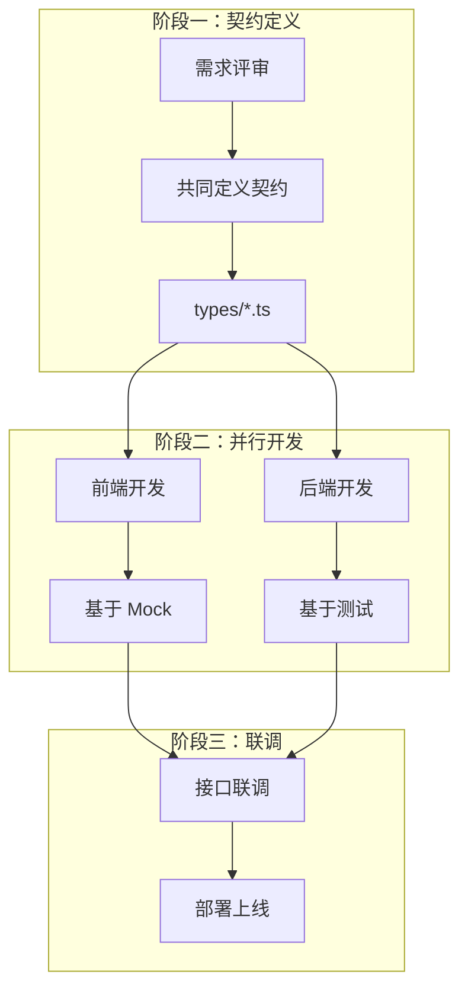
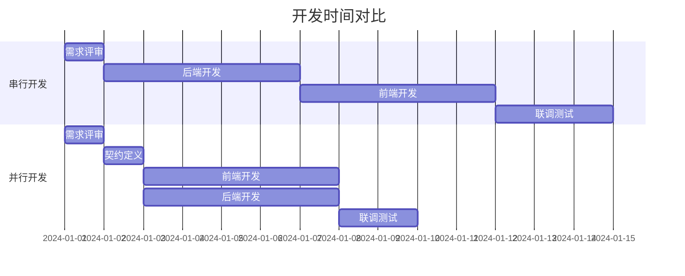
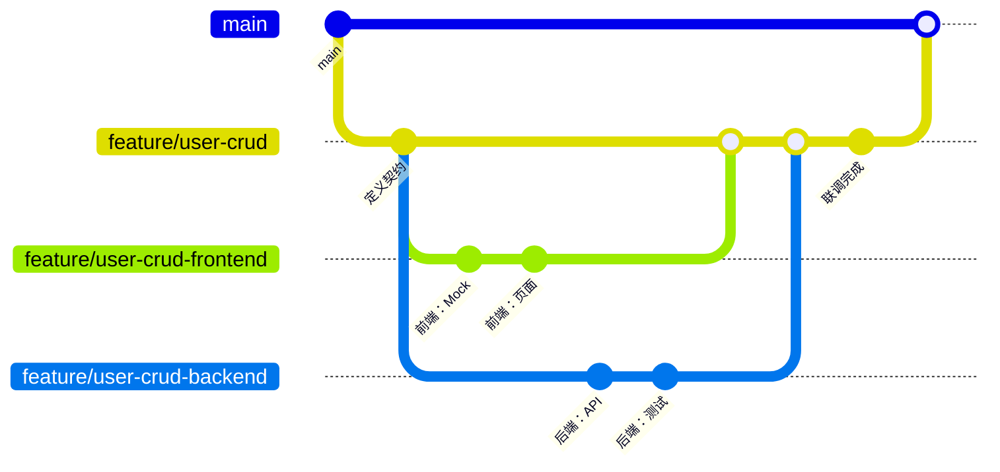
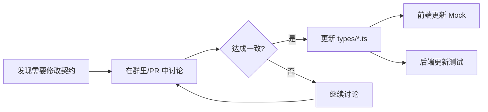

# 2.4.3 你写你的，我写我的——并行开发

## 一句话破题

并行开发的核心是：**前后端基于同一份契约独立工作，彼此不阻塞**。前端用 Mock 跑通页面，后端用测试验证逻辑，联调时只需对接真实接口。

## 并行开发流程



## 时间线对比



**串行开发**：1 + 5 + 5 + 3 = **14 天**  
**并行开发**：1 + 1 + 5 + 2 = **9 天**（节省 36%）

## 前端并行开发实践

### 基于契约生成 Mock

```typescript
// 1. 定义契约（types/post.ts）
export interface Post {
  id: string
  title: string
  content: string
  author: { id: string; name: string }
  createdAt: string
}

export interface CreatePostRequest {
  title: string
  content: string
}

// 2. 创建 Mock 工厂（mocks/factories/post.ts）
import { faker } from '@faker-js/faker/locale/zh_CN'
import type { Post } from '@/types/post'

export function createMockPost(overrides?: Partial<Post>): Post {
  return {
    id: faker.string.uuid(),
    title: faker.lorem.sentence(),
    content: faker.lorem.paragraphs(3),
    author: {
      id: faker.string.uuid(),
      name: faker.person.fullName(),
    },
    createdAt: faker.date.recent().toISOString(),
    ...overrides,
  }
}

// 3. 前端直接使用（components/post-list.tsx）
'use client'
import { createMockPost } from '@/mocks/factories/post'

export function PostList() {
  // 开发阶段使用 Mock 数据
  const posts = Array.from({ length: 10 }, () => createMockPost())
  
  return (
    <ul>
      {posts.map(post => (
        <li key={post.id}>{post.title}</li>
      ))}
    </ul>
  )
}
```

### 前端开发清单

- [ ] 基于契约创建 TypeScript 类型
- [ ] 创建 Mock 数据工厂
- [ ] 开发页面组件
- [ ] 处理加载状态
- [ ] 处理错误状态
- [ ] 处理空状态
- [ ] 表单验证
- [ ] 响应式适配

## 后端并行开发实践

### 基于契约编写测试

```typescript
// app/api/posts/route.test.ts
import { POST, GET } from './route'
import { createMockPost } from '@/mocks/factories/post'

describe('POST /api/posts', () => {
  it('应该创建文章并返回正确格式', async () => {
    const request = new Request('http://localhost/api/posts', {
      method: 'POST',
      body: JSON.stringify({
        title: '测试标题',
        content: '测试内容',
      }),
    })
    
    const response = await POST(request)
    const data = await response.json()
    
    // 验证响应格式符合契约
    expect(data.code).toBe(200)
    expect(data.data).toHaveProperty('id')
    expect(data.data).toHaveProperty('title', '测试标题')
    expect(data.data).toHaveProperty('content', '测试内容')
    expect(data.data).toHaveProperty('author')
    expect(data.data).toHaveProperty('createdAt')
  })
  
  it('标题为空时应返回 400', async () => {
    const request = new Request('http://localhost/api/posts', {
      method: 'POST',
      body: JSON.stringify({
        title: '',
        content: '测试内容',
      }),
    })
    
    const response = await POST(request)
    const data = await response.json()
    
    expect(response.status).toBe(400)
    expect(data.code).toBe(400)
  })
})
```

### 后端开发清单

- [ ] 基于契约定义响应类型
- [ ] 编写 API 路由处理
- [ ] 实现数据验证（Zod）
- [ ] 实现业务逻辑
- [ ] 编写单元测试
- [ ] 处理错误情况
- [ ] 实现权限控制

## 协作规范

### Git 分支策略



### 契约变更流程



### 沟通模板

```markdown
## 契约变更通知

**接口**：POST /api/posts
**变更内容**：新增 tags 字段
**原因**：产品需求新增标签功能
**影响范围**：文章创建、文章列表

### 变更前
\`\`\`typescript
interface CreatePostRequest {
  title: string
  content: string
}
\`\`\`

### 变更后
\`\`\`typescript
interface CreatePostRequest {
  title: string
  content: string
  tags?: string[]  // 新增
}
\`\`\`

**前端同学**：请更新 Mock 和表单
**后端同学**：请更新验证和存储逻辑

cc: @前端 @后端
```

## 常见问题与解决

### 1. 契约理解不一致

```typescript
// ❌ 前端以为是数组
interface Response {
  users: User[]
}

// ❌ 后端以为是对象
interface Response {
  users: { list: User[], total: number }
}

// ✅ 统一写在 types 文件中，双方共用
// types/user.ts
export interface UsersResponse {
  code: number
  data: {
    users: User[]
    total: number
  }
}
```

### 2. 字段命名不一致

```typescript
// ✅ 命名规范
// - 使用 camelCase
// - 时间字段统一用 xxxAt（createdAt, updatedAt）
// - ID 字段统一用 xxxId（userId, postId）
// - 布尔值用 isXxx / hasXxx（isActive, hasPermission）
```

### 3. 进度不同步

```markdown
## 每日站会同步模板

**前端进度**：
- 完成：用户列表页面
- 进行中：用户编辑表单
- 阻塞：无

**后端进度**：
- 完成：用户 CRUD API
- 进行中：权限校验
- 阻塞：等待确认权限规则

**需要协调**：
- 用户删除接口的返回格式需确认
```

## 本节小结

| 阶段 | 前端工作 | 后端工作 |
|------|----------|----------|
| 契约定义 | 参与讨论、确认格式 | 参与讨论、确认格式 |
| 并行开发 | Mock 数据 + 页面开发 | API 实现 + 单元测试 |
| 联调测试 | 切换真实 API | 提供测试环境 |

**核心原则**：契约是前后端的唯一共识，一切以契约为准。
