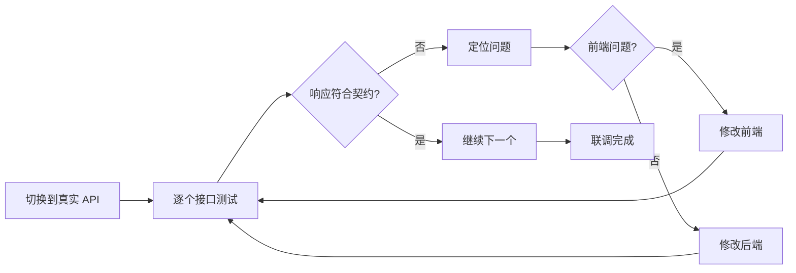

# 2.4.4 为什么接口对不上——联调测试

## 一句话破题

联调是验证契约的最后一关——前端的 Mock 和后端的实现必须都严格遵循契约，否则这一阶段就会暴露所有的"我以为"问题。

## 联调流程



## 联调前的准备

### 1. 环境配置

```bash
# .env.development
NEXT_PUBLIC_API_BASE_URL=http://localhost:3000/api

# .env.staging
NEXT_PUBLIC_API_BASE_URL=https://staging-api.example.com

# .env.production  
NEXT_PUBLIC_API_BASE_URL=https://api.example.com
```

### 2. 切换 Mock 到真实 API

```typescript
// services/user.ts
const USE_MOCK = process.env.NEXT_PUBLIC_USE_MOCK === 'true'

export async function getUsers(): Promise<UsersListResponse> {
  if (USE_MOCK) {
    return getMockUsers()  // 开发时用 Mock
  }
  
  // 联调时用真实 API
  const res = await fetch(`${process.env.NEXT_PUBLIC_API_BASE_URL}/users`)
  return res.json()
}
```

### 3. 联调清单

```markdown
## 用户模块联调清单

### GET /api/users
- [ ] 正常返回用户列表
- [ ] 分页参数生效
- [ ] 搜索参数生效
- [ ] 空列表处理
- [ ] 权限校验

### POST /api/users
- [ ] 正常创建用户
- [ ] 字段验证错误返回
- [ ] 邮箱重复检测
- [ ] 创建成功后刷新列表

### PUT /api/users/:id
- [ ] 正常更新用户
- [ ] 不存在的用户返回 404
- [ ] 权限校验

### DELETE /api/users/:id
- [ ] 正常删除用户
- [ ] 不存在的用户返回 404
- [ ] 删除后列表刷新
```

## 常见问题排查

### 1. 字段名不一致

```typescript
// 契约定义
interface User {
  createdAt: string
}

// 后端返回
{
  "created_at": "2024-01-01"  // snake_case vs camelCase
}

// 排查方法：在 Network 面板查看实际响应
```

**解决方案**：

```typescript
// 方案 1：后端改为 camelCase（推荐）
// 方案 2：前端做字段映射
function transformUser(data: any): User {
  return {
    ...data,
    createdAt: data.created_at,
  }
}
```

### 2. 数据类型不匹配

```typescript
// 契约定义
interface User {
  id: string  // 前端期望字符串
}

// 后端返回
{
  "id": 123  // 实际是数字
}

// 可能导致问题
users.find(u => u.id === "123")  // 永远找不到
```

**解决方案**：

```typescript
// 方案 1：后端统一返回字符串
// 方案 2：前端做类型转换
function transformUser(data: any): User {
  return {
    ...data,
    id: String(data.id),
  }
}
```

### 3. 响应格式不一致

```typescript
// 契约定义
interface ApiResponse<T> {
  code: number
  message: string
  data: T
}

// 后端返回（错误情况）
{
  "error": "Not found"  // 缺少 code 字段
}

// 前端处理时崩溃
if (response.code === 200) { ... }  // code undefined
```

**解决方案**：

```typescript
// 统一的响应处理函数
async function fetchApi<T>(url: string): Promise<ApiResponse<T>> {
  const res = await fetch(url)
  const data = await res.json()
  
  // 标准化响应格式
  if (!data.code) {
    return {
      code: res.status,
      message: data.error || data.message || '未知错误',
      data: null as T,
    }
  }
  
  return data
}
```

### 4. 跨域问题（CORS）

```
Access to fetch at 'https://api.example.com' from origin 
'http://localhost:3000' has been blocked by CORS policy
```

**解决方案**：

```typescript
// next.config.js - 开发环境代理
module.exports = {
  async rewrites() {
    return [
      {
        source: '/api/:path*',
        destination: 'https://api.example.com/:path*',
      },
    ]
  },
}

// 或者后端配置 CORS headers
// Access-Control-Allow-Origin: *
```

### 5. 时间格式不一致

```typescript
// 契约定义
createdAt: string  // 期望 ISO 格式

// 后端返回各种格式
"2024-01-01"           // 缺少时间
"2024/01/01 12:00:00"  // 非 ISO 格式
1704067200             // Unix 时间戳
```

**解决方案**：

```typescript
// 统一使用 dayjs 处理
import dayjs from 'dayjs'

function formatDate(date: string | number): string {
  return dayjs(date).format('YYYY-MM-DD HH:mm:ss')
}
```

## 调试工具

### 1. 浏览器 Network 面板

```
查看位置：F12 → Network → Fetch/XHR

关键信息：
- Request URL：请求地址是否正确
- Request Method：GET/POST 是否正确
- Request Headers：Content-Type 是否正确
- Request Payload：请求体格式
- Response：实际返回数据
- Status Code：200/400/500
```

### 2. 使用 console.log 对比

```typescript
export async function getUsers() {
  const res = await fetch('/api/users')
  const data = await res.json()
  
  // 对比契约和实际数据
  console.log('契约要求:', '{ code, message, data: { users, total } }')
  console.log('实际返回:', JSON.stringify(data, null, 2))
  
  return data
}
```

### 3. Postman / Thunder Client

```
1. 导入 API 契约
2. 独立测试每个接口
3. 验证响应格式
4. 保存测试用例
```

## 联调问题追踪模板

```markdown
## 问题：用户列表接口返回格式不对

**接口**：GET /api/users

**契约要求**：
\`\`\`json
{
  "code": 200,
  "data": {
    "users": [...],
    "total": 100
  }
}
\`\`\`

**实际返回**：
\`\`\`json
{
  "code": 200,
  "data": [...]  // 直接是数组，缺少 total
}
\`\`\`

**影响**：分页组件无法显示总数

**解决方案**：后端修改返回格式

**责任人**：@后端同学

**状态**：待修复
```

## 联调自动化

### 契约测试

```typescript
// tests/contract.test.ts
import { z } from 'zod'

const UserSchema = z.object({
  id: z.string(),
  name: z.string(),
  email: z.string().email(),
  createdAt: z.string().datetime(),
})

const UsersResponseSchema = z.object({
  code: z.number(),
  message: z.string(),
  data: z.object({
    users: z.array(UserSchema),
    total: z.number(),
  }),
})

describe('API 契约测试', () => {
  it('GET /api/users 应该符合契约', async () => {
    const res = await fetch(`${API_BASE}/users`)
    const data = await res.json()
    
    // 验证响应格式
    const result = UsersResponseSchema.safeParse(data)
    
    if (!result.success) {
      console.log('契约验证失败:', result.error.format())
    }
    
    expect(result.success).toBe(true)
  })
})
```

## 本节小结

| 阶段 | 工作内容 |
|------|----------|
| 联调前 | 准备环境变量、编写联调清单 |
| 联调中 | 逐个接口验证、记录问题 |
| 联调后 | 更新契约（如有变更）、补充测试 |

**核心原则**：联调问题 80% 源于契约理解不一致，先查契约再查代码。
