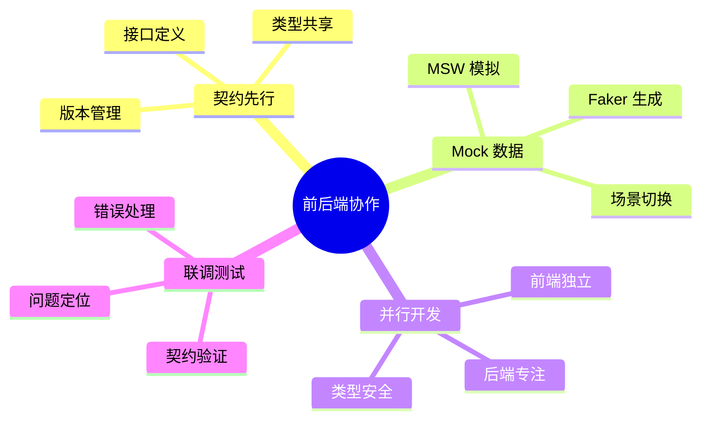
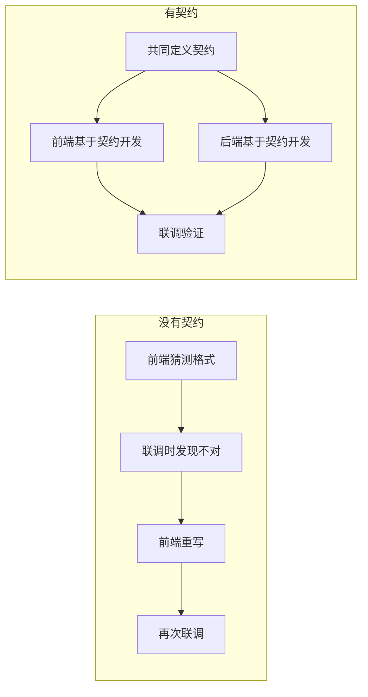
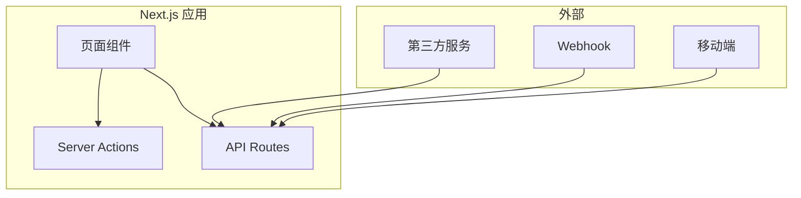

# 2.4 前后端如何高效协作——接口契约

## 认知重构

在传统开发模式中，前端等后端、后端等需求，彼此阻塞是常态。而在 Vibe Coding 时代，**契约先行**的理念让前后端可以并行开发，AI 也能基于契约生成更准确的代码。

```
传统模式：需求 → 后端开发 → 前端对接 → 联调（串行）
契约先行：需求 → 定义契约 → 前后端并行开发 → 联调（并行）
```

## 本章知识图谱



## 核心概念速览

| 概念 | 作用 | 工具 |
|------|------|------|
| **API 契约** | 定义请求/响应格式 | TypeScript 类型、Zod Schema |
| **Mock 数据** | 模拟后端响应 | MSW、Faker.js |
| **并行开发** | 前后端同时进行 | 共享类型定义 |
| **联调测试** | 验证契约一致性 | Postman、测试用例 |

## 为什么需要 API 契约？



### 契约的三大价值

1. **消除沟通歧义**：接口格式白纸黑字，没有"我以为"
2. **支持并行开发**：前端用 Mock，后端用测试，互不阻塞
3. **AI 协作更精准**：AI 基于类型定义生成代码，准确率大幅提升

## API Route 在 Next.js 中的位置



| 场景 | 推荐方案 |
|------|----------|
| 内部数据变更 | Server Actions |
| 对外暴露接口 | API Routes |
| 第三方回调 | API Routes |
| 移动端调用 | API Routes |

## 本章导航

- **2.4.1 契约先行**：先定义接口，再写代码
- **2.4.2 Mock 数据**：让前端不依赖后端
- **2.4.3 并行开发**：前后端同时进行
- **2.4.4 联调测试**：确保契约一致性
