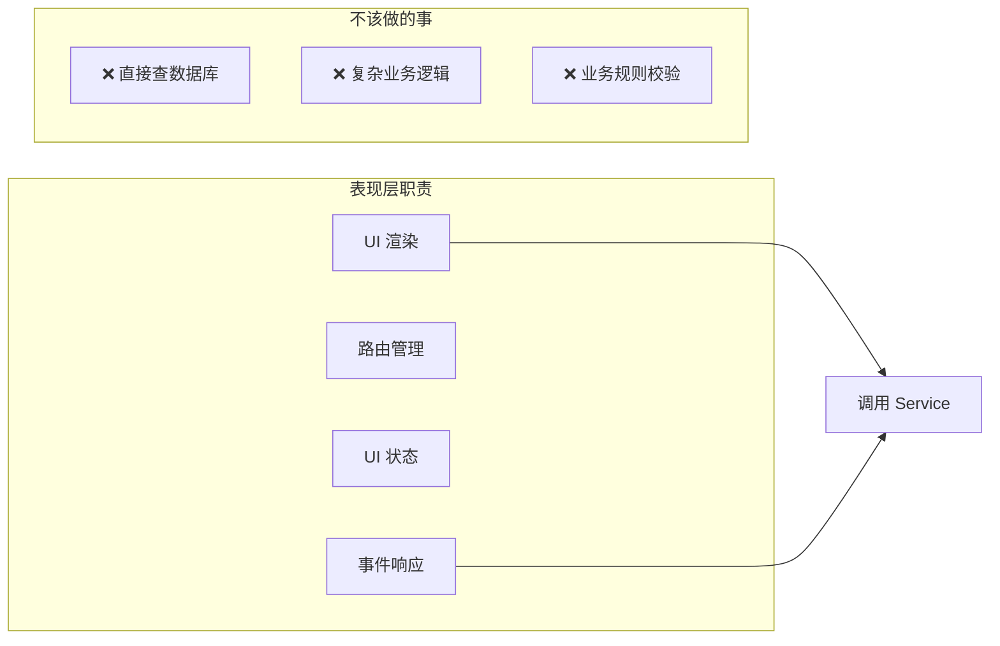
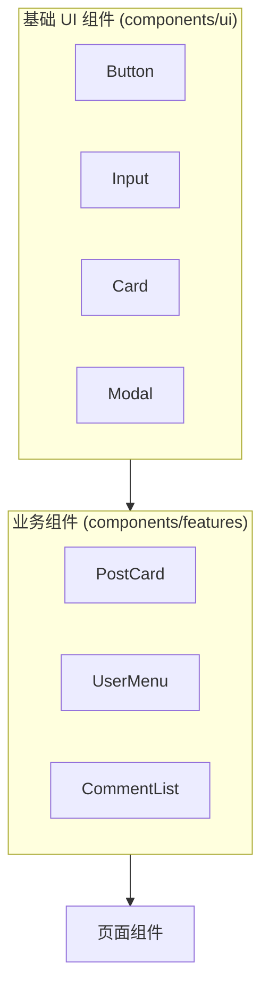

# 2.5.1 用户能看见的层——表现层

## 一句话破题

表现层是用户直接接触的界面——它只负责"呈现什么"和"如何交互"，不关心数据从哪来、业务规则是什么。

## 表现层的职责边界



| 应该做 | 不应该做 |
|--------|----------|
| 渲染 UI 组件 | 直接写 SQL/Prisma 查询 |
| 处理用户交互 | 实现复杂业务逻辑 |
| 管理 UI 状态（展开/折叠） | 处理跨实体的业务规则 |
| 调用 Service 层方法 | 直接操作多个数据表 |

## Next.js 中的表现层文件

### 约定文件职责

| 文件 | 职责 | 示例 |
|------|------|------|
| `page.tsx` | 页面入口，组装组件 | 文章列表页 |
| `layout.tsx` | 共享布局，导航/侧边栏 | Dashboard 布局 |
| `loading.tsx` | 加载状态 UI | 骨架屏 |
| `error.tsx` | 错误边界 UI | 错误提示 + 重试 |
| `not-found.tsx` | 404 页面 | 自定义 404 |

### 目录组织

```
app/
├── (marketing)/              # 营销页面组
│   ├── layout.tsx            # 营销页共享布局
│   ├── page.tsx              # 首页
│   └── about/
│       └── page.tsx
│
├── (dashboard)/              # 后台页面组
│   ├── layout.tsx            # 后台共享布局（含侧边栏）
│   ├── dashboard/
│   │   └── page.tsx          # 仪表盘首页
│   └── posts/
│       ├── page.tsx          # 文章列表
│       ├── [id]/
│       │   └── page.tsx      # 文章详情
│       └── new/
│           └── page.tsx      # 新建文章
│
└── components/               # 组件库
    ├── ui/                   # 基础 UI 组件
    │   ├── button.tsx
    │   └── input.tsx
    └── features/             # 业务组件
        ├── post-card.tsx
        └── user-avatar.tsx
```

## 页面组件的正确写法

### ✅ 好的实践：职责单一

```typescript
// app/(dashboard)/posts/page.tsx
import { postService } from '@/services/post.service'
import { PostList } from '@/components/features/post-list'
import { CreatePostButton } from '@/components/features/create-post-button'

export default async function PostsPage() {
  // 只做一件事：获取数据并传给组件
  const posts = await postService.getMyPosts()
  
  return (
    <div className="space-y-6">
      <div className="flex justify-between items-center">
        <h1 className="text-2xl font-bold">我的文章</h1>
        <CreatePostButton />
      </div>
      <PostList posts={posts} />
    </div>
  )
}
```

### ❌ 坏的实践：职责混杂

```typescript
// ❌ 不要这样写
export default async function PostsPage() {
  const session = await getServerSession()
  
  // ❌ 业务逻辑不应该在页面里
  if (!session) {
    redirect('/login')
  }
  
  // ❌ 数据库操作不应该在页面里
  const posts = await prisma.post.findMany({
    where: { authorId: session.user.id },
    include: { tags: true, author: true },
  })
  
  // ❌ 业务规则不应该在页面里
  const publishedPosts = posts.filter(p => p.status === 'published')
  const canCreateMore = publishedPosts.length < 100
  
  return (
    <div>
      {/* 很长的 JSX，难以维护 */}
    </div>
  )
}
```

## 组件分类策略

### 基础 UI 组件 vs 业务组件



| 类型 | 特点 | 示例 |
|------|------|------|
| **基础 UI** | 无业务逻辑，高度复用 | Button, Input, Card |
| **业务组件** | 包含特定业务展示逻辑 | PostCard, UserAvatar |
| **页面组件** | 组装各类组件，处理数据流 | PostsPage |

### 业务组件示例

```typescript
// components/features/post-card.tsx
import { Card } from '@/components/ui/card'
import { Badge } from '@/components/ui/badge'
import type { Post } from '@/types/post'

interface PostCardProps {
  post: Post
  onEdit?: () => void
  onDelete?: () => void
}

export function PostCard({ post, onEdit, onDelete }: PostCardProps) {
  return (
    <Card className="p-4">
      <div className="flex justify-between">
        <h3 className="font-semibold">{post.title}</h3>
        <Badge variant={post.status === 'published' ? 'success' : 'secondary'}>
          {post.status === 'published' ? '已发布' : '草稿'}
        </Badge>
      </div>
      <p className="text-gray-600 mt-2 line-clamp-2">{post.excerpt}</p>
      <div className="flex gap-2 mt-4">
        {onEdit && <button onClick={onEdit}>编辑</button>}
        {onDelete && <button onClick={onDelete}>删除</button>}
      </div>
    </Card>
  )
}
```

## UI 状态管理

### 局部状态：useState

```typescript
// 展开/折叠、输入框值等 UI 状态
'use client'

export function Accordion({ title, children }) {
  const [isOpen, setIsOpen] = useState(false)
  
  return (
    <div>
      <button onClick={() => setIsOpen(!isOpen)}>{title}</button>
      {isOpen && <div>{children}</div>}
    </div>
  )
}
```

### 跨组件状态：Context

```typescript
// contexts/sidebar-context.tsx
'use client'

const SidebarContext = createContext<{
  isOpen: boolean
  toggle: () => void
} | null>(null)

export function SidebarProvider({ children }) {
  const [isOpen, setIsOpen] = useState(true)
  
  return (
    <SidebarContext.Provider value={{ isOpen, toggle: () => setIsOpen(!isOpen) }}>
      {children}
    </SidebarContext.Provider>
  )
}

export function useSidebar() {
  const context = useContext(SidebarContext)
  if (!context) throw new Error('useSidebar must be used within SidebarProvider')
  return context
}
```

## 觉知：表现层常见问题

### 1. 在 Server Component 中使用 Hooks

```typescript
// ❌ Server Component 不能用 useState
export default function Page() {
  const [count, setCount] = useState(0)  // 报错！
}

// ✅ 把有状态的部分抽成 Client Component
export default function Page() {
  return <Counter />  // Counter 是 'use client'
}
```

### 2. 页面组件过于臃肿

```typescript
// ❌ 一个页面文件 500 行
export default function Page() {
  // 200 行逻辑
  return (
    // 300 行 JSX
  )
}

// ✅ 拆分成多个组件
export default function Page() {
  return (
    <PageLayout>
      <PageHeader />
      <PageContent />
      <PageFooter />
    </PageLayout>
  )
}
```

### 3. 样式和逻辑耦合

```typescript
// ❌ 业务逻辑决定样式
<div className={user.role === 'admin' ? 'bg-red-500' : 'bg-blue-500'}>

// ✅ 抽象成语义化的 props
<UserBadge role={user.role} />

// UserBadge 内部处理样式映射
```

## 本节小结

| 原则 | 说明 |
|------|------|
| **职责单一** | 页面只负责组装组件和获取数据 |
| **组件分层** | 基础 UI → 业务组件 → 页面组件 |
| **状态下沉** | UI 状态放在最小需要的组件中 |
| **逻辑外移** | 业务逻辑交给 Service 层 |
