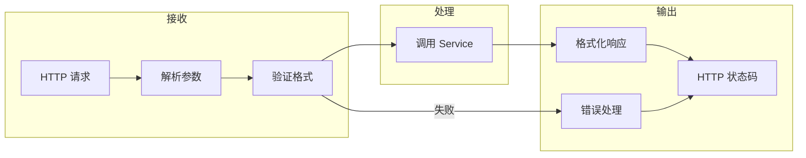

# 2.5.2 前后端沟通的层——接口层

## 一句话破题

接口层是前后端的"翻译官"——它把 HTTP 请求转换成业务层能理解的参数，把业务层的结果转换成标准的 HTTP 响应。

## 接口层的职责边界



| 应该做 | 不应该做 |
|--------|----------|
| 解析请求参数 | 实现业务逻辑 |
| 验证参数格式 | 直接操作数据库 |
| 调用 Service 层 | 处理复杂业务规则 |
| 格式化响应数据 | 跨多个实体的操作 |
| 处理 HTTP 错误 | 发送邮件等副作用 |

## Next.js 中的接口层

### API Routes vs Server Actions

| 特性 | API Routes | Server Actions |
|------|-----------|----------------|
| **触发方式** | HTTP 请求 | 函数调用 |
| **适用场景** | 对外 API、Webhook | 内部数据变更 |
| **文件位置** | `app/api/*/route.ts` | `app/actions/*.ts` |
| **返回格式** | Response 对象 | 任意可序列化数据 |

### API Route 结构

```typescript
// app/api/posts/route.ts
import { NextRequest, NextResponse } from 'next/server'
import { postService } from '@/services/post.service'
import { CreatePostSchema } from '@/schemas/post'

// GET /api/posts
export async function GET(request: NextRequest) {
  const searchParams = request.nextUrl.searchParams
  const page = Number(searchParams.get('page')) || 1
  const pageSize = Number(searchParams.get('pageSize')) || 10
  
  const result = await postService.list({ page, pageSize })
  
  return NextResponse.json({
    code: 200,
    message: '获取成功',
    data: result,
  })
}

// POST /api/posts
export async function POST(request: NextRequest) {
  const body = await request.json()
  
  // 参数验证
  const validated = CreatePostSchema.safeParse(body)
  if (!validated.success) {
    return NextResponse.json({
      code: 400,
      message: '参数错误',
      errors: validated.error.flatten().fieldErrors,
    }, { status: 400 })
  }
  
  // 调用 Service
  const post = await postService.create(validated.data)
  
  return NextResponse.json({
    code: 200,
    message: '创建成功',
    data: post,
  }, { status: 201 })
}
```

### 动态路由

```typescript
// app/api/posts/[id]/route.ts
import { NextRequest, NextResponse } from 'next/server'
import { postService } from '@/services/post.service'

// GET /api/posts/:id
export async function GET(
  request: NextRequest,
  { params }: { params: { id: string } }
) {
  const post = await postService.findById(params.id)
  
  if (!post) {
    return NextResponse.json({
      code: 404,
      message: '文章不存在',
    }, { status: 404 })
  }
  
  return NextResponse.json({
    code: 200,
    data: post,
  })
}

// DELETE /api/posts/:id
export async function DELETE(
  request: NextRequest,
  { params }: { params: { id: string } }
) {
  await postService.delete(params.id)
  
  return NextResponse.json({
    code: 200,
    message: '删除成功',
  })
}
```

## 统一错误处理

### 自定义错误类

```typescript
// lib/errors.ts
export class AppError extends Error {
  constructor(
    public code: number,
    public message: string,
    public status: number = 400
  ) {
    super(message)
  }
}

export class NotFoundError extends AppError {
  constructor(message = '资源不存在') {
    super(404, message, 404)
  }
}

export class UnauthorizedError extends AppError {
  constructor(message = '未授权') {
    super(401, message, 401)
  }
}

export class ForbiddenError extends AppError {
  constructor(message = '无权限') {
    super(403, message, 403)
  }
}
```

### 错误处理包装器

```typescript
// lib/api-handler.ts
import { NextRequest, NextResponse } from 'next/server'
import { AppError } from './errors'

type Handler = (request: NextRequest, context?: any) => Promise<NextResponse>

export function withErrorHandler(handler: Handler): Handler {
  return async (request, context) => {
    try {
      return await handler(request, context)
    } catch (error) {
      console.error('API Error:', error)
      
      if (error instanceof AppError) {
        return NextResponse.json({
          code: error.code,
          message: error.message,
        }, { status: error.status })
      }
      
      return NextResponse.json({
        code: 500,
        message: '服务器内部错误',
      }, { status: 500 })
    }
  }
}
```

### 使用错误处理

```typescript
// app/api/posts/[id]/route.ts
import { withErrorHandler } from '@/lib/api-handler'
import { NotFoundError } from '@/lib/errors'

export const GET = withErrorHandler(async (request, { params }) => {
  const post = await postService.findById(params.id)
  
  if (!post) {
    throw new NotFoundError('文章不存在')
  }
  
  return NextResponse.json({ code: 200, data: post })
})
```

## 请求验证

### 使用 Zod 验证

```typescript
// schemas/post.ts
import { z } from 'zod'

export const CreatePostSchema = z.object({
  title: z.string().min(1, '标题不能为空').max(100, '标题最多 100 字'),
  content: z.string().min(10, '内容至少 10 个字符'),
  tags: z.array(z.string()).optional(),
  status: z.enum(['draft', 'published']).default('draft'),
})

export const UpdatePostSchema = CreatePostSchema.partial()

export const ListPostsSchema = z.object({
  page: z.coerce.number().min(1).default(1),
  pageSize: z.coerce.number().min(1).max(100).default(10),
  status: z.enum(['draft', 'published']).optional(),
})
```

### 验证查询参数

```typescript
// app/api/posts/route.ts
export async function GET(request: NextRequest) {
  const searchParams = Object.fromEntries(request.nextUrl.searchParams)
  
  const validated = ListPostsSchema.safeParse(searchParams)
  if (!validated.success) {
    return NextResponse.json({
      code: 400,
      message: '参数错误',
      errors: validated.error.flatten().fieldErrors,
    }, { status: 400 })
  }
  
  const result = await postService.list(validated.data)
  return NextResponse.json({ code: 200, data: result })
}
```

## 认证中间件

```typescript
// lib/auth-middleware.ts
import { getServerSession } from 'next-auth'
import { NextRequest, NextResponse } from 'next/server'
import { authOptions } from '@/lib/auth'

export async function withAuth(
  request: NextRequest,
  handler: (request: NextRequest, user: User) => Promise<NextResponse>
) {
  const session = await getServerSession(authOptions)
  
  if (!session?.user) {
    return NextResponse.json({
      code: 401,
      message: '请先登录',
    }, { status: 401 })
  }
  
  return handler(request, session.user)
}
```

## 觉知：接口层常见问题

### 1. 在接口层写业务逻辑

```typescript
// ❌ 业务逻辑不应该在 route.ts 里
export async function POST(request: NextRequest) {
  const body = await request.json()
  
  // 这些应该在 Service 层
  const existingUser = await prisma.user.findUnique({ ... })
  if (existingUser) { ... }
  const hashedPassword = await bcrypt.hash(body.password, 10)
  const user = await prisma.user.create({ ... })
  await sendWelcomeEmail(user.email)
  
  return NextResponse.json({ ... })
}

// ✅ 接口层只做转发
export async function POST(request: NextRequest) {
  const body = await request.json()
  const validated = CreateUserSchema.safeParse(body)
  if (!validated.success) { ... }
  
  const user = await userService.register(validated.data)
  
  return NextResponse.json({ code: 200, data: user })
}
```

### 2. 状态码使用不当

```typescript
// ❌ 所有响应都用 200
return NextResponse.json({ code: 404, message: '不存在' })  // HTTP 200

// ✅ HTTP 状态码和业务码对应
return NextResponse.json(
  { code: 404, message: '不存在' },
  { status: 404 }  // HTTP 404
)
```

### 3. 响应格式不统一

```typescript
// ❌ 各种格式混用
return NextResponse.json({ success: true, data: user })
return NextResponse.json({ error: 'Not found' })
return NextResponse.json(user)

// ✅ 统一格式
return NextResponse.json({ code: 200, message: '成功', data: user })
return NextResponse.json({ code: 404, message: '不存在' })
```

## 本节小结

| 原则 | 说明 |
|------|------|
| **只做转发** | 接口层不实现业务逻辑 |
| **验证前置** | 先验证参数，再调用 Service |
| **格式统一** | 响应格式和错误处理保持一致 |
| **状态码准确** | HTTP 状态码要反映真实情况 |
