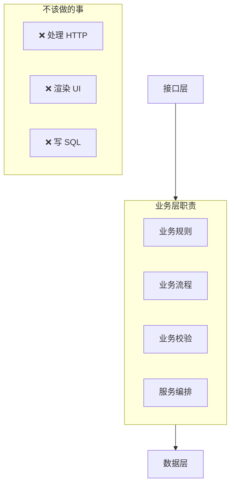
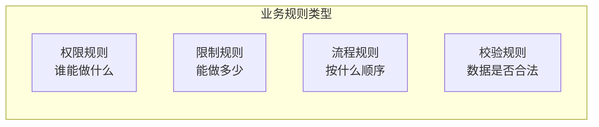
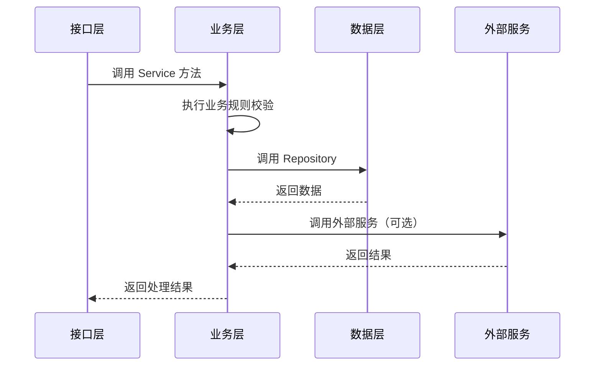

# 2.5.3 处理复杂业务的层——业务层

## 一句话破题

业务层是应用的"大脑"——它封装了所有业务规则和核心逻辑，不关心数据怎么存、界面怎么展示，只关心"业务应该怎么做"。

## 业务层的职责边界



| 应该做 | 不应该做 |
|--------|----------|
| 实现业务规则 | 处理 HTTP 请求/响应 |
| 业务数据校验 | 直接写 Prisma 查询 |
| 编排多个数据操作 | 渲染 UI 组件 |
| 调用外部服务 | 处理路由逻辑 |

## Service 的基本结构

### 文件组织

```
services/
├── auth.service.ts      # 认证相关
├── user.service.ts      # 用户相关
├── post.service.ts      # 文章相关
└── notification.service.ts  # 通知相关
```

### 基本模式

```typescript
// services/post.service.ts
import { postRepository } from '@/repositories/post.repository'
import { userRepository } from '@/repositories/user.repository'
import { NotFoundError, ForbiddenError } from '@/lib/errors'
import type { CreatePostInput, UpdatePostInput } from '@/types/post'

export const postService = {
  // 获取文章列表
  async list(params: { page: number; pageSize: number; authorId?: string }) {
    return postRepository.findMany(params)
  },
  
  // 获取单篇文章
  async findById(id: string) {
    const post = await postRepository.findById(id)
    if (!post) {
      throw new NotFoundError('文章不存在')
    }
    return post
  },
  
  // 创建文章
  async create(input: CreatePostInput, authorId: string) {
    // 业务规则：检查用户是否可以发布
    const user = await userRepository.findById(authorId)
    if (user.status === 'banned') {
      throw new ForbiddenError('账号已被禁止发布')
    }
    
    // 业务规则：免费用户每天限 3 篇
    if (user.plan === 'free') {
      const todayCount = await postRepository.countTodayByAuthor(authorId)
      if (todayCount >= 3) {
        throw new ForbiddenError('今日发布已达上限')
      }
    }
    
    return postRepository.create({ ...input, authorId })
  },
  
  // 更新文章
  async update(id: string, input: UpdatePostInput, userId: string) {
    const post = await this.findById(id)
    
    // 业务规则：只能编辑自己的文章
    if (post.authorId !== userId) {
      throw new ForbiddenError('无权编辑此文章')
    }
    
    return postRepository.update(id, input)
  },
  
  // 删除文章
  async delete(id: string, userId: string) {
    const post = await this.findById(id)
    
    if (post.authorId !== userId) {
      throw new ForbiddenError('无权删除此文章')
    }
    
    return postRepository.delete(id)
  },
}
```

## 业务规则的封装

### 规则分类



### 权限规则示例

```typescript
// services/post.service.ts
async publish(postId: string, userId: string) {
  const post = await postRepository.findById(postId)
  
  // 权限规则 1：文章必须存在
  if (!post) {
    throw new NotFoundError()
  }
  
  // 权限规则 2：只有作者能发布
  if (post.authorId !== userId) {
    throw new ForbiddenError('只有作者能发布文章')
  }
  
  // 权限规则 3：草稿才能发布
  if (post.status !== 'draft') {
    throw new ForbiddenError('只有草稿可以发布')
  }
  
  return postRepository.update(postId, { 
    status: 'published',
    publishedAt: new Date(),
  })
}
```

### 限制规则示例

```typescript
// services/user.service.ts
async uploadAvatar(userId: string, file: File) {
  const user = await userRepository.findById(userId)
  
  // 限制规则 1：文件大小
  const maxSize = user.plan === 'pro' ? 10 * 1024 * 1024 : 2 * 1024 * 1024
  if (file.size > maxSize) {
    throw new ForbiddenError(`文件大小不能超过 ${maxSize / 1024 / 1024}MB`)
  }
  
  // 限制规则 2：文件类型
  const allowedTypes = ['image/jpeg', 'image/png', 'image/webp']
  if (!allowedTypes.includes(file.type)) {
    throw new ForbiddenError('只支持 JPG、PNG、WebP 格式')
  }
  
  // 上传逻辑...
}
```

## 服务编排

当一个操作涉及多个数据实体时，Service 层负责编排：

```typescript
// services/order.service.ts
async createOrder(input: CreateOrderInput, userId: string) {
  // 1. 校验用户
  const user = await userRepository.findById(userId)
  if (!user) throw new NotFoundError('用户不存在')
  
  // 2. 校验商品库存
  const product = await productRepository.findById(input.productId)
  if (!product) throw new NotFoundError('商品不存在')
  if (product.stock < input.quantity) {
    throw new ForbiddenError('库存不足')
  }
  
  // 3. 计算价格（应用优惠等业务规则）
  const totalPrice = this.calculatePrice(product, input.quantity, input.couponCode)
  
  // 4. 创建订单（事务）
  return prisma.$transaction(async (tx) => {
    // 扣减库存
    await productRepository.decreaseStock(tx, input.productId, input.quantity)
    
    // 创建订单
    const order = await orderRepository.create(tx, {
      userId,
      productId: input.productId,
      quantity: input.quantity,
      totalPrice,
    })
    
    // 发送通知
    await notificationService.sendOrderCreated(user.email, order)
    
    return order
  })
}
```

## 与其他层的交互



## 觉知：业务层常见问题

### 1. Service 变成"透传层"

```typescript
// ❌ 没有业务逻辑，只是转发
async findById(id: string) {
  return postRepository.findById(id)
}

// ✅ 应该包含业务处理
async findById(id: string) {
  const post = await postRepository.findById(id)
  if (!post) throw new NotFoundError()
  
  // 业务逻辑：增加浏览量
  await postRepository.incrementViewCount(id)
  
  return post
}
```

### 2. 在 Service 里写 Prisma 查询

```typescript
// ❌ 数据访问应该在 Repository
async list() {
  return prisma.post.findMany({
    where: { status: 'published' },
    include: { author: true },
  })
}

// ✅ 调用 Repository
async list() {
  return postRepository.findPublished()
}
```

### 3. 业务规则分散在各处

```typescript
// ❌ 同一个规则在多处重复
// page.tsx 里
if (post.authorId !== userId) { ... }
// route.ts 里
if (post.authorId !== userId) { ... }

// ✅ 规则集中在 Service
// service.ts
async checkOwnership(postId: string, userId: string) {
  const post = await this.findById(postId)
  if (post.authorId !== userId) {
    throw new ForbiddenError()
  }
  return post
}
```

## 本节小结

| 原则 | 说明 |
|------|------|
| **规则集中** | 所有业务规则写在 Service 层 |
| **服务编排** | 跨实体操作由 Service 协调 |
| **不碰数据库** | 数据操作委托给 Repository |
| **不处理 HTTP** | HTTP 相关逻辑在接口层 |
