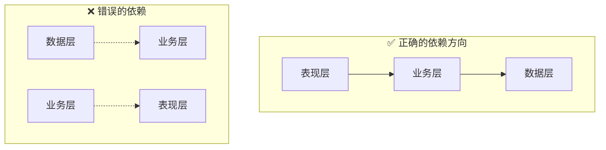

# 2.5.5 层与层如何对话——层间通信

## 一句话破题

层与层之间如何通信决定了代码的可维护性——通过接口抽象和依赖注入，可以让各层之间松耦合，便于测试和替换。

## 依赖关系原则



**核心原则**：上层依赖下层，下层不依赖上层。

| 层级 | 可以依赖 | 不可依赖 |
|------|----------|----------|
| 表现层 | 业务层 | - |
| 业务层 | 数据层 | 表现层 |
| 数据层 | 无 | 业务层、表现层 |

## 接口抽象

### 定义接口

```typescript
// types/repositories.ts
export interface IPostRepository {
  findById(id: string): Promise<Post | null>
  findMany(params: FindManyParams): Promise<PaginatedResult<Post>>
  create(data: CreatePostInput): Promise<Post>
  update(id: string, data: UpdatePostInput): Promise<Post>
  delete(id: string): Promise<void>
}

export interface IUserRepository {
  findById(id: string): Promise<User | null>
  findByEmail(email: string): Promise<User | null>
  create(data: CreateUserInput): Promise<User>
}
```

### 实现接口

```typescript
// repositories/post.repository.ts
import type { IPostRepository } from '@/types/repositories'

export const postRepository: IPostRepository = {
  async findById(id) {
    return prisma.post.findUnique({ where: { id } })
  },
  
  async findMany(params) {
    // 实现...
  },
  
  async create(data) {
    return prisma.post.create({ data })
  },
  
  async update(id, data) {
    return prisma.post.update({ where: { id }, data })
  },
  
  async delete(id) {
    await prisma.post.delete({ where: { id } })
  },
}
```

## 依赖注入

### 简单方式：直接导入

```typescript
// services/post.service.ts
import { postRepository } from '@/repositories/post.repository'

export const postService = {
  async findById(id: string) {
    return postRepository.findById(id)
  },
}
```

适用于：小型项目、快速开发。

### 工厂模式

```typescript
// services/post.service.ts
import type { IPostRepository } from '@/types/repositories'

export function createPostService(repo: IPostRepository) {
  return {
    async findById(id: string) {
      const post = await repo.findById(id)
      if (!post) throw new NotFoundError()
      return post
    },
    
    async create(input: CreatePostInput, authorId: string) {
      return repo.create({ ...input, authorId })
    },
  }
}

// 创建实例
import { postRepository } from '@/repositories/post.repository'
export const postService = createPostService(postRepository)
```

适用于：需要测试、需要替换实现。

### 依赖容器

```typescript
// lib/container.ts
import { postRepository } from '@/repositories/post.repository'
import { userRepository } from '@/repositories/user.repository'
import { createPostService } from '@/services/post.service'
import { createUserService } from '@/services/user.service'

// 创建所有服务实例
export const container = {
  repositories: {
    post: postRepository,
    user: userRepository,
  },
  services: {
    post: createPostService(postRepository),
    user: createUserService(userRepository),
  },
}

// 使用
import { container } from '@/lib/container'
const post = await container.services.post.findById(id)
```

## 测试中的依赖替换

### Mock Repository

```typescript
// tests/post.service.test.ts
import { createPostService } from '@/services/post.service'

const mockPostRepository = {
  findById: jest.fn(),
  findMany: jest.fn(),
  create: jest.fn(),
  update: jest.fn(),
  delete: jest.fn(),
}

const postService = createPostService(mockPostRepository)

describe('PostService', () => {
  beforeEach(() => {
    jest.clearAllMocks()
  })
  
  describe('findById', () => {
    it('should return post when found', async () => {
      const mockPost = { id: '1', title: 'Test' }
      mockPostRepository.findById.mockResolvedValue(mockPost)
      
      const result = await postService.findById('1')
      
      expect(result).toEqual(mockPost)
      expect(mockPostRepository.findById).toHaveBeenCalledWith('1')
    })
    
    it('should throw NotFoundError when not found', async () => {
      mockPostRepository.findById.mockResolvedValue(null)
      
      await expect(postService.findById('1')).rejects.toThrow(NotFoundError)
    })
  })
})
```

### 使用真实数据库测试

```typescript
// tests/integration/post.repository.test.ts
import { postRepository } from '@/repositories/post.repository'
import { prisma } from '@/lib/prisma'

describe('PostRepository Integration', () => {
  beforeEach(async () => {
    await prisma.post.deleteMany()
  })
  
  afterAll(async () => {
    await prisma.$disconnect()
  })
  
  it('should create and find post', async () => {
    const created = await postRepository.create({
      title: 'Test',
      content: 'Content',
      authorId: 'user-1',
    })
    
    const found = await postRepository.findById(created.id)
    
    expect(found).toMatchObject({
      title: 'Test',
      content: 'Content',
    })
  })
})
```

## 跨层数据传递

### 使用 DTO

```typescript
// types/dto.ts
export interface PostDTO {
  id: string
  title: string
  content: string
  author: {
    id: string
    name: string
  }
  createdAt: string
}

// 数据层返回原始数据
// 业务层转换为 DTO
// 表现层使用 DTO

// services/post.service.ts
function toDTO(post: PostWithAuthor): PostDTO {
  return {
    id: post.id,
    title: post.title,
    content: post.content,
    author: {
      id: post.author.id,
      name: post.author.name,
    },
    createdAt: post.createdAt.toISOString(),
  }
}

export const postService = {
  async findById(id: string): Promise<PostDTO> {
    const post = await postRepository.findWithAuthor(id)
    if (!post) throw new NotFoundError()
    return toDTO(post)
  },
}
```

## 觉知：层间通信常见问题

### 1. 循环依赖

```typescript
// ❌ Service A 依赖 Service B，B 又依赖 A
// user.service.ts
import { postService } from './post.service'
// post.service.ts
import { userService } from './user.service'

// ✅ 通过事件或回调解耦
// 或者提取公共逻辑到新的 Service
```

### 2. 跨层直接调用

```typescript
// ❌ 表现层直接调用数据层
// page.tsx
const post = await prisma.post.findUnique({ where: { id } })

// ✅ 通过业务层
// page.tsx
const post = await postService.findById(id)
```

### 3. 暴露内部实现

```typescript
// ❌ 返回 Prisma 类型，暴露了 ORM 细节
async findById(id: string): Promise<Prisma.Post> { }

// ✅ 返回业务类型
async findById(id: string): Promise<Post> { }
```

## 本节小结

| 原则 | 说明 |
|------|------|
| **单向依赖** | 上层依赖下层，不可反向 |
| **接口抽象** | 通过接口定义层间契约 |
| **依赖注入** | 运行时传入依赖，便于测试 |
| **DTO 传递** | 跨层使用 DTO，隐藏内部实现 |
