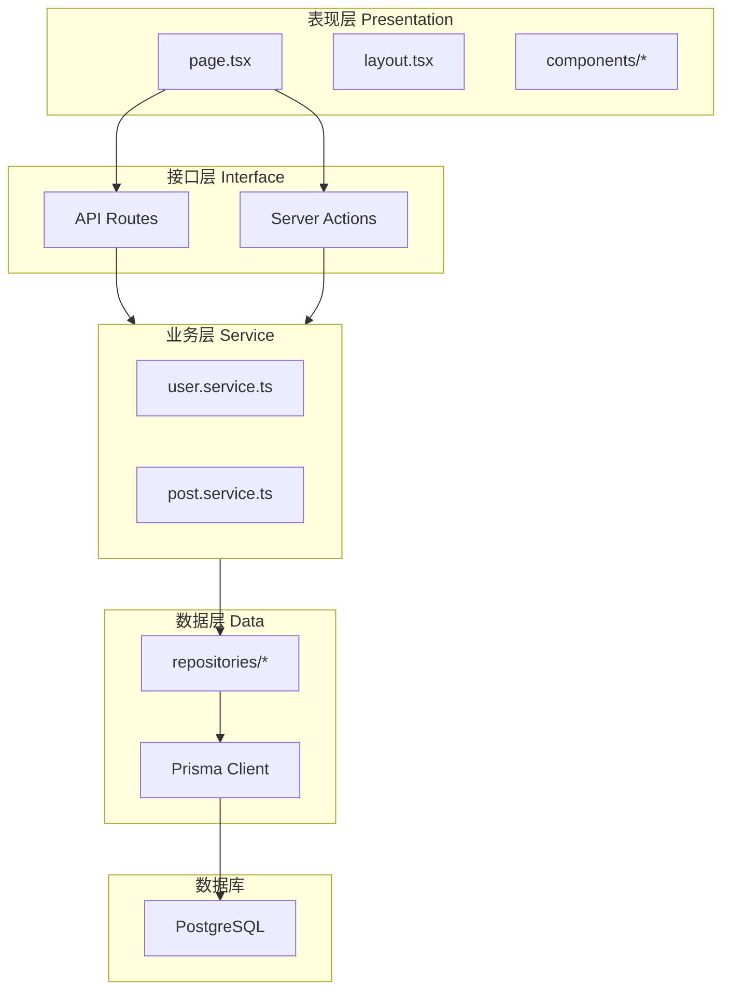

# 2.5 代码为什么会越写越乱——架构分层

## 认知重构

代码越写越乱的根本原因是：**职责混杂**。页面组件里写数据库查询，API 路由里写业务逻辑，到处都是重复代码。分层架构的目的就是**让每一层只做一件事**。

```
乱的代码：page.tsx 里既有 UI、又有业务逻辑、还有数据库操作
好的代码：page.tsx 只管 UI，逻辑交给 service，数据交给 repository
```

## 分层架构全景



## 各层职责速览

| 层级 | 职责 | 关键文件 |
|------|------|----------|
| **表现层** | UI 渲染、用户交互 | `page.tsx`, `components/*` |
| **接口层** | 请求处理、参数校验 | `route.ts`, `actions.ts` |
| **业务层** | 核心逻辑、业务规则 | `*.service.ts` |
| **数据层** | 数据访问、ORM 操作 | `*.repository.ts`, Prisma |

## 为什么要分层？

### 不分层的代码

```typescript
// app/posts/page.tsx - 一个文件干所有事
export default async function PostsPage() {
  // UI 关心的
  const session = await getServerSession()
  
  // 业务逻辑
  if (!session) {
    redirect('/login')
  }
  
  // 数据访问
  const posts = await prisma.post.findMany({
    where: { authorId: session.user.id },
    orderBy: { createdAt: 'desc' },
    include: { author: true, tags: true },
  })
  
  // 更多业务逻辑
  const publishedPosts = posts.filter(p => p.status === 'published')
  const draftPosts = posts.filter(p => p.status === 'draft')
  
  return (
    <div>
      <h1>我的文章</h1>
      {/* 很长的 JSX */}
    </div>
  )
}
```

**问题**：
- 换数据库要改页面文件
- 业务逻辑无法复用
- 难以测试
- AI 生成的代码到处都是

### 分层后的代码

```typescript
// app/posts/page.tsx - 只关心 UI
export default async function PostsPage() {
  const { publishedPosts, draftPosts } = await postService.getMyPosts()
  
  return (
    <div>
      <PostTabs published={publishedPosts} drafts={draftPosts} />
    </div>
  )
}

// services/post.service.ts - 只关心业务逻辑
export const postService = {
  async getMyPosts() {
    const session = await authService.requireAuth()
    const posts = await postRepository.findByAuthor(session.user.id)
    
    return {
      publishedPosts: posts.filter(p => p.status === 'published'),
      draftPosts: posts.filter(p => p.status === 'draft'),
    }
  }
}

// repositories/post.repository.ts - 只关心数据访问
export const postRepository = {
  async findByAuthor(authorId: string) {
    return prisma.post.findMany({
      where: { authorId },
      orderBy: { createdAt: 'desc' },
      include: { author: true, tags: true },
    })
  }
}
```

**好处**：
- 每层职责单一，易于理解
- 业务逻辑可复用
- 易于测试（Mock 数据层即可）
- AI 生成的代码有固定的放置位置

## 目录结构建议

```
src/
├── app/                    # 表现层 + 接口层
│   ├── (marketing)/        # 营销页面
│   ├── (dashboard)/        # 后台页面
│   ├── api/                # API Routes
│   └── actions/            # Server Actions（可选单独放）
│
├── components/             # UI 组件
│   ├── ui/                 # 基础 UI 组件
│   └── features/           # 业务组件
│
├── services/               # 业务层
│   ├── auth.service.ts
│   ├── user.service.ts
│   └── post.service.ts
│
├── repositories/           # 数据层
│   ├── user.repository.ts
│   └── post.repository.ts
│
├── lib/                    # 工具函数
│   ├── prisma.ts
│   └── utils.ts
│
└── types/                  # 类型定义
    ├── user.ts
    └── post.ts
```

## 本章导航

- **2.5.1 表现层**：页面组件与路由管理
- **2.5.2 接口层**：API 路由与 HTTP 处理
- **2.5.3 业务层**：核心逻辑与规则封装
- **2.5.4 数据层**：ORM 与数据库交互
- **2.5.5 层间通信**：依赖注入与接口抽象
