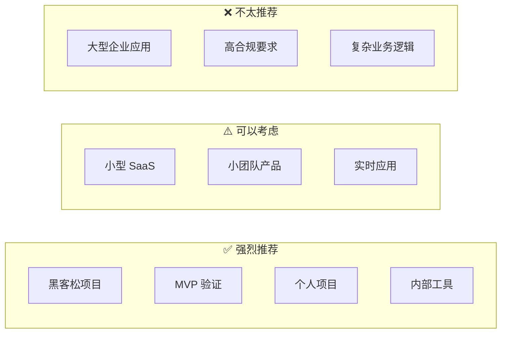
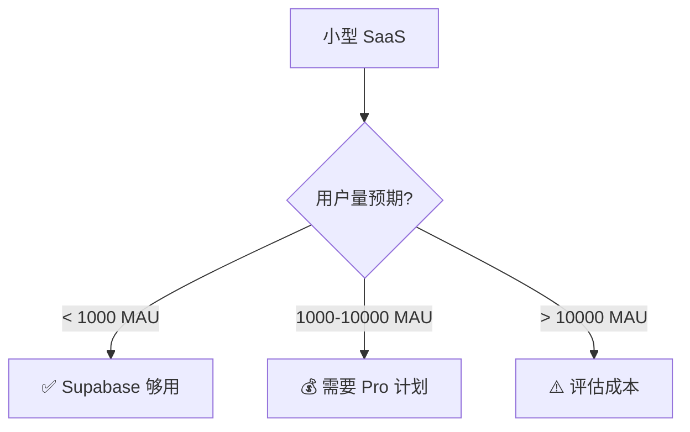
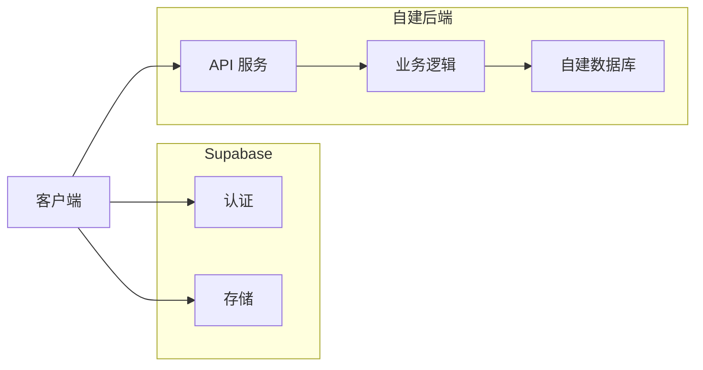

# 2.6.2 适用场景：快速原型 vs 生产环境

## 一句话破题

Supabase 在"快速上线"场景下无可匹敌，但到了"深度定制"阶段就要慎重考虑了。

## 场景决策矩阵



## ✅ 强烈推荐的场景

### 1. 黑客松 / 48小时比赛

```typescript
// 10 分钟搭建完整后端
// 1. 创建项目（supabase.com）
// 2. 建表（可视化界面）
// 3. 写代码

const { data } = await supabase
  .from('submissions')
  .insert({ name, idea, team_id })
  .select()

// 完成！不用配置数据库、不用写 API
```

**为什么适合**：时间紧迫，验证想法比代码质量重要。

### 2. MVP 产品验证

| 阶段 | 用 Supabase | 传统方式 |
|------|-------------|----------|
| 搭建后端 | 1 天 | 1-2 周 |
| 用户认证 | 30 分钟 | 2-3 天 |
| 文件上传 | 1 小时 | 1-2 天 |
| **总计** | **1-2 天** | **2-3 周** |

**核心价值**：快速验证产品假设，失败了损失最小。

### 3. 个人项目 / Side Project

```typescript
// 个人博客、笔记应用、TODO 工具等
// 免费额度完全够用：
// - 500MB 数据库
// - 1GB 文件存储
// - 200 并发连接
```

### 4. 内部工具

- 后台管理系统
- 数据看板
- 团队协作工具

**优势**：用户量可控，免费额度够用，快速迭代。

## ⚠️ 可以考虑的场景

### 小型 SaaS 产品



### 实时协作应用

```typescript
// Supabase Realtime 开箱即用
const channel = supabase
  .channel('room:123')
  .on('broadcast', { event: 'cursor' }, (payload) => {
    updateCursor(payload.userId, payload.position)
  })
  .subscribe()

// 广播鼠标位置
channel.send({
  type: 'broadcast',
  event: 'cursor',
  payload: { userId, position },
})
```

**注意**：免费版限制 200 并发连接。

## ❌ 不太推荐的场景

### 1. 复杂业务逻辑

```typescript
// ❌ 复杂业务规则难以用 RLS 表达
// 例如：多级审批、动态权限、复杂计费规则

// 这种逻辑放在 Supabase RLS 里会很痛苦
// 建议使用传统后端 + 业务层
```

### 2. 高合规要求

| 要求 | Supabase 支持 |
|------|---------------|
| 数据本地化 | ⚠️ 有限（部分区域） |
| 审计日志 | ⚠️ 需要额外配置 |
| HIPAA | ❌ 需要企业版 |
| PCI DSS | ❌ 不支持 |

### 3. 已有成熟基础设施

```
如果你已经有：
- 运维团队
- CI/CD 流程
- 监控告警
- 自建认证系统

那么 Supabase 的价值就没那么大了
```

## 混合方案

### Supabase + 自建后端



```typescript
// 只用 Supabase 的 Auth 和 Storage
// 业务逻辑走自建后端

// 1. 用 Supabase 登录
const { data: { session } } = await supabase.auth.getSession()

// 2. 调用自建 API（带上 token）
const response = await fetch('/api/orders', {
  headers: {
    Authorization: `Bearer ${session?.access_token}`,
  },
})

// 3. 自建后端验证 Supabase JWT
import { createClient } from '@supabase/supabase-js'
const { data: { user } } = await supabase.auth.getUser(token)
```

## 觉知：场景选择常见误区

### 1. "免费就用 Supabase"

```
❌ 错误认知：因为免费所以用
✅ 正确思考：因为适合场景所以用

即使 Supabase 收费，如果能帮你节省 2 周开发时间，
那也是值得的。
```

### 2. "生产环境不能用 BaaS"

```
❌ 错误认知：BaaS 只能做原型
✅ 现实情况：

很多公司用 Supabase 跑生产：
- 用户量不大的 SaaS
- 内部工具
- 特定模块（认证、存储）
```

### 3. "以后肯定要迁移，不如现在自建"

```
❌ 过早优化
✅ YAGNI 原则

如果项目可能失败，先验证再优化。
迁移成本 < 验证失败的时间成本。
```

## 本节小结

| 场景 | 推荐度 | 理由 |
|------|--------|------|
| 黑客松/MVP | ⭐⭐⭐⭐⭐ | 速度第一 |
| 个人项目 | ⭐⭐⭐⭐⭐ | 免费够用 |
| 小型 SaaS | ⭐⭐⭐⭐ | 成本可控 |
| 实时应用 | ⭐⭐⭐⭐ | 开箱即用 |
| 复杂业务 | ⭐⭐ | 定制困难 |
| 企业应用 | ⭐ | 合规问题 |
