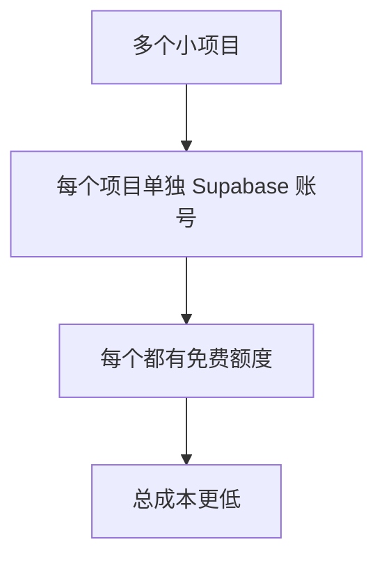

# 2.6.3 成本考量：免费额度与付费计划

## 一句话破题

Supabase 的免费额度对个人项目绰绰有余，但一旦上量，成本可能比自建更高——关键是算清楚你的使用模式。

## 定价方案对比

### 三档定价（2024）

| 项目 | Free | Pro ($25/月) | Team ($599/月) |
|------|------|--------------|----------------|
| **数据库** | 500 MB | 8 GB | 8 GB |
| **文件存储** | 1 GB | 100 GB | 100 GB |
| **带宽** | 2 GB | 250 GB | 250 GB |
| **并发连接** | 200 | 500 | 500 |
| **Edge Functions** | 500K 调用 | 2M 调用 | 2M 调用 |
| **Realtime** | 200 并发 | 500 并发 | 500 并发 |
| **暂停策略** | 7 天不活跃 | 永不暂停 | 永不暂停 |

### 超出额度费用

```
数据库：$0.125/GB/月
存储：$0.021/GB/月
带宽：$0.09/GB
Edge Functions：$2/100万次调用
```

## 成本计算实例

### 场景 1：个人博客

```
月访问量：5,000 PV
数据库：50 MB
文件存储：200 MB
带宽：1 GB

结论：✅ 免费版完全够用
费用：$0/月
```

### 场景 2：小型 SaaS

```
月活用户：500
数据库：2 GB
文件存储：20 GB
带宽：50 GB

方案：Pro 版本
费用：$25/月
```

### 场景 3：中型应用

```
月活用户：5,000
数据库：10 GB
文件存储：100 GB
带宽：300 GB

计算：
- Pro 基础：$25
- 数据库超出 (10-8) × $0.125 = $0.25
- 带宽超出 (300-250) × $0.09 = $4.5

费用：约 $30/月
```

### 场景 4：高流量应用

```
月活用户：50,000
数据库：100 GB
文件存储：1 TB
带宽：5 TB

这种情况下，自建可能更划算
需要评估 Team 版本或自托管
```

## 成本优化策略

### 1. 数据库优化

```sql
-- 定期清理旧数据
DELETE FROM logs WHERE created_at < NOW() - INTERVAL '30 days';

-- 使用合适的数据类型
-- ❌ 不要用 TEXT 存储短字符串
-- ✅ 使用 VARCHAR(100) 等
```

### 2. 存储优化

```typescript
// 压缩图片后上传
import imageCompression from 'browser-image-compression'

const compressedFile = await imageCompression(file, {
  maxSizeMB: 0.5,
  maxWidthOrHeight: 1200,
})

await supabase.storage.from('images').upload(path, compressedFile)
```

### 3. 减少带宽

```typescript
// 只查询需要的字段
const { data } = await supabase
  .from('posts')
  .select('id, title, summary')  // 不要 select('*')
  .limit(20)

// 使用 CDN 缓存
const { data } = supabase.storage
  .from('images')
  .getPublicUrl('image.jpg', {
    transform: { width: 400, height: 300 },
  })
```

### 4. 利用免费额度



## 与自建方案成本对比

### 自建成本估算

| 组件 | 月费用 |
|------|--------|
| VPS (2核4G) | $10-20 |
| 托管 PostgreSQL | $15-50 |
| S3 存储 (50GB) | $1-3 |
| 运维时间成本 | $$$（无法估算） |

### 对比结论

```
小项目（< 1000 用户）：
  Supabase 更划算，省去运维成本

中型项目（1000-10000 用户）：
  差不多，取决于具体使用模式

大型项目（> 10000 用户）：
  自建可能更划算，但要考虑运维成本
```

## 隐性成本

### Supabase 的隐性成本

- **学习曲线**：RLS、Realtime 需要时间学习
- **调试困难**：问题排查不如自建透明
- **供应商锁定**：迁移有成本

### 自建的隐性成本

- **运维时间**：数据库备份、安全更新
- **故障响应**：半夜数据库挂了谁来修
- **扩容规划**：预估容量、调整配置

## 免费版限制警告

### 7 天暂停策略

```
Free 版本：7 天无活动会自动暂停数据库
- 会丢失数据库连接
- 需要手动唤醒
- 不适合生产环境

解决方案：
1. 升级 Pro
2. 定时任务保持活跃（不推荐）
3. 自托管 Supabase
```

### 并发连接限制

```
Free：200 并发
Pro：500 并发

超出限制会导致连接失败
高并发场景需要：
1. 使用连接池
2. 升级到更高版本
3. 考虑自建
```

## 本节小结

| 用户规模 | 推荐方案 | 月成本 |
|----------|----------|--------|
| 个人项目 | Free | $0 |
| 1-500 MAU | Free/Pro | $0-25 |
| 500-5000 MAU | Pro | $25-50 |
| 5000-50000 MAU | Team/自建 | $100+ |
| 50000+ MAU | 自建 | 视情况 |
