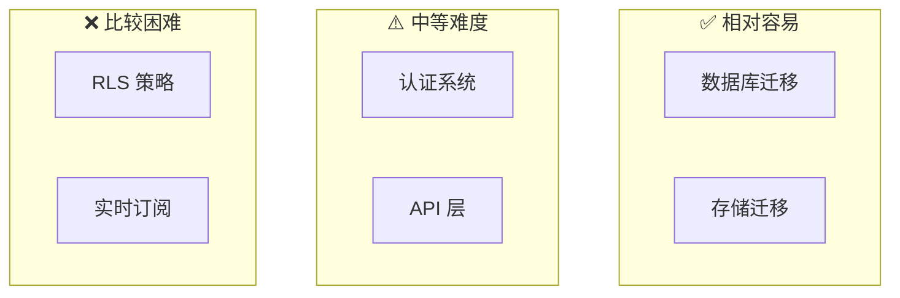
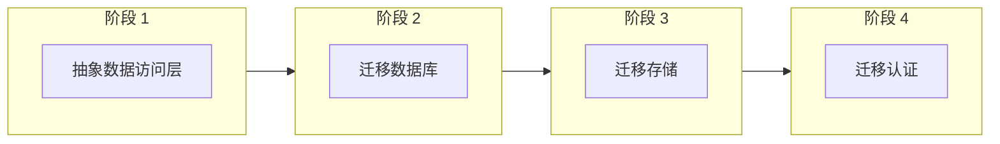

# 2.6.4 迁移策略：从 Supabase 到自建服务

## 一句话破题

Supabase 基于开源技术栈，迁移不是不可能，但需要提前规划——在代码设计时就要考虑"可替换性"。

## 迁移难度评估



| 服务 | 迁移难度 | 替代方案 |
|------|----------|----------|
| Database | ⭐⭐ | 标准 PostgreSQL |
| Storage | ⭐⭐ | S3 / 阿里云 OSS |
| Auth | ⭐⭐⭐ | NextAuth.js / Clerk |
| Realtime | ⭐⭐⭐⭐ | Socket.io / Pusher |
| RLS | ⭐⭐⭐⭐⭐ | 应用层权限控制 |

## 数据库迁移

### 导出数据

```bash
# 方式 1：Supabase Dashboard 导出
# Settings > Database > Download backup

# 方式 2：使用 pg_dump
pg_dump -h db.xxx.supabase.co \
  -p 5432 \
  -U postgres \
  -d postgres \
  -F c \
  -f backup.dump
```

### 导入到新数据库

```bash
# 创建新数据库
createdb -h localhost -U postgres myapp

# 恢复数据
pg_restore -h localhost \
  -U postgres \
  -d myapp \
  backup.dump
```

### 代码改造

```typescript
// 之前：使用 Supabase 客户端
const { data } = await supabase.from('posts').select('*')

// 之后：使用 Prisma
const posts = await prisma.post.findMany()

// 或者保持接口一致
// repositories/post.repository.ts
export const postRepository = {
  async findAll() {
    // 只需要改这里的实现
    return prisma.post.findMany()
  }
}
```

## 存储迁移

### 导出文件

```typescript
// 列出所有文件
const { data: files } = await supabase.storage
  .from('images')
  .list()

// 批量下载
for (const file of files) {
  const { data } = await supabase.storage
    .from('images')
    .download(file.name)
  
  // 保存到本地或上传到新存储
  await uploadToS3(file.name, data)
}
```

### 迁移到 S3

```typescript
// lib/storage.ts
import { S3Client, PutObjectCommand } from '@aws-sdk/client-s3'

const s3 = new S3Client({ region: 'ap-northeast-1' })

export async function uploadFile(key: string, file: Buffer) {
  await s3.send(new PutObjectCommand({
    Bucket: 'my-bucket',
    Key: key,
    Body: file,
  }))
}

export function getPublicUrl(key: string) {
  return `https://my-bucket.s3.amazonaws.com/${key}`
}
```

### 代码适配

```typescript
// 抽象存储接口
interface IStorage {
  upload(path: string, file: File): Promise<string>
  getUrl(path: string): string
  delete(path: string): Promise<void>
}

// Supabase 实现
const supabaseStorage: IStorage = {
  async upload(path, file) {
    await supabase.storage.from('bucket').upload(path, file)
    return path
  },
  getUrl(path) {
    return supabase.storage.from('bucket').getPublicUrl(path).data.publicUrl
  },
  async delete(path) {
    await supabase.storage.from('bucket').remove([path])
  },
}

// S3 实现
const s3Storage: IStorage = {
  async upload(path, file) { /* S3 实现 */ },
  getUrl(path) { /* S3 URL */ },
  async delete(path) { /* S3 删除 */ },
}

// 使用时只依赖接口
export const storage: IStorage = supabaseStorage  // 轻松切换
```

## 认证迁移

### 导出用户数据

```sql
-- 从 Supabase auth.users 导出
SELECT id, email, created_at, raw_user_meta_data
FROM auth.users;
```

### 迁移到 NextAuth.js

```typescript
// 1. 安装 NextAuth
// pnpm add next-auth @auth/prisma-adapter

// 2. 配置 NextAuth
// app/api/auth/[...nextauth]/route.ts
import NextAuth from 'next-auth'
import { PrismaAdapter } from '@auth/prisma-adapter'
import Google from 'next-auth/providers/google'

export const { handlers, auth } = NextAuth({
  adapter: PrismaAdapter(prisma),
  providers: [Google],
})

// 3. 迁移用户数据
// 需要重置密码或让用户重新关联 OAuth
```

### 处理已登录用户

```typescript
// 过渡期：同时支持两套认证
async function getCurrentUser(request: Request) {
  // 先尝试 Supabase token
  const supabaseUser = await getSupabaseUser(request)
  if (supabaseUser) return supabaseUser
  
  // 再尝试 NextAuth session
  const session = await auth()
  if (session?.user) return session.user
  
  return null
}
```

## RLS 迁移（最难）

### Supabase RLS

```sql
-- Supabase 的 RLS 策略
CREATE POLICY "users_own_posts" ON posts
  USING (auth.uid() = author_id);
```

### 迁移到应用层

```typescript
// 必须在应用层实现权限控制
// services/post.service.ts
export const postService = {
  async findById(id: string, userId: string) {
    const post = await postRepository.findById(id)
    
    if (!post) throw new NotFoundError()
    
    // 原来 RLS 自动做的，现在要手动做
    if (post.authorId !== userId && post.status !== 'published') {
      throw new ForbiddenError()
    }
    
    return post
  },
  
  async update(id: string, userId: string, data: UpdatePostInput) {
    const post = await postRepository.findById(id)
    
    // 权限检查
    if (post.authorId !== userId) {
      throw new ForbiddenError()
    }
    
    return postRepository.update(id, data)
  },
}
```

## 渐进式迁移策略



### 阶段 1：代码重构

```typescript
// 不直接使用 Supabase 客户端
// ❌
const { data } = await supabase.from('posts').select('*')

// ✅ 通过 Repository 抽象
const posts = await postRepository.findAll()
```

### 阶段 2：迁移数据库

```typescript
// 改变 Repository 实现，不改接口
// postRepository 从 Supabase 切换到 Prisma
```

### 阶段 3：迁移存储

```typescript
// 改变 Storage 实现
export const storage: IStorage = s3Storage
```

### 阶段 4：迁移认证

```typescript
// 最后迁移认证，影响范围最大
// 需要通知用户重新登录
```

## 觉知：迁移常见问题

### 1. 没有提前抽象

```typescript
// ❌ 到处直接用 supabase.from()
// 迁移时要改几十个文件

// ✅ 提前用 Repository 模式
// 迁移时只改一处
```

### 2. 依赖 RLS 的隐式权限

```typescript
// ❌ 前端直接查询，依赖 RLS 过滤
const { data } = await supabase.from('posts').select('*')

// 迁移后没有 RLS，会暴露所有数据！

// ✅ 显式传递用户 ID
const posts = await postService.findByUser(userId)
```

### 3. 低估迁移时间

```
实际迁移时间往往是预估的 2-3 倍

建议：
1. 预留充足时间
2. 先在测试环境完整跑一遍
3. 准备回滚方案
```

## 本节小结

| 迁移项 | 难度 | 建议 |
|--------|------|------|
| **数据库** | ⭐⭐ | 标准 pg_dump/restore |
| **存储** | ⭐⭐ | 抽象 Storage 接口 |
| **认证** | ⭐⭐⭐ | 提前规划过渡期 |
| **RLS** | ⭐⭐⭐⭐⭐ | 应用层重写权限 |

**核心原则**：在写代码时就考虑可替换性，用接口抽象隔离具体实现。
