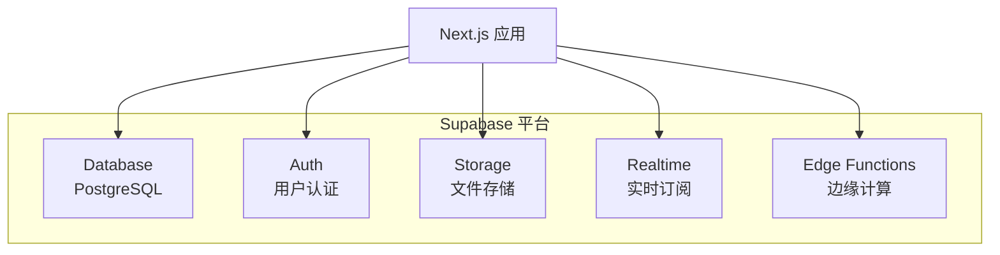
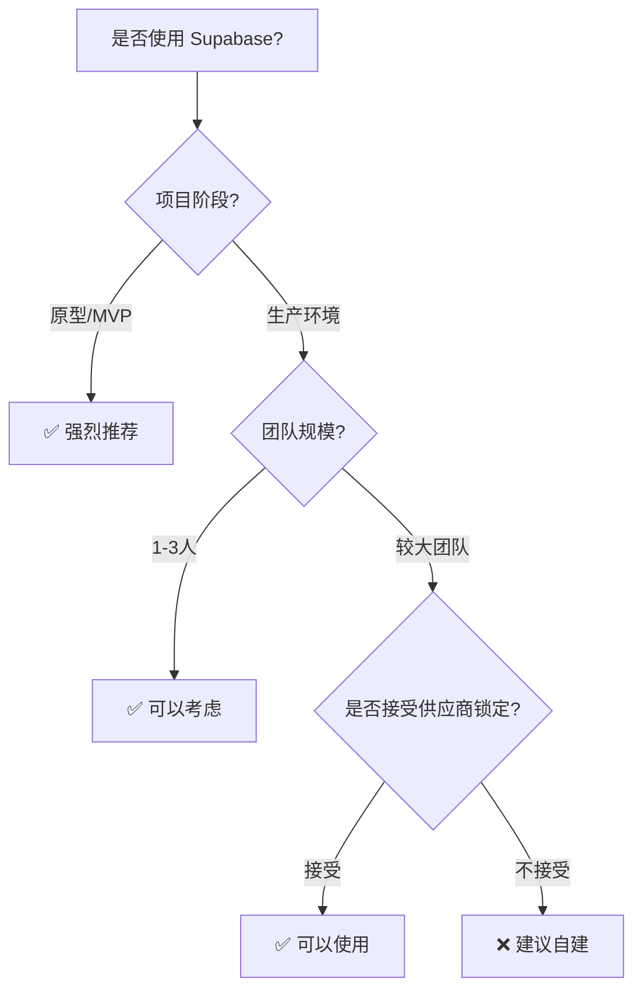

# 2.6 全家桶服务好不好用——Supabase 适用与取舍

## 认知重构

Supabase 自称"开源的 Firebase 替代品"，提供了数据库、认证、存储、实时订阅等一体化服务。它能让你快速搭建后端，但"全家桶"也意味着一定程度的绑定。

```
传统方式：PostgreSQL + NextAuth + S3 + 自建实时服务
Supabase：一个平台全搞定（但有迁移成本）
```

## Supabase 服务全景



| 服务 | 功能 | 对标 |
|------|------|------|
| **Database** | PostgreSQL 数据库 | 自建 PostgreSQL |
| **Auth** | 用户认证、OAuth | NextAuth.js |
| **Storage** | 文件存储 | 阿里云 OSS / S3 |
| **Realtime** | 数据变更订阅 | Socket.io |
| **Edge Functions** | 边缘函数 | Cloudflare Workers |

## 何时该用 Supabase？



### ✅ 适合使用 Supabase

- **快速原型**：几分钟搭建后端
- **黑客松项目**：时间紧迫，一站式解决
- **小团队**：不想运维数据库
- **实时功能**：聊天、协作等场景

### ❌ 不太适合

- **高度定制化需求**：复杂业务逻辑
- **严格合规要求**：数据必须自主可控
- **已有成熟基础设施**：迁移成本高
- **预算敏感**：用量大时成本可能更高

## 本章导航

- **2.6.1 Supabase 服务概览**：数据库/存储/认证一体化
- **2.6.2 适用场景**：快速原型 vs 生产环境
- **2.6.3 成本考量**：免费额度与付费计划
- **2.6.4 迁移策略**：从 Supabase 到自建服务
