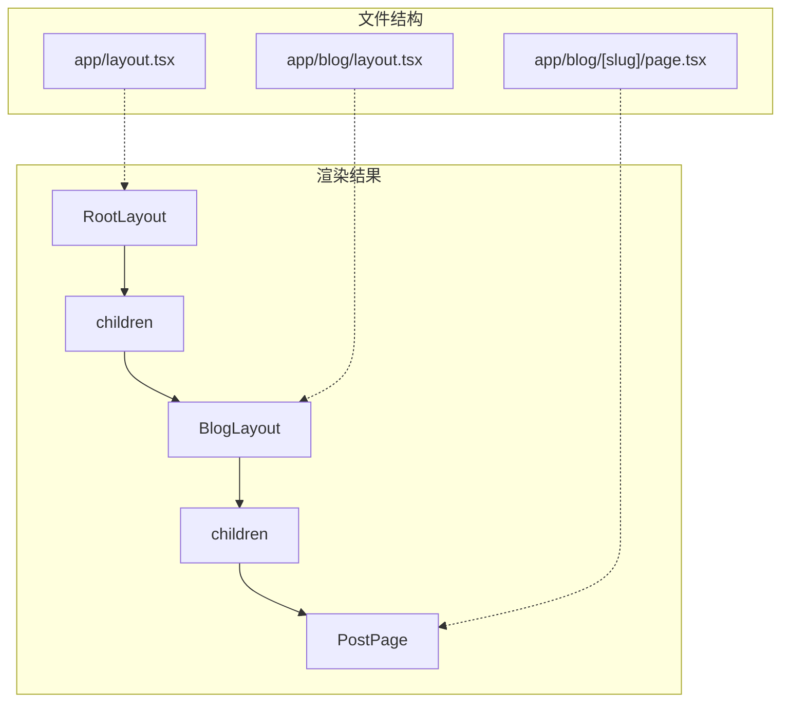

# 3.1.1 页面放哪，路由就在哪——文件系统路由

### 一句话破题

在 App Router 中，文件夹结构就是 URL 结构，`page.tsx` 是页面终点，`layout.tsx` 是共享外壳。

### 核心价值

传统的路由配置需要维护一个独立的配置文件，手动映射 URL 和组件。App Router 的文件系统路由彻底消除了这层抽象——**你的文件目录就是你的网站地图**。这种"所见即所得"的设计大幅降低了心智负担。

### 特殊文件约定

Next.js App Router 定义了一组**保留文件名**，每个都有特定用途：

| 文件名 | 作用 | 是否必须 |
|--------|------|----------|
| `page.tsx` | 定义路由的 UI 内容，使该路由可访问 | 是（否则该路径不可访问） |
| `layout.tsx` | 定义共享布局，包裹子路由 | 根目录必须有 |
| `loading.tsx` | 定义加载状态 UI（Suspense 边界） | 否 |
| `error.tsx` | 定义错误状态 UI（Error Boundary） | 否 |
| `not-found.tsx` | 定义 404 页面 | 否 |
| `template.tsx` | 类似 layout 但每次导航都重新挂载 | 否 |

### 快速上手

**最小可行结构：**

```
app/
├── layout.tsx      # 根布局（必须）
├── page.tsx        # 首页 /
├── about/
│   └── page.tsx    # /about
└── blog/
    ├── page.tsx    # /blog
    └── [slug]/
        └── page.tsx # /blog/xxx
```

**根布局示例 (`app/layout.tsx`)：**

```tsx
export default function RootLayout({
  children,
}: {
  children: React.ReactNode
}) {
  return (
    <html lang="zh-CN">
      <body>
        <nav>全站导航栏</nav>
        <main>{children}</main>
        <footer>全站页脚</footer>
      </body>
    </html>
  )
}
```

**页面示例 (`app/about/page.tsx`)：**

```tsx
export default function AboutPage() {
  return (
    <div>
      <h1>关于我们</h1>
      <p>这是关于页面的内容</p>
    </div>
  )
}
```

### 布局嵌套机制

布局的核心特性是**嵌套**和**持久化**。当用户在子页面间导航时，父级 Layout 不会重新渲染。



**嵌套布局示例 (`app/blog/layout.tsx`)：**

```tsx
export default function BlogLayout({
  children,
}: {
  children: React.ReactNode
}) {
  return (
    <div className="blog-container">
      <aside>博客侧边栏</aside>
      <article>{children}</article>
    </div>
  )
}
```

### Loading 状态

`loading.tsx` 会自动创建一个 Suspense 边界，在页面内容加载时显示：

```tsx
// app/blog/loading.tsx
export default function Loading() {
  return (
    <div className="animate-pulse">
      <div className="h-8 bg-gray-200 rounded w-3/4 mb-4"></div>
      <div className="h-4 bg-gray-200 rounded w-full mb-2"></div>
      <div className="h-4 bg-gray-200 rounded w-5/6"></div>
    </div>
  )
}
```

### AI 协作指南

**核心意图**：让 AI 帮你快速搭建页面结构骨架。

**需求定义公式**：
- 功能描述：我需要创建一个 [页面类型] 页面
- 交互方式：该页面需要 [共享布局/独立布局]
- 预期效果：URL 路径为 `/xxx`，包含 [具体内容]

**关键术语**：`page.tsx`、`layout.tsx`、`loading.tsx`、`children prop`、`嵌套布局`

**交互策略**：
1. 先让 AI 生成文件结构目录
2. 确认结构正确后，再让它填充各文件内容
3. 最后让它添加 loading 和 error 状态

### 避坑指南

1. **根布局必须包含 `<html>` 和 `<body>` 标签**，子布局不需要
2. **`page.tsx` 是使路由可访问的唯一方式**，没有它文件夹只是用于组织代码
3. **Layout 组件必须接受并渲染 `children` prop**，否则子页面无法显示
4. **避免在 Layout 中使用会频繁变化的状态**，因为它不会重新渲染

### 验收清单

- [ ] 根目录有 `layout.tsx` 且包含 `<html>` 和 `<body>`
- [ ] 每个需要访问的路径都有对应的 `page.tsx`
- [ ] 布局正确嵌套，导航时父布局不闪烁
- [ ] 数据加载较慢的页面有 `loading.tsx` 骨架屏
