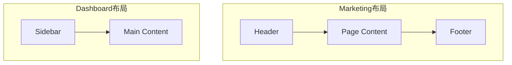

# 3.1.3 整理乱糟糟的路由——路由组

### 一句话破题

用圆括号 `(group)` 命名文件夹，可以在不影响 URL 的情况下组织代码和共享布局。

### 核心价值

当项目变大时，`app` 目录下会堆满文件夹：首页、关于、博客、后台、设置……乱成一团。路由组让你像整理抽屉一样分类这些页面，而且**分类名不会出现在 URL 中**。

### 路由组语法

用圆括号包裹的文件夹名称就是路由组：

```
app/
├── (marketing)/
│   ├── layout.tsx      # 营销页专用布局
│   ├── page.tsx        # 首页 -> URL: /
│   └── about/
│       └── page.tsx    # 关于 -> URL: /about
├── (dashboard)/
│   ├── layout.tsx      # 后台专用布局
│   └── settings/
│       └── page.tsx    # 设置 -> URL: /settings
```

**关键点**：`(marketing)` 和 `(dashboard)` 都不会出现在 URL 中。

### 三大应用场景

#### 场景一：代码组织

把相关页面放在一起，代码更清晰：

```
app/
├── (auth)/             # 认证相关
│   ├── login/
│   ├── register/
│   └── forgot-password/
├── (shop)/             # 商城相关
│   ├── products/
│   ├── cart/
│   └── checkout/
└── (blog)/             # 博客相关
    ├── posts/
    └── categories/
```

#### 场景二：不同布局

营销页面和后台页面通常需要完全不同的 UI 框架：

```tsx
// app/(marketing)/layout.tsx
export default function MarketingLayout({ children }) {
  return (
    <div>
      <header>品牌 Logo + 导航</header>
      <main>{children}</main>
      <footer>版权信息</footer>
    </div>
  )
}

// app/(dashboard)/layout.tsx
export default function DashboardLayout({ children }) {
  return (
    <div className="flex">
      <aside>侧边栏菜单</aside>
      <main className="flex-1">{children}</main>
    </div>
  )
}
```



#### 场景三：多个根布局

甚至可以为不同路由组创建独立的根布局：

```
app/
├── (marketing)/
│   ├── layout.tsx      # 包含 <html><body>
│   └── page.tsx
├── (dashboard)/
│   ├── layout.tsx      # 包含 <html><body>
│   └── page.tsx
```

> **注意**：使用多个根布局时，在它们之间导航会触发完整的页面刷新。

### 路由组 vs 普通文件夹

| 特性 | 普通文件夹 | 路由组 `(name)` |
|------|-----------|-----------------|
| 影响 URL | 是 | 否 |
| 可包含 layout | 是 | 是 |
| 可包含 page | 是 | 是 |
| 用途 | 定义 URL 路径 | 组织代码/共享布局 |

### 嵌套路由组

路由组可以嵌套使用：

```
app/
├── (shop)/
│   ├── (browse)/       # 浏览相关
│   │   ├── products/
│   │   └── categories/
│   └── (checkout)/     # 结账相关
│       ├── cart/
│       └── payment/
```

### AI 协作指南

**核心意图**：让 AI 帮你重构现有路由结构，或规划新项目的路由组织。

**需求定义公式**：
- 功能描述：我的项目有 [页面类型列表]
- 交互方式：不同类型需要 [不同布局描述]
- 预期效果：URL 保持简洁，代码按功能分组

**关键术语**：`路由组`、`(group)`、`共享布局`、`代码组织`

**交互策略**：
1. 列出所有页面和它们的 URL
2. 让 AI 分析哪些页面可以共享布局
3. 让它给出路由组划分建议
4. 确认后让它生成文件结构

### 避坑指南

1. **路由组名称不能重复**：`(auth)` 和 `(auth)` 不能同时存在
2. **同一 URL 只能有一个 page.tsx**：不能在 `(a)/about/page.tsx` 和 `(b)/about/page.tsx` 同时存在
3. **多根布局会导致页面刷新**：跨根布局导航时，状态会丢失
4. **不要过度使用**：简单项目用普通文件夹就够了

### 验收清单

- [ ] 路由组名称使用圆括号包裹
- [ ] URL 中不包含路由组名称
- [ ] 每个路由组有独立的 layout.tsx（如需要）
- [ ] 同一 URL 路径下只有一个 page.tsx
