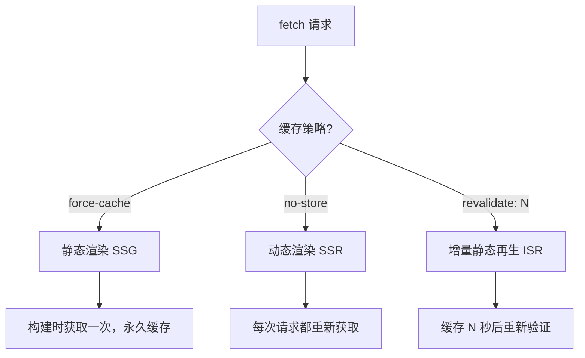

# 3.1.4 数据该何时获取——数据获取策略

### 一句话破题

在 Server Component 中直接 `await` 数据，Next.js 会根据你的缓存配置自动选择最优的渲染策略。

### 核心价值

忘记 `useEffect` 和 `isLoading` 状态管理。App Router 的数据获取模式让你像写后端代码一样直接获取数据——没有客户端请求，没有加载状态管理，数据随 HTML 一起到达浏览器。

### 数据获取基础

**Server Component 中直接获取数据：**

```tsx
// app/posts/page.tsx
async function getPosts() {
  const res = await fetch('https://api.example.com/posts')
  if (!res.ok) throw new Error('获取失败')
  return res.json()
}

export default async function PostsPage() {
  const posts = await getPosts()
  
  return (
    <ul>
      {posts.map((post: any) => (
        <li key={post.id}>{post.title}</li>
      ))}
    </ul>
  )
}
```

### 三种缓存策略

Next.js 扩展了原生 `fetch`，提供了三种缓存行为：



| 策略 | 配置 | 行为 | 适用场景 |
|------|------|------|----------|
| **静态** | `cache: 'force-cache'` | 构建时获取，永久缓存 | 不常变化的内容 |
| **动态** | `cache: 'no-store'` | 每次请求都重新获取 | 实时数据 |
| **ISR** | `next: { revalidate: N }` | 缓存 N 秒后重新验证 | 需要定期更新的内容 |

### 快速上手

**静态渲染（默认）：**

```tsx
// 构建时获取，之后永不更新
const data = await fetch('https://api.example.com/static-data')
```

**动态渲染：**

```tsx
// 每次访问都重新获取
const data = await fetch('https://api.example.com/realtime', {
  cache: 'no-store'
})
```

**ISR（推荐）：**

```tsx
// 每 60 秒重新验证一次
const data = await fetch('https://api.example.com/posts', {
  next: { revalidate: 60 }
})
```

### 页面级缓存配置

除了在 fetch 中配置，也可以在页面级别设置：

```tsx
// app/posts/page.tsx

// 整个页面每 60 秒重新验证
export const revalidate = 60

// 或者强制动态渲染
// export const dynamic = 'force-dynamic'

export default async function PostsPage() {
  // ...
}
```

### 并行数据获取

多个数据源时，使用 `Promise.all` 并行获取：

```tsx
export default async function DashboardPage() {
  // 并行获取，总耗时 = 最慢的那个请求
  const [user, posts, notifications] = await Promise.all([
    getUser(),
    getPosts(),
    getNotifications()
  ])
  
  return (
    <div>
      <UserProfile user={user} />
      <PostList posts={posts} />
      <NotificationBell count={notifications.length} />
    </div>
  )
}
```

### 手动重新验证

对于需要立即更新的场景（如用户提交后），可以手动触发重新验证：

```tsx
// app/actions.ts
'use server'

import { revalidatePath, revalidateTag } from 'next/cache'

export async function createPost(formData: FormData) {
  // 创建文章...
  
  // 方式一：重新验证特定路径
  revalidatePath('/posts')
  
  // 方式二：重新验证特定标签
  revalidateTag('posts')
}
```

配合 fetch 的 tag：

```tsx
const posts = await fetch('https://api.example.com/posts', {
  next: { tags: ['posts'] }
})
```

### 数据获取模式对比

| 模式 | 获取时机 | 首屏速度 | 数据新鲜度 | 适用场景 |
|------|----------|----------|------------|----------|
| **Server Component** | 服务端 | 快 | 可配置 | 大多数场景 |
| **Client fetch** | 客户端 | 慢 | 实时 | 用户交互触发 |
| **Route Handler** | API 路由 | - | 实时 | 第三方调用 |

### AI 协作指南

**核心意图**：让 AI 帮你为页面选择合适的数据获取策略。

**需求定义公式**：
- 功能描述：这个页面需要展示 [数据类型]
- 交互方式：数据更新频率为 [实时/每小时/每天/很少]
- 预期效果：首屏加载 [快速/可接受]，数据 [必须最新/可以稍旧]

**关键术语**：`fetch`、`cache`、`revalidate`、`no-store`、`revalidatePath`、`revalidateTag`

**交互策略**：
1. 描述页面的数据需求和更新频率
2. 让 AI 推荐缓存策略
3. 让它实现数据获取函数
4. 补充手动重新验证逻辑（如需要）

### 避坑指南

1. **Server Component 中不能用 Hooks**：`useState`、`useEffect` 等在服务端不可用
2. **fetch 默认静态缓存**：如需实时数据，必须显式设置 `cache: 'no-store'`
3. **revalidate 是最小间隔**：设置 60 秒不代表每 60 秒必定更新，而是至少 60 秒后才可能更新
4. **错误要处理**：fetch 失败时要有兜底方案，否则整个页面会崩溃

### 验收清单

- [ ] 数据在服务端获取，HTML 中已包含内容
- [ ] 缓存策略与业务需求匹配
- [ ] 多个数据源使用 `Promise.all` 并行获取
- [ ] fetch 错误有适当处理
- [ ] 需要立即更新的场景配置了手动重新验证
