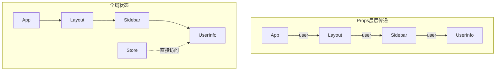
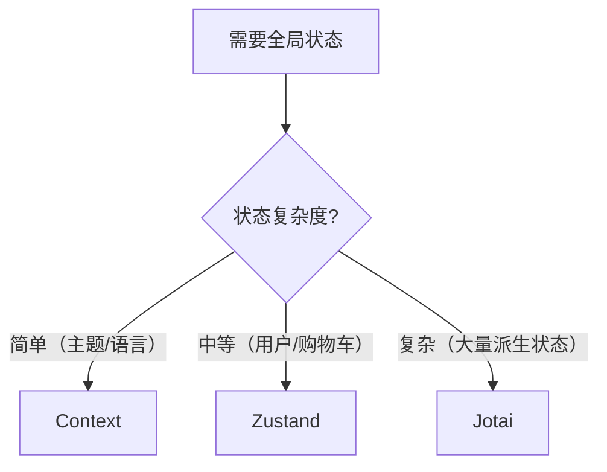

# 3.2.3 复杂状态的全局管理——全局状态管理

### 一句话破题

当状态需要跨越多层组件共享时，全局状态管理让你摆脱"Props 层层传递"的噩梦。

### 核心价值

状态提升解决了兄弟组件共享数据的问题，但当组件层级很深时，中间的组件被迫传递它们根本不关心的 Props。全局状态管理允许任意组件直接访问共享状态。



### 方案一：React Context

内置方案，适合简单场景：

```tsx
'use client'

import { createContext, useContext, useState, ReactNode } from 'react'

// 1. 创建 Context
interface ThemeContextType {
  theme: 'light' | 'dark'
  toggleTheme: () => void
}

const ThemeContext = createContext<ThemeContextType | null>(null)

// 2. 创建 Provider
export function ThemeProvider({ children }: { children: ReactNode }) {
  const [theme, setTheme] = useState<'light' | 'dark'>('light')
  
  const toggleTheme = () => {
    setTheme(prev => prev === 'light' ? 'dark' : 'light')
  }
  
  return (
    <ThemeContext.Provider value={{ theme, toggleTheme }}>
      {children}
    </ThemeContext.Provider>
  )
}

// 3. 创建 Hook（推荐）
export function useTheme() {
  const context = useContext(ThemeContext)
  if (!context) {
    throw new Error('useTheme must be used within ThemeProvider')
  }
  return context
}

// 4. 使用
function ThemeToggle() {
  const { theme, toggleTheme } = useTheme()
  return <button onClick={toggleTheme}>当前：{theme}</button>
}
```

**Context 的局限性：**
- 任何 value 变化都会导致所有消费者重新渲染
- 需要手动优化（useMemo、拆分 Context）
- 不适合频繁更新的状态

### 方案二：Zustand（推荐）

轻量、简单、无样板代码：

```tsx
// store/useUserStore.ts
import { create } from 'zustand'

interface UserState {
  user: { name: string; email: string } | null
  setUser: (user: UserState['user']) => void
  logout: () => void
}

export const useUserStore = create<UserState>((set) => ({
  user: null,
  setUser: (user) => set({ user }),
  logout: () => set({ user: null }),
}))

// 在组件中使用
'use client'

import { useUserStore } from '@/store/useUserStore'

function UserProfile() {
  const user = useUserStore((state) => state.user)
  const logout = useUserStore((state) => state.logout)
  
  if (!user) return <p>请登录</p>
  
  return (
    <div>
      <p>{user.name}</p>
      <button onClick={logout}>退出</button>
    </div>
  )
}
```

**Zustand 的优势：**
- 自动进行细粒度订阅，避免不必要渲染
- 可在 React 外部访问状态
- 支持中间件（持久化、日志等）
- TypeScript 支持良好

### 方案三：Jotai

原子化状态，适合复杂交互：

```tsx
// atoms/userAtom.ts
import { atom } from 'jotai'

export const userAtom = atom<{ name: string } | null>(null)

// 派生状态
export const isLoggedInAtom = atom((get) => get(userAtom) !== null)

// 使用
'use client'

import { useAtom, useAtomValue } from 'jotai'
import { userAtom, isLoggedInAtom } from '@/atoms/userAtom'

function UserStatus() {
  const [user, setUser] = useAtom(userAtom)
  const isLoggedIn = useAtomValue(isLoggedInAtom)  // 只读
  
  return <p>{isLoggedIn ? user?.name : '未登录'}</p>
}
```

### 方案对比

| 特性 | Context | Zustand | Jotai |
|------|---------|---------|-------|
| 学习成本 | 低 | 低 | 中 |
| 样板代码 | 中 | 少 | 少 |
| 渲染优化 | 手动 | 自动 | 自动 |
| 适用场景 | 简单/低频更新 | 通用 | 复杂派生状态 |
| React 外访问 | 困难 | 简单 | 可行 |

### 选择建议



### AI 协作指南

**核心意图**：让 AI 帮你设计全局状态结构和选择合适的方案。

**需求定义公式**：
- 功能描述：需要在 [哪些组件] 之间共享 [什么数据]
- 交互方式：数据更新频率是 [高/中/低]
- 预期效果：状态变化时只有 [哪些组件] 需要重新渲染

**关键术语**：`Context`、`Zustand`、`Jotai`、`atom`、`store`、`selector`

**交互策略**：
1. 描述需要共享的状态和使用场景
2. 让 AI 推荐合适的方案
3. 让它实现 store/context 定义
4. 在组件中集成使用

### 避坑指南

1. **Context 不是万能的**：频繁更新的状态用 Context 会导致性能问题
2. **Zustand selector 要稳定**：避免在组件内创建新的 selector 函数
3. **不要过度使用全局状态**：能用 Props 解决的就不要用全局
4. **Server Component 不能使用 Hooks**：全局状态只能在 Client Component 中访问

### 验收清单

- [ ] 选择了合适的状态管理方案
- [ ] 状态结构设计合理
- [ ] 使用 selector 进行细粒度订阅
- [ ] Provider 包裹在正确的层级
