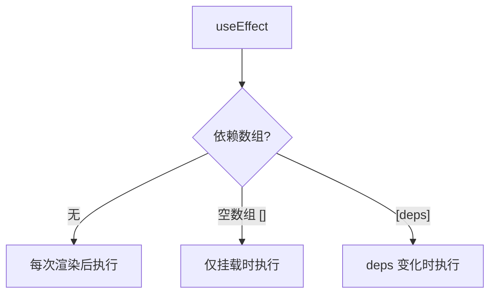

# 3.2.4 积木的副作用怎么办——Effect 副作用

### 一句话破题

useEffect 让你在组件渲染后执行"副作用"操作，如数据获取、订阅事件、操作 DOM。

### 核心价值

React 组件的主要职责是根据 Props 和 State 返回 UI。但有时你需要与"外部世界"交互——这些不直接影响渲染输出的操作就是"副作用"。

**常见副作用：**
- 发起网络请求
- 手动操作 DOM
- 设置定时器
- 订阅事件/WebSocket
- 记录日志

### useEffect 基础

```tsx
'use client'

import { useEffect, useState } from 'react'

function UserProfile({ userId }: { userId: string }) {
  const [user, setUser] = useState(null)
  
  useEffect(() => {
    // 副作用逻辑
    async function fetchUser() {
      const res = await fetch(`/api/users/${userId}`)
      const data = await res.json()
      setUser(data)
    }
    fetchUser()
  }, [userId])  // 依赖数组：userId 变化时重新执行
  
  return <div>{user?.name}</div>
}
```

### 依赖数组详解

```tsx
// 1. 无依赖数组：每次渲染后都执行（谨慎使用）
useEffect(() => {
  console.log('每次渲染后执行')
})

// 2. 空数组：只在挂载时执行一次
useEffect(() => {
  console.log('只在挂载时执行')
}, [])

// 3. 有依赖：依赖变化时执行
useEffect(() => {
  console.log('userId 变化时执行')
}, [userId])
```



### 清理函数

当组件卸载或依赖变化时，需要清理副作用：

```tsx
useEffect(() => {
  // 设置
  const timer = setInterval(() => {
    console.log('tick')
  }, 1000)
  
  // 清理函数（组件卸载或依赖变化前执行）
  return () => {
    clearInterval(timer)
  }
}, [])
```

**需要清理的场景：**

```tsx
// 事件监听
useEffect(() => {
  const handleResize = () => console.log(window.innerWidth)
  window.addEventListener('resize', handleResize)
  return () => window.removeEventListener('resize', handleResize)
}, [])

// WebSocket
useEffect(() => {
  const ws = new WebSocket('wss://...')
  ws.onmessage = (e) => setMessages(prev => [...prev, e.data])
  return () => ws.close()
}, [])

// AbortController（取消请求）
useEffect(() => {
  const controller = new AbortController()
  
  fetch('/api/data', { signal: controller.signal })
    .then(res => res.json())
    .then(setData)
    .catch(err => {
      if (err.name !== 'AbortError') throw err
    })
  
  return () => controller.abort()
}, [])
```

### 常见错误模式

**错误 1：遗漏依赖**

```tsx
// 错误：count 应该在依赖数组中
useEffect(() => {
  const timer = setInterval(() => {
    setCount(count + 1)  // 闭包陷阱
  }, 1000)
  return () => clearInterval(timer)
}, [])  // ESLint 会警告

// 正确：使用函数式更新
useEffect(() => {
  const timer = setInterval(() => {
    setCount(prev => prev + 1)
  }, 1000)
  return () => clearInterval(timer)
}, [])
```

**错误 2：无限循环**

```tsx
// 错误：每次渲染都创建新对象，触发 effect
useEffect(() => {
  setUser({ ...user, lastVisit: new Date() })
}, [user])  // 死循环！

// 正确：只在必要时更新
useEffect(() => {
  setUser(prev => ({ ...prev, lastVisit: new Date() }))
}, [])  // 或使用其他条件
```

### App Router 中的 useEffect

在 App Router 中，**优先使用 Server Component 获取数据**，只在必要时使用 useEffect：

| 场景 | 推荐方案 |
|------|----------|
| 页面初始数据 | Server Component + fetch |
| 用户交互后获取 | useEffect 或 Server Action |
| 订阅/监听 | useEffect |
| DOM 操作 | useEffect |

### AI 协作指南

**核心意图**：让 AI 帮你正确处理副作用逻辑。

**需求定义公式**：
- 功能描述：需要在 [时机] 执行 [操作]
- 交互方式：该操作依赖 [哪些数据] 的变化
- 预期效果：组件卸载时需要 [清理什么]

**关键术语**：`useEffect`、依赖数组、清理函数、`AbortController`

**交互策略**：
1. 描述副作用的触发条件
2. 让 AI 分析正确的依赖数组
3. 确认是否需要清理函数
4. 检查是否有更好的替代方案（如 Server Component）

### 避坑指南

1. **依赖数组要完整**：ESLint 规则 `react-hooks/exhaustive-deps` 会提醒你
2. **对象/函数依赖要稳定**：用 useMemo/useCallback 包裹
3. **异步操作要处理竞态**：使用 AbortController 或 flag 变量
4. **避免在 useEffect 中直接 async**：内部定义 async 函数再调用

### 验收清单

- [ ] 依赖数组完整且正确
- [ ] 需要清理的副作用有返回清理函数
- [ ] 异步请求有竞态处理
- [ ] 考虑过是否可用 Server Component 替代
