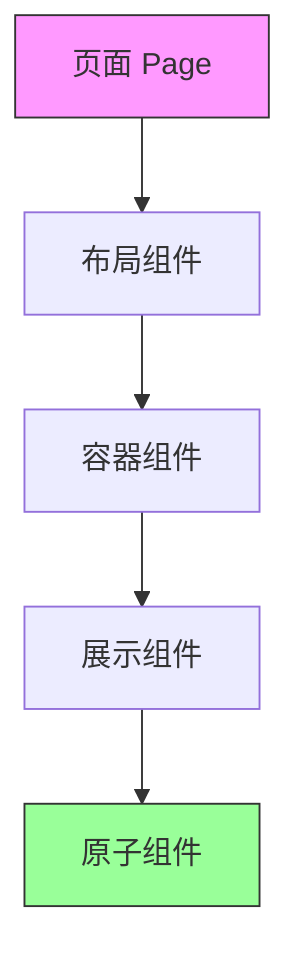
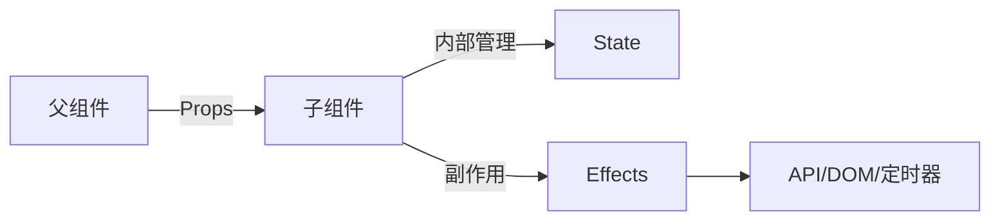

# 3.2 像搭乐高一样构建页面——前端构建块

### 一句话破题

组件是 React 应用的原子单位，通过 Props 传递数据、State 管理内部状态、Effects 处理副作用。

### 本节定位

如果说路由是网站的骨架，那么组件就是构成骨架的每一块积木。本节将教你如何像搭乐高一样，用可复用的组件构建复杂的用户界面。



### 组件化思维的核心

#### 为什么要组件化？

| 传统开发 | 组件化开发 |
|----------|------------|
| 一个页面一坨代码 | 拆分成可复用的小块 |
| 改一处影响全局 | 组件内部独立运作 |
| 复制粘贴满天飞 | 一处修改，处处生效 |
| 难以测试 | 单元测试友好 |

#### 组件的三大要素

1. **Props（属性）**：父组件传递给子组件的数据，只读
2. **State（状态）**：组件内部管理的数据，可变
3. **Effects（副作用）**：与外部世界交互的逻辑



### Server Component vs Client Component

在 App Router 中，组件默认是 Server Component：

| 特性 | Server Component | Client Component |
|------|------------------|------------------|
| 默认值 | 是 | 否（需 `'use client'`） |
| 可使用 Hooks | 否 | 是 |
| 可访问浏览器 API | 否 | 是 |
| 可直接访问数据库 | 是 | 否 |
| 打包到客户端 JS | 否 | 是 |
| 适用场景 | 数据获取、静态 UI | 交互、状态管理 |

**何时使用 Client Component：**

```tsx
'use client' // 在文件顶部声明

import { useState } from 'react'

export function Counter() {
  const [count, setCount] = useState(0)
  
  return (
    <button onClick={() => setCount(count + 1)}>
      点击次数：{count}
    </button>
  )
}
```

### 组件设计原则

1. **单一职责**：每个组件只做一件事
2. **Props 向下，Events 向上**：数据单向流动
3. **组合优于继承**：通过嵌套组合构建复杂 UI
4. **关注点分离**：展示逻辑与业务逻辑分开

### 本节导航

| 小节 | 主题 | 核心内容 |
|------|------|----------|
| **3.2.1** | Props | 类型定义、默认值、children |
| **3.2.2** | State | useState、状态提升 |
| **3.2.3** | 全局状态 | Context、Zustand/Jotai |
| **3.2.4** | Effects | useEffect、清理函数 |
| **3.2.5** | 自定义 Hooks | 逻辑复用与抽象 |
| **3.2.6** | 组件设计 | 单一职责、组合模式 |

### AI 协作指南

**核心意图**：让 AI 帮你设计和实现可复用的组件。

**需求定义公式**：
- 功能描述：我需要一个 [组件名称]，用于 [具体用途]
- 交互方式：用户可以 [操作描述]
- 预期效果：组件展示 [外观描述]，响应 [交互行为]

**关键术语**：`Props`、`State`、`useEffect`、`'use client'`、`Server Component`

**交互策略**：
1. 先让 AI 分析组件应该是 Server 还是 Client
2. 定义 Props 接口
3. 实现基础 UI 结构
4. 添加交互逻辑和状态管理

### 验收清单

- [ ] 理解 Server/Client Component 的区别
- [ ] 知道何时使用 `'use client'`
- [ ] 能够设计合理的 Props 接口
- [ ] 理解数据流动方向（Props 向下，Events 向上）
