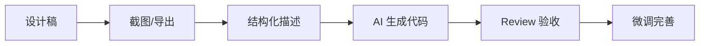

# 3.3 能不能让 AI 看懂设计稿——Figma 集成实战与 AI 协作

### 一句话破题

将设计稿截图或链接提供给 AI，配合清晰的结构描述，让 AI 生成接近设计稿的代码。

### 核心价值

传统的设计到开发流程需要开发者逐像素还原设计稿，耗时且容易出错。在 Vibe Coding 体系下，AI 可以"看懂"设计稿并生成基础代码，你的任务是**验收和微调**。

### 设计稿到代码的工作流



### 准备工作：从 Figma 获取信息

**方式一：截图法（推荐新手）**

1. 在 Figma 中选中目标组件或页面
2. 截取清晰的截图
3. 将截图粘贴到 AI 对话中

**方式二：Dev Mode 导出**

Figma 的 Dev Mode 可以导出：
- CSS 属性（颜色、间距、字体）
- 组件结构
- 资源文件

**方式三：Figma 插件**

一些插件可以直接生成代码：
- **Anima**：导出 React/Vue 代码
- **Locofy**：AI 驱动的代码生成
- **Builder.io**：可视化到代码

### AI 协作：结构化描述设计稿

仅仅给 AI 一张图是不够的。你需要用**结构化语言**描述设计意图：

**有效的 Prompt 模板：**

```
请根据这张设计稿生成 React + Tailwind 代码：

**页面/组件名称**：用户资料卡片

**整体布局**：
- 卡片容器，圆角阴影
- 左侧：用户头像（圆形，64px）
- 右侧：用户信息（姓名、职位、简介）

**交互要求**：
- 鼠标悬停时卡片轻微上浮
- 点击卡片跳转到用户详情页

**样式细节**：
- 背景色：白色
- 阴影：轻微
- 间距：内边距 16px

**技术要求**：
- 使用 Tailwind CSS
- 组件接收 user 对象作为 Props
```

### 关键技巧：分层描述

将设计稿分解为多个层次：

| 层次 | 描述内容 | 示例 |
|------|----------|------|
| **布局层** | 整体结构、容器、网格 | "两栏布局，左侧固定 240px" |
| **组件层** | 独立的 UI 单元 | "卡片、按钮、输入框" |
| **样式层** | 颜色、字体、间距 | "主色调 #3B82F6，圆角 8px" |
| **交互层** | 悬停、点击、动画 | "hover 时放大 1.05 倍" |

### 常见场景实战

**场景一：还原导航栏**

```
设计稿：[粘贴截图]

请生成顶部导航栏代码：
- 左侧：Logo 图片
- 中间：导航链接（首页、产品、关于）
- 右侧：登录/注册按钮
- 移动端：汉堡菜单
- 使用 Next.js Link 组件
- 当前页面链接高亮
```

**场景二：还原表单**

```
设计稿：[粘贴截图]

请生成登录表单：
- 邮箱输入框（带图标）
- 密码输入框（带显示/隐藏切换）
- 记住我复选框
- 登录按钮（主色调）
- 忘记密码链接
- 使用 shadcn/ui 组件
- 添加表单验证提示
```

### 验收清单

AI 生成代码后，按以下清单验收：

- [ ] **布局正确**：元素位置、间距与设计稿一致
- [ ] **响应式**：在不同屏幕尺寸下正常显示
- [ ] **交互完整**：悬停、点击等状态正确
- [ ] **无障碍**：有 alt 文本、正确的语义标签
- [ ] **代码质量**：无重复代码、Props 类型正确

### 常见问题与解决

**问题：AI 生成的布局偏差较大**

解决：
1. 提供更详细的布局描述（使用 Flexbox/Grid 术语）
2. 分步生成：先布局，再填充内容
3. 指定具体的像素值或比例

**问题：颜色不准确**

解决：
1. 从 Figma 复制精确的颜色值
2. 在 Prompt 中明确指定：`背景色 #F3F4F6`
3. 建立设计令牌（Design Tokens）

**问题：组件风格不统一**

解决：
1. 先建立基础组件库（Button、Input 等）
2. 在 Prompt 中引用已有组件
3. 使用 shadcn/ui 保持一致性

### AI 协作指南

**核心意图**：让 AI 理解设计稿并生成可用代码。

**需求定义公式**：
- 视觉描述：[截图] + 布局说明
- 交互描述：用户操作 + 系统响应
- 技术约束：使用的框架/组件库

**关键术语**：`Flexbox`、`Grid`、`Tailwind`、`响应式`、`设计令牌`

**交互策略**：
1. 先给 AI 看整体设计，让它理解上下文
2. 分组件逐个生成，而非一次性生成整页
3. 生成后立即在浏览器中验证
4. 发现偏差时，给 AI 具体的修改指令

### 工具推荐

| 工具 | 用途 | 特点 |
|------|------|------|
| **v0.dev** | 自然语言生成 UI | Vercel 出品，生成 shadcn 组件 |
| **Claude** | 识图 + 代码生成 | 多模态，可直接看图 |
| **Cursor** | IDE 内设计还原 | 可粘贴图片到对话 |

### 最佳实践总结

1. **建立设计系统**：统一颜色、字体、间距，减少每次描述的成本
2. **组件优先**：先生成可复用组件，再组合成页面
3. **增量开发**：不要一次性生成整个页面，分块进行
4. **及时验收**：每生成一个组件就验证，避免错误累积
5. **保留原稿**：将设计稿截图保存在项目中，方便后续对照
