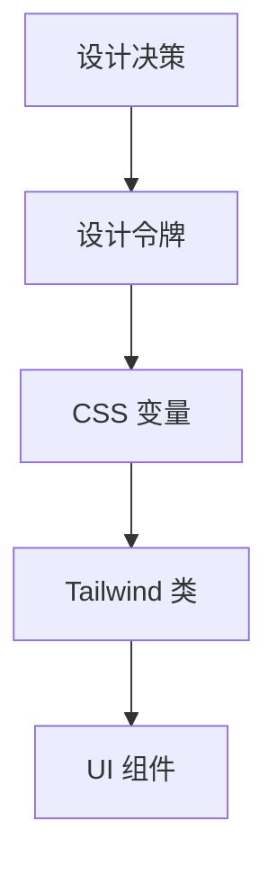

# 3.4.3 告别五颜六色的黑——设计系统

### 一句话破题

设计系统是一套统一的视觉规范（颜色、字体、间距），确保 UI 一致性并简化与 AI 的协作。

### 核心价值

没有设计系统，每次描述颜色都要说"那种蓝"、"稍微深一点的灰"。有了设计系统，你只需说 `primary`、`muted`，AI 就知道确切的值。

### 设计令牌（Design Tokens）

设计令牌是设计系统的基础，它将设计决策抽象为可复用的变量：



### 颜色系统

**语义化颜色（推荐）**

shadcn/ui 使用语义化颜色命名：

| 变量 | 用途 | 示例 |
|------|------|------|
| `--background` | 页面背景 | 白色/深灰 |
| `--foreground` | 主要文字 | 黑色/白色 |
| `--primary` | 品牌主色 | 蓝色 |
| `--secondary` | 次要元素 | 浅灰 |
| `--muted` | 弱化内容 | 灰色文字 |
| `--accent` | 强调元素 | 悬停背景 |
| `--destructive` | 危险操作 | 红色 |

**在 CSS 中定义**

```css
/* globals.css */
@layer base {
  :root {
    --background: 0 0% 100%;
    --foreground: 222.2 84% 4.9%;
    --primary: 222.2 47.4% 11.2%;
    --primary-foreground: 210 40% 98%;
    --secondary: 210 40% 96%;
    --muted: 210 40% 96%;
    --muted-foreground: 215.4 16.3% 46.9%;
    --accent: 210 40% 96%;
    --destructive: 0 84.2% 60.2%;
  }

  .dark {
    --background: 222.2 84% 4.9%;
    --foreground: 210 40% 98%;
    /* ... */
  }
}
```

**在 Tailwind 中使用**

```tsx
<div className="bg-background text-foreground">
  <button className="bg-primary text-primary-foreground">
    主按钮
  </button>
  <p className="text-muted-foreground">
    次要文字
  </p>
</div>
```

### 字体系统

**字号规范**

| 类名 | 大小 | 用途 |
|------|------|------|
| `text-xs` | 12px | 辅助信息、标签 |
| `text-sm` | 14px | 次要内容、表单 |
| `text-base` | 16px | 正文 |
| `text-lg` | 18px | 小标题 |
| `text-xl` | 20px | 标题 |
| `text-2xl` | 24px | 大标题 |
| `text-3xl` | 30px | 页面标题 |

**字重规范**

| 类名 | 字重 | 用途 |
|------|------|------|
| `font-normal` | 400 | 正文 |
| `font-medium` | 500 | 强调 |
| `font-semibold` | 600 | 小标题 |
| `font-bold` | 700 | 标题 |

**配置自定义字体**

```ts
// tailwind.config.ts
import { fontFamily } from "tailwindcss/defaultTheme"

export default {
  theme: {
    extend: {
      fontFamily: {
        sans: ["Inter", ...fontFamily.sans],
        mono: ["JetBrains Mono", ...fontFamily.mono],
      },
    },
  },
}
```

### 间距系统

Tailwind 使用 4px 为基础单位：

| 值 | 像素 | 常见用途 |
|-----|------|----------|
| `1` | 4px | 图标与文字间距 |
| `2` | 8px | 紧凑元素间距 |
| `3` | 12px | 表单元素内边距 |
| `4` | 16px | 卡片内边距、默认间距 |
| `6` | 24px | 区块间距 |
| `8` | 32px | 大区块间距 |
| `12` | 48px | 页面区域分隔 |

**间距使用原则**

1. **一致性**：相同层级的元素使用相同间距
2. **层次感**：父子元素间距 < 兄弟元素间距
3. **呼吸感**：重要内容周围留更多空白

### 圆角与阴影

**圆角规范**

| 类名 | 值 | 用途 |
|------|-----|------|
| `rounded-sm` | 2px | 小元素 |
| `rounded` | 4px | 默认 |
| `rounded-md` | 6px | 按钮、输入框 |
| `rounded-lg` | 8px | 卡片 |
| `rounded-xl` | 12px | 大卡片 |
| `rounded-full` | 9999px | 圆形头像、标签 |

**阴影规范**

| 类名 | 用途 |
|------|------|
| `shadow-sm` | 悬浮卡片、下拉菜单 |
| `shadow` | 普通卡片 |
| `shadow-md` | 弹窗、模态框 |
| `shadow-lg` | 重要浮层 |

### 建立项目设计系统

**1. 定义设计变量文件**

```ts
// lib/design-tokens.ts
export const colors = {
  brand: {
    primary: "#3B82F6",
    secondary: "#10B981",
    accent: "#F59E0B",
  },
  semantic: {
    success: "#22C55E",
    warning: "#EAB308",
    error: "#EF4444",
    info: "#3B82F6",
  },
}

export const spacing = {
  page: "max-w-7xl mx-auto px-4 sm:px-6 lg:px-8",
  section: "py-12 md:py-16 lg:py-20",
  card: "p-4 md:p-6",
}
```

**2. 扩展 Tailwind 配置**

```ts
// tailwind.config.ts
import { colors } from "./lib/design-tokens"

export default {
  theme: {
    extend: {
      colors: {
        brand: colors.brand,
      },
    },
  },
}
```

### AI 协作指南

**核心意图**：让 AI 使用统一的设计语言。

**需求定义公式**：
- 项目使用 [设计系统名/自定义规范]
- 颜色使用语义化变量：`primary`、`muted`、`destructive`
- 间距遵循 4px 基础单位

**关键术语**：`设计令牌`、`语义化颜色`、`CSS 变量`、`主题切换`

**交互策略**：
1. 项目初期向 AI 说明设计系统规范
2. 在 Prompt 中使用设计系统术语
3. 要求 AI 使用已定义的颜色/间距变量

### 验收清单

- [ ] 颜色使用语义化变量，不是硬编码值
- [ ] 字号使用 Tailwind 预设类
- [ ] 间距遵循 4px 倍数规律
- [ ] 暗色模式颜色正确切换
