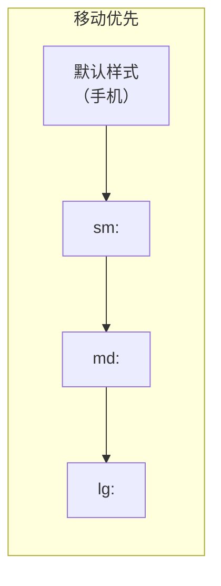

# 3.4.4 手机和电脑都能看——响应式设计

### 一句话破题

移动优先意味着先为小屏设计，再逐步增强大屏体验，Tailwind 的断点系统天然支持这种方式。

### 核心价值

超过 50% 的网页流量来自移动设备。响应式设计确保你的应用在任何设备上都能提供良好体验，而移动优先策略让这个过程更简单。

### 移动优先 vs 桌面优先



**移动优先**：默认样式面向手机，用断点添加大屏样式。

```html
<!-- 移动优先：默认单列，md 以上两列 -->
<div class="grid grid-cols-1 md:grid-cols-2">
```

**桌面优先**（不推荐）：默认样式面向桌面，用 `max-*` 断点收缩。

### Tailwind 断点详解

| 断点 | 最小宽度 | 典型设备 |
|------|----------|----------|
| 默认 | 0px | 手机（竖屏） |
| `sm:` | 640px | 手机（横屏） |
| `md:` | 768px | 平板 |
| `lg:` | 1024px | 笔记本 |
| `xl:` | 1280px | 桌面显示器 |
| `2xl:` | 1536px | 大显示器 |

### 常见响应式模式

**1. 响应式网格**

```tsx
<div className="grid grid-cols-1 sm:grid-cols-2 lg:grid-cols-3 xl:grid-cols-4 gap-4">
  {products.map(product => (
    <ProductCard key={product.id} {...product} />
  ))}
</div>
```

**2. 响应式导航**

```tsx
function Navbar() {
  return (
    <nav className="flex items-center justify-between p-4">
      <Logo />
      
      {/* 桌面导航：大屏显示 */}
      <div className="hidden md:flex gap-6">
        <NavLink href="/">首页</NavLink>
        <NavLink href="/products">产品</NavLink>
        <NavLink href="/about">关于</NavLink>
      </div>
      
      {/* 移动端汉堡菜单：小屏显示 */}
      <button className="md:hidden">
        <MenuIcon />
      </button>
    </nav>
  )
}
```

**3. 响应式字体**

```html
<h1 class="text-2xl sm:text-3xl md:text-4xl lg:text-5xl font-bold">
  响应式标题
</h1>
```

**4. 响应式间距**

```html
<section class="py-8 md:py-12 lg:py-16">
  <div class="px-4 md:px-6 lg:px-8 max-w-7xl mx-auto">
    内容区域
  </div>
</section>
```

**5. 响应式隐藏/显示**

| 类 | 效果 |
|-----|------|
| `hidden` | 默认隐藏 |
| `block` | 默认显示 |
| `md:hidden` | md 以上隐藏 |
| `hidden md:block` | md 以下隐藏，md 以上显示 |

### 响应式布局组件

**容器组件**

```tsx
function Container({ children }: { children: React.ReactNode }) {
  return (
    <div className="w-full max-w-7xl mx-auto px-4 sm:px-6 lg:px-8">
      {children}
    </div>
  )
}
```

**响应式卡片列表**

```tsx
function CardGrid({ children }: { children: React.ReactNode }) {
  return (
    <div className="grid grid-cols-1 sm:grid-cols-2 lg:grid-cols-3 gap-4 md:gap-6">
      {children}
    </div>
  )
}
```

**响应式侧边栏布局**

```tsx
function DashboardLayout({ children }: { children: React.ReactNode }) {
  return (
    <div className="flex flex-col md:flex-row min-h-screen">
      {/* 侧边栏：移动端在顶部，桌面端在左侧 */}
      <aside className="w-full md:w-64 bg-gray-100 p-4">
        <Sidebar />
      </aside>
      
      {/* 主内容区 */}
      <main className="flex-1 p-4 md:p-6">
        {children}
      </main>
    </div>
  )
}
```

### 响应式图片

```tsx
import Image from 'next/image'

function ResponsiveImage() {
  return (
    <div className="relative w-full aspect-video md:aspect-[4/3] lg:aspect-[16/9]">
      <Image
        src="/hero.jpg"
        alt="Hero"
        fill
        className="object-cover"
        sizes="(max-width: 768px) 100vw, (max-width: 1200px) 50vw, 33vw"
      />
    </div>
  )
}
```

### 调试响应式

**1. 浏览器开发者工具**

Chrome DevTools 的设备模拟器可以快速切换不同尺寸。

**2. Tailwind 调试指示器**

```tsx
// 开发时添加到页面角落
function BreakpointIndicator() {
  if (process.env.NODE_ENV === 'production') return null
  
  return (
    <div className="fixed bottom-4 left-4 bg-black text-white px-2 py-1 text-xs rounded z-50">
      <span className="sm:hidden">xs</span>
      <span className="hidden sm:inline md:hidden">sm</span>
      <span className="hidden md:inline lg:hidden">md</span>
      <span className="hidden lg:inline xl:hidden">lg</span>
      <span className="hidden xl:inline 2xl:hidden">xl</span>
      <span className="hidden 2xl:inline">2xl</span>
    </div>
  )
}
```

### AI 协作指南

**核心意图**：让 AI 生成移动优先的响应式代码。

**需求定义公式**：
- 功能描述：[组件/页面]
- 响应式要求：移动端 [布局]，桌面端 [布局]
- 断点：使用 Tailwind 默认断点

**关键术语**：`移动优先`、`断点`、`grid`、`hidden`、`flex-col md:flex-row`

**示例 Prompt**：

```
创建一个产品列表页面：
- 移动端：单列卡片
- 平板（md）：两列
- 桌面（lg）：三列
- 使用 Tailwind 响应式类
- 卡片间距：移动端 16px，桌面 24px
```

### 避坑指南

1. **不要使用 `max-*` 断点**：除非特殊情况，坚持移动优先
2. **测试真实设备**：模拟器不能完全替代真机测试
3. **注意触控目标**：移动端按钮至少 44x44px
4. **避免横向滚动**：确保内容不超出视口

### 验收清单

- [ ] 默认样式针对移动端
- [ ] 关键断点（md、lg）有对应样式
- [ ] 导航在移动端可用（汉堡菜单或底部导航）
- [ ] 图片使用 `sizes` 属性优化加载
- [ ] 触控元素足够大
