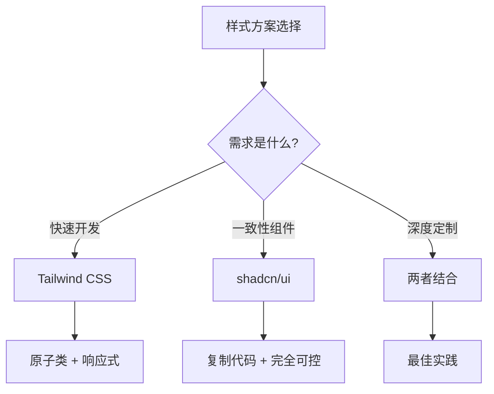

# 3.4 告别选择困难症——Tailwind + shadcn/ui

### 一句话破题

Tailwind 提供原子化样式类，shadcn/ui 提供可定制组件，两者结合是 Next.js 项目的最佳样式方案。

### 核心价值

CSS 的世界充满选择：CSS Modules、Styled Components、Emotion、Sass……每种方案都有优缺点。Tailwind + shadcn/ui 的组合已成为 React 社区的主流选择，也是 Vibe Coding 技术栈的标配。

### 为什么选择这套方案？



| 方案 | 优点 | 缺点 |
|------|------|------|
| **Tailwind CSS** | 无需命名、快速迭代、体积小 | 类名长、需要学习 |
| **shadcn/ui** | 高质量组件、完全可定制 | 需要手动安装 |
| **传统 CSS** | 熟悉、无学习成本 | 命名困难、样式冲突 |
| **CSS-in-JS** | 组件化、动态样式 | 运行时开销 |

### 本节导航

| 小节 | 主题 | 核心内容 |
|------|------|----------|
| **3.4.1** | Tailwind CSS | 原子化 CSS、常用类、响应式 |
| **3.4.2** | shadcn/ui | 安装使用、组件定制 |
| **3.4.3** | 设计系统 | 颜色/字体/间距规范 |
| **3.4.4** | 响应式设计 | 移动优先、断点策略 |

### 快速开始

**1. 创建项目时已包含 Tailwind**

```bash
npx create-next-app@latest my-app
# 选择 Yes 使用 Tailwind CSS
```

**2. 安装 shadcn/ui**

```bash
npx shadcn@latest init
```

**3. 添加组件**

```bash
npx shadcn@latest add button
npx shadcn@latest add card
npx shadcn@latest add input
```

### AI 协作指南

**核心意图**：让 AI 使用 Tailwind + shadcn 生成一致的 UI 代码。

**需求定义公式**：
- 功能描述：我需要一个 [组件/页面]
- 样式要求：使用 Tailwind CSS
- 组件要求：使用 shadcn/ui 的 [组件名]

**关键术语**：`Tailwind`、`shadcn/ui`、`cn()`、`className`、`响应式`

**示例 Prompt**：

```
请用 Tailwind CSS 和 shadcn/ui 创建一个登录表单：
- 使用 Card 作为容器
- 使用 Input 组件（邮箱和密码）
- 使用 Button 组件（登录按钮）
- 添加"忘记密码"链接
- 响应式：移动端全宽，桌面端最大 400px
```

### 验收清单

- [ ] Tailwind 配置正确，样式生效
- [ ] shadcn/ui 组件正确安装和导入
- [ ] 组件使用 `cn()` 合并样式类
- [ ] 响应式断点设置合理
