# 3.5.1 看看网络请求慢在哪——Network 面板

### 一句话破题

数据不显示？接口报错？Network 面板能告诉你每个请求的完整生命周期。

### 核心价值

前端应用的大部分问题都与网络请求相关。Network 面板让你看到：请求发出去了吗？服务器返回了什么？花了多长时间？

### 打开 Network 面板

1. 打开 Chrome DevTools（F12 或右键 → 检查）
2. 点击 "Network" 标签
3. **刷新页面**以开始捕获请求

### 面板核心区域

```
┌─────────────────────────────────────────────────────┐
│ [过滤器] All | Fetch/XHR | JS | CSS | Img | ...     │
├─────────────────────────────────────────────────────┤
│ Name          Status  Type    Size    Time          │
│ api/users     200     fetch   1.2KB   120ms         │
│ api/posts     404     fetch   0.5KB   80ms   ← 问题 │
│ bundle.js     200     script  450KB   1.2s          │
├─────────────────────────────────────────────────────┤
│ [请求详情面板]                                       │
│ Headers | Preview | Response | Timing               │
└─────────────────────────────────────────────────────┘
```

### 快速过滤请求

| 过滤器 | 用途 |
|--------|------|
| **Fetch/XHR** | 只看 API 请求（最常用） |
| **JS** | JavaScript 文件 |
| **CSS** | 样式文件 |
| **Img** | 图片资源 |
| **搜索框** | 按 URL 关键词过滤 |

### 查看请求详情

点击任意请求，右侧会展开详情面板：

**Headers 标签**

```
General:
  Request URL: https://api.example.com/users
  Request Method: GET
  Status Code: 200 OK

Request Headers:
  Authorization: Bearer eyJhbGc...
  Content-Type: application/json

Response Headers:
  Content-Type: application/json
  Cache-Control: max-age=3600
```

**Response 标签**

显示服务器返回的原始数据：

```json
{
  "users": [
    { "id": 1, "name": "张三" },
    { "id": 2, "name": "李四" }
  ]
}
```

**Preview 标签**

以格式化的方式展示响应数据，更易读。

**Timing 标签**

```mermaid
gantt
    title 请求时间线
    dateFormat X
    axisFormat %L ms
    
    section 连接
    DNS 解析      :0, 10
    TCP 连接      :10, 30
    SSL 握手      :30, 50
    
    section 请求
    等待服务器    :50, 150
    下载响应      :150, 180
```



### 常见问题诊断

**问题 1：请求返回 4xx/5xx**

| 状态码 | 含义 | 常见原因 |
|--------|------|----------|
| 400 | Bad Request | 请求参数格式错误 |
| 401 | Unauthorized | 未登录或 token 过期 |
| 403 | Forbidden | 无权限访问 |
| 404 | Not Found | URL 路径错误 |
| 500 | Internal Server Error | 服务端代码报错 |

**检查步骤**：
1. 查看 Response 标签，服务器通常会返回错误描述
2. 对比 Request Headers 中的 Authorization 是否正确
3. 检查请求 URL 和参数是否符合 API 文档

**问题 2：请求没发出去**

可能原因：
- 代码逻辑问题，请求函数没被调用
- CORS 跨域问题（Console 会有报错）
- 网络断开

**问题 3：请求很慢**

查看 Timing 标签，定位瓶颈：
- **TTFB 高**：服务器处理慢，需优化后端
- **Content Download 高**：响应体太大，考虑分页或压缩
- **Stalled 高**：浏览器连接数限制，减少并发请求

### 实用技巧

**复制请求为 cURL**

右键请求 → Copy → Copy as cURL

可以在终端直接执行，或粘贴给后端同事调试：

```bash
curl 'https://api.example.com/users' \
  -H 'Authorization: Bearer xxx' \
  -H 'Content-Type: application/json'
```

**保留日志**

勾选 "Preserve log"，页面跳转后请求记录不会清空。

**模拟慢网**

点击 "No throttling" 下拉菜单，可以模拟 3G、离线等网络环境。

**禁用缓存**

勾选 "Disable cache"，确保每次都是新请求。

### AI 协作指南

**核心意图**：用 Network 信息帮 AI 定位问题。

**有效的描述方式**：

```
我的 API 请求返回了错误：
- URL: /api/posts
- Method: POST
- Status: 400
- Request Body: {"title": ""}
- Response: {"error": "title is required"}

请问如何修复？
```

**关键术语**：`Status Code`、`Request Headers`、`Response Body`、`CORS`、`TTFB`

### 避坑指南

1. **记得刷新页面**：打开 Network 面板后要刷新，否则看不到请求
2. **关注 Fetch/XHR**：调试 API 时只看这类请求，减少干扰
3. **区分预检请求**：CORS 会先发 OPTIONS 请求，真正的请求在后面
4. **注意缓存**：304 状态码表示使用了缓存，勾选 Disable cache 避免干扰

### 验收清单

- [ ] 能够找到指定的 API 请求
- [ ] 能够查看请求的状态码和响应内容
- [ ] 能够分析请求的时间消耗
- [ ] 知道如何复制请求为 cURL
