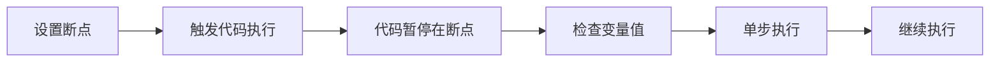

# 3.5.2 代码到底跑没跑——Console 调试

### 一句话破题

Console 是你与代码对话的窗口——打印变量、追踪执行、捕获错误。

### 核心价值

代码不按预期工作时，你需要知道：这段代码执行了吗？变量的值是什么？在哪里出错了？Console 面板能回答所有这些问题。

### Console 日志方法

```tsx
// 基础日志
console.log('普通信息', data)

// 警告（黄色）
console.warn('这是一个警告')

// 错误（红色）
console.error('这是一个错误')

// 表格形式显示数组/对象
console.table([{ id: 1, name: '张三' }, { id: 2, name: '李四' }])

// 分组日志
console.group('用户操作')
console.log('点击了按钮')
console.log('发送了请求')
console.groupEnd()

// 计时
console.time('数据处理')
// ... 耗时操作
console.timeEnd('数据处理') // 输出: 数据处理: 123.45ms

// 条件日志（只在条件为 false 时输出）
console.assert(user !== null, '用户不应该为 null')
```

### 读懂错误信息

当 JavaScript 报错时，Console 会显示红色错误信息：

```
Uncaught TypeError: Cannot read properties of undefined (reading 'name')
    at UserProfile (UserProfile.tsx:15:23)
    at renderWithHooks (react-dom.development.js:16305:18)
    at mountIndeterminateComponent (react-dom.development.js:20074:13)
```

**拆解错误信息**：

| 部分 | 含义 |
|------|------|
| `Uncaught TypeError` | 错误类型：类型错误 |
| `Cannot read properties of undefined` | 尝试读取 undefined 的属性 |
| `(reading 'name')` | 具体是读取 `name` 属性时出错 |
| `at UserProfile (UserProfile.tsx:15:23)` | 出错位置：文件第 15 行第 23 列 |

**常见错误类型**：

| 错误类型 | 含义 | 常见场景 |
|----------|------|----------|
| `TypeError` | 类型错误 | 对 undefined/null 调用方法 |
| `ReferenceError` | 引用错误 | 使用未声明的变量 |
| `SyntaxError` | 语法错误 | 代码语法问题 |
| `RangeError` | 范围错误 | 递归溢出、无效数组长度 |

### 调试技巧

**技巧 1：定位代码是否执行**

```tsx
function handleClick() {
  console.log('1. 函数开始执行')
  
  if (someCondition) {
    console.log('2. 进入了 if 分支')
    // ...
  }
  
  console.log('3. 函数执行完毕')
}
```

**技巧 2：检查变量值**

```tsx
function processData(data) {
  console.log('收到的数据:', data)
  console.log('数据类型:', typeof data)
  console.log('是否为数组:', Array.isArray(data))
  
  // 如果是对象，展开查看所有属性
  console.dir(data)
}
```

**技巧 3：追踪调用栈**

```tsx
function problematicFunction() {
  console.trace('追踪调用栈') // 显示是谁调用了这个函数
}
```

### 使用断点调试

比 `console.log` 更强大的是断点调试：

1. 打开 DevTools → Sources 面板
2. 找到对应的源文件
3. 点击行号设置断点
4. 刷新页面或触发相关操作



**断点面板控制按钮**：

| 按钮 | 功能 |
|------|------|
| ▶️ Resume | 继续执行到下一个断点 |
| ⏭️ Step Over | 执行当前行，不进入函数内部 |
| ⬇️ Step Into | 进入函数内部 |
| ⬆️ Step Out | 跳出当前函数 |

**条件断点**：

右键点击行号 → Add conditional breakpoint

```javascript
// 只在 userId 为 5 时暂停
userId === 5
```

### React 中的 Console 调试

**调试 Props**：

```tsx
function UserCard({ user }) {
  console.log('UserCard 收到的 props:', { user })
  
  return <div>{user.name}</div>
}
```

**调试 State 更新**：

```tsx
function Counter() {
  const [count, setCount] = useState(0)
  
  useEffect(() => {
    console.log('count 更新为:', count)
  }, [count])
  
  // ...
}
```

**调试 useEffect 执行**：

```tsx
useEffect(() => {
  console.log('Effect 执行，依赖值:', { userId })
  
  return () => {
    console.log('Effect 清理')
  }
}, [userId])
```

### AI 协作指南

**核心意图**：把错误信息准确传达给 AI。

**有效的描述方式**：

```
我的代码报错了：

错误信息：
TypeError: Cannot read properties of undefined (reading 'map')
    at ProductList (ProductList.tsx:12:18)

相关代码：
function ProductList({ products }) {
  return products.map(p => <div>{p.name}</div>)
}

// 调用方式
<ProductList products={data?.products} />
```

**关键术语**：`TypeError`、`undefined`、`调用栈`、`断点`、`单步执行`

### 避坑指南

1. **生产环境移除 console.log**：使用 ESLint 规则或构建时自动移除
2. **不要日志敏感信息**：密码、token 等不应打印到控制台
3. **日志要有意义**：`console.log(1)` 不如 `console.log('请求发送前:', payload)`
4. **利用分组**：复杂流程使用 `console.group()` 组织日志

### 验收清单

- [ ] 能够使用 console.log 输出变量值
- [ ] 能够看懂错误信息并定位问题文件和行号
- [ ] 知道如何设置断点进行调试
- [ ] 能够使用单步执行追踪代码流程
