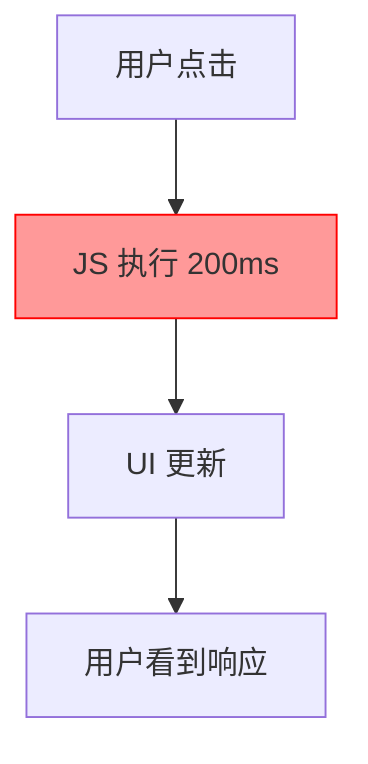

# 3.5.3 为什么页面这么卡——Performance 分析

### 一句话破题

当页面感觉"卡"的时候，Performance 面板能告诉你时间都花在了哪里。

### 核心价值

用户对卡顿非常敏感——超过 100ms 的响应延迟就会被感知。Performance 面板让你看到浏览器在每一毫秒都在做什么，从而找出性能瓶颈。

### 录制性能数据

1. 打开 DevTools → Performance 面板
2. 点击 **Record** 按钮（或 Ctrl+E）
3. 执行你想分析的操作（如页面滚动、按钮点击）
4. 点击 **Stop** 结束录制

### 理解火焰图

录制完成后，你会看到一个"火焰图"：

```
Main Thread
├── Task (200ms) ← 长任务！
│   ├── Function Call: heavyCalculation (150ms)
│   └── Function Call: updateDOM (50ms)
├── Task (16ms)
│   └── Render (16ms)
└── Task (8ms)
    └── Paint (8ms)
```

**关键概念**：

| 术语 | 含义 |
|------|------|
| **Main Thread** | 主线程，JS 执行和 UI 渲染都在这里 |
| **Task** | 一个执行任务 |
| **Long Task** | 超过 50ms 的任务（红色标记） |
| **Frame** | 一帧渲染（目标 16.67ms = 60fps） |

### 识别性能问题

**问题 1：长任务阻塞**



长任务会阻塞主线程，导致页面无响应。

**优化方案**：
- 拆分长任务为多个小任务
- 使用 `requestAnimationFrame` 分帧处理
- 将计算移至 Web Worker

```tsx
// 问题代码：同步处理大量数据
function processAllItems(items) {
  items.forEach(item => heavyProcess(item)) // 阻塞 200ms
}

// 优化：分批处理
async function processItemsInChunks(items) {
  const chunkSize = 100
  for (let i = 0; i < items.length; i += chunkSize) {
    const chunk = items.slice(i, i + chunkSize)
    chunk.forEach(item => heavyProcess(item))
    await new Promise(resolve => setTimeout(resolve, 0)) // 让出主线程
  }
}
```

**问题 2：频繁重绘/重排**

Layout（重排）和 Paint（重绘）是昂贵的操作：

```tsx
// 问题：读写交替导致强制重排
elements.forEach(el => {
  const height = el.offsetHeight // 读
  el.style.height = height + 10 + 'px' // 写
})

// 优化：批量读，批量写
const heights = elements.map(el => el.offsetHeight) // 批量读
elements.forEach((el, i) => {
  el.style.height = heights[i] + 10 + 'px' // 批量写
})
```

**问题 3：内存泄漏**

切换到 Memory 面板检查：

1. 点击 **Take heap snapshot**
2. 执行一些操作（如打开/关闭弹窗）
3. 再次 **Take heap snapshot**
4. 比较两个快照，查看是否有未释放的对象

**常见内存泄漏场景**：

```tsx
// 泄漏：事件监听未清理
useEffect(() => {
  window.addEventListener('resize', handleResize)
  // 忘记 return 清理函数！
}, [])

// 正确：清理事件监听
useEffect(() => {
  window.addEventListener('resize', handleResize)
  return () => window.removeEventListener('resize', handleResize)
}, [])
```

### React 性能优化

**1. 避免不必要的重渲染**

使用 `React.memo` 包裹纯展示组件：

```tsx
const ExpensiveComponent = React.memo(function ExpensiveComponent({ data }) {
  // 只有 data 变化时才重新渲染
  return <div>{/* 复杂渲染 */}</div>
})
```

**2. 使用 useMemo 缓存计算结果**

```tsx
const sortedList = useMemo(() => {
  return items.sort((a, b) => a.name.localeCompare(b.name))
}, [items]) // 只有 items 变化时才重新排序
```

**3. 使用 useCallback 稳定回调引用**

```tsx
const handleClick = useCallback(() => {
  doSomething(id)
}, [id]) // 只有 id 变化时才创建新函数
```

### 性能指标

| 指标 | 含义 | 目标值 |
|------|------|--------|
| **FCP** | First Contentful Paint | < 1.8s |
| **LCP** | Largest Contentful Paint | < 2.5s |
| **FID** | First Input Delay | < 100ms |
| **CLS** | Cumulative Layout Shift | < 0.1 |
| **TTI** | Time to Interactive | < 3.8s |

使用 Lighthouse 面板可以自动测量这些指标。

### AI 协作指南

**核心意图**：用性能数据帮 AI 定位优化点。

**有效的描述方式**：

```
页面滚动时很卡，Performance 录制显示：
- Main Thread 有多个 200ms+ 的长任务
- 长任务主要来自 `renderList` 函数
- 列表有 1000 个项目

请问如何优化？
```

**关键术语**：`Long Task`、`Layout`、`Paint`、`React.memo`、`虚拟滚动`

### 避坑指南

1. **不要过早优化**：先确认问题存在，再优化
2. **测量要在生产模式**：开发模式的 React 会慢很多
3. **关注真实用户指标**：使用 RUM 监控真实用户体验
4. **优先优化关键路径**：首屏渲染比次要交互更重要

### 验收清单

- [ ] 能够录制并分析 Performance 数据
- [ ] 能够识别火焰图中的长任务
- [ ] 知道如何检测内存泄漏
- [ ] 了解 React 常用的性能优化方法
