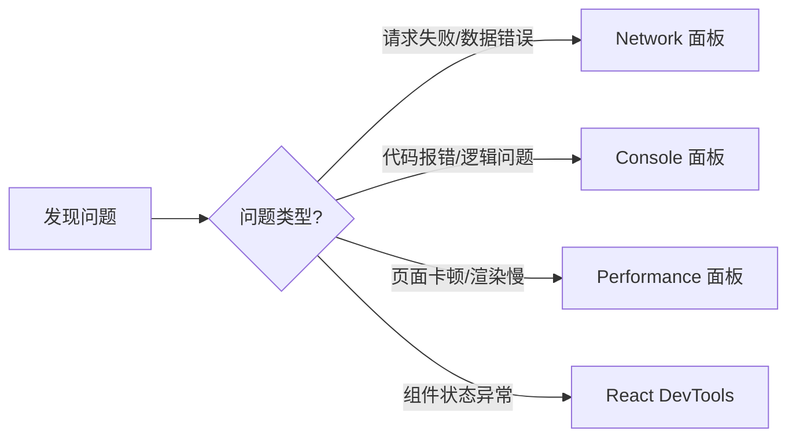

# 3.5 别靠猜来找 Bug——Debug 实战

### 一句话破题

调试不是玄学，而是科学——用正确的工具，在正确的位置，观察正确的数据。

### 本节定位

当代码不按预期工作时，新手往往陷入"猜测-修改-祈祷"的循环。而高手会打开 DevTools，用数据说话。本节将教你掌握 Chrome DevTools 的四大核心面板，让问题无所遁形。

### 调试思维模型

高效调试遵循**定位-观察-验证**的循环：

| 阶段 | 行动 | 工具 |
|------|------|------|
| **定位** | 缩小问题范围 | 二分法注释代码 |
| **观察** | 收集运行时数据 | DevTools 各面板 |
| **验证** | 确认假设是否正确 | 修改代码并测试 |

### 调试前的准备

在开始调试之前，确保你的开发环境配置正确：

1. **开发模式**：确保运行的是 `npm run dev` 而非生产构建
2. **Source Maps**：确保 TypeScript/JavaScript 的 source map 已启用
3. **React DevTools**：安装 Chrome 扩展程序
4. **禁用缓存**：在 Network 面板勾选 "Disable cache"

### 本节导航

| 小节 | 主题 | 解决什么问题 |
|------|------|--------------|
| **3.5.1** | Network 面板 | 请求失败、数据格式错误、接口慢 |
| **3.5.2** | Console 调试 | 代码报错、逻辑判断、变量值检查 |
| **3.5.3** | Performance 分析 | 页面卡顿、渲染性能、内存泄漏 |
| **3.5.4** | React DevTools | 组件状态、Props 传递、重渲染问题 |

### 常见问题速查表

| 现象 | 可能原因 | 检查工具 | 检查要点 |
|------|----------|----------|----------|
| 白屏 | JS 报错 | Console | 红色错误信息 |
| 数据不显示 | 请求失败 | Network | 状态码、响应体 |
| 页面卡顿 | 渲染性能 | Performance | 长任务、重绘 |
| 状态不更新 | React 状态 | React DevTools | 组件状态、Props |

### AI 协作指南

**核心意图**：当遇到 Bug 时，先用 DevTools 收集信息，再让 AI 帮你分析。

**有效的求助方式**：
- "Network 显示请求返回 500，响应体是 [粘贴响应]，这是什么问题？"
- "Console 报错 [粘贴错误栈]，这个错误是什么意思？"
- "Performance 录制显示这个函数执行了 200ms，如何优化？"

**无效的求助方式**：
- "页面白屏了，怎么办？"（信息不足）
- "代码不工作"（没有具体描述）

### Vibe Coding 视角

在 Vibe Coding 体系下，调试能力决定了你能否有效验收 AI 生成的代码。当 AI 写的代码不工作时，你需要：

1. **用 DevTools 定位问题**：而不是盲目让 AI "修一修"
2. **给 AI 精确的反馈**：提供错误信息、网络请求截图
3. **验证 AI 的修复**：确认问题真的解决了，而非引入新问题

### 验收清单

- [ ] 知道如何打开 Chrome DevTools（F12 或 Cmd+Option+I）
- [ ] 能够在 Network 面板找到请求并查看响应
- [ ] 能够在 Console 面板看懂错误信息
- [ ] 已安装 React Developer Tools 扩展
