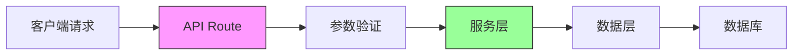

# 3.6 别把厨房建在客厅——API Route 与服务层分离

### 一句话破题

API Route 是你的应用与外界通信的门户，但业务逻辑应该在服务层，而非路由处理器中。

### 本节定位

在 Next.js App Router 中，你可以用 Route Handlers 创建后端 API。但如果不做好分层，很快就会变成"厨房和客厅连在一起"——逻辑混乱、难以维护。



### 分层架构的核心原则

| 层级 | 职责 | 不该做的事 |
|------|------|------------|
| **API Route** | 接收请求、验证参数、返回响应 | 业务逻辑、数据库操作 |
| **Service 层** | 业务逻辑、规则校验 | HTTP 处理、数据库细节 |
| **Data 层** | 数据库操作、ORM 调用 | 业务规则、HTTP 响应 |

### 为什么需要分层？

**场景**：假设你要实现"创建文章"功能。

**没有分层（所有逻辑塞在 Route Handler 里）**：

```tsx
// 问题代码：一锅炖
export async function POST(request: Request) {
  const body = await request.json()
  
  // 验证逻辑
  if (!body.title || body.title.length < 3) {
    return Response.json({ error: '标题太短' }, { status: 400 })
  }
  
  // 业务逻辑
  const slug = body.title.toLowerCase().replace(/ /g, '-')
  const existingPost = await prisma.post.findUnique({ where: { slug } })
  if (existingPost) {
    return Response.json({ error: 'slug 已存在' }, { status: 409 })
  }
  
  // 数据库操作
  const post = await prisma.post.create({
    data: { title: body.title, slug, content: body.content }
  })
  
  return Response.json(post, { status: 201 })
}
```

**有分层（职责清晰）**：

```tsx
// app/api/posts/route.ts - API 层
export async function POST(request: Request) {
  const body = await request.json()
  const result = createPostSchema.safeParse(body)
  if (!result.success) {
    return Response.json({ error: result.error }, { status: 400 })
  }
  
  try {
    const post = await postService.createPost(result.data)
    return Response.json(post, { status: 201 })
  } catch (error) {
    return handleError(error)
  }
}

// services/postService.ts - 服务层
export async function createPost(data: CreatePostInput) {
  const slug = generateSlug(data.title)
  const existing = await postRepository.findBySlug(slug)
  if (existing) {
    throw new ConflictError('slug 已存在')
  }
  return postRepository.create({ ...data, slug })
}

// repositories/postRepository.ts - 数据层
export async function create(data: PostData) {
  return prisma.post.create({ data })
}
```

### 本节导航

| 小节 | 主题 | 核心内容 |
|------|------|----------|
| **3.6.1** | API Route 结构 | GET/POST/PUT/DELETE 处理 |
| **3.6.2** | 请求验证 | Zod 参数校验、类型安全 |
| **3.6.3** | 服务层设计 | 业务逻辑封装与复用 |
| **3.6.4** | 错误处理 | 统一异常处理机制 |

### AI 协作指南

**核心意图**：让 AI 帮你设计分层清晰的 API。

**需求定义公式**：
- 功能描述：我需要一个 [资源] 的 CRUD API
- 技术要求：使用 Next.js Route Handler + Zod + Prisma
- 分层要求：API 层只做路由，业务逻辑放服务层

**关键术语**：`Route Handler`、`Service`、`Repository`、`Zod`、`错误处理`

### 验收清单

- [ ] API Route 只处理请求和响应
- [ ] 业务逻辑封装在 Service 层
- [ ] 使用 Zod 进行参数验证
- [ ] 有统一的错误处理机制
