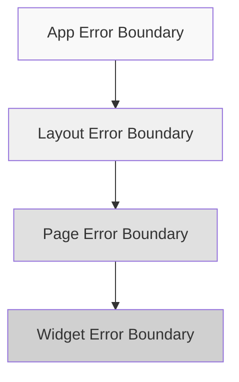

# 3.7.1 错误边界

### 一句话破题

Error Boundary 是 React 的保险丝，一个组件短路时，保护其他组件继续工作。

### 核心价值

JavaScript 错误不应该让整个应用崩溃。Error Boundary 可以捕获子组件树中的错误，显示备用 UI，而不是白屏。

### 基础实现

```tsx
// components/ErrorBoundary.tsx
'use client'

import { Component, ReactNode } from 'react'

interface Props {
  children: ReactNode
  fallback?: ReactNode
  onError?: (error: Error, errorInfo: React.ErrorInfo) => void
}

interface State {
  hasError: boolean
  error: Error | null
}

export class ErrorBoundary extends Component<Props, State> {
  constructor(props: Props) {
    super(props)
    this.state = { hasError: false, error: null }
  }

  static getDerivedStateFromError(error: Error): State {
    return { hasError: true, error }
  }

  componentDidCatch(error: Error, errorInfo: React.ErrorInfo) {
    console.error('ErrorBoundary caught an error:', error, errorInfo)
    this.props.onError?.(error, errorInfo)
  }

  render() {
    if (this.state.hasError) {
      return this.props.fallback || <DefaultFallback error={this.state.error} />
    }

    return this.props.children
  }
}

function DefaultFallback({ error }: { error: Error | null }) {
  return (
    <div className="p-4 border border-red-200 rounded-lg bg-red-50">
      <h2 className="text-red-800 font-medium">出错了</h2>
      <p className="text-red-600 text-sm mt-1">
        {error?.message || '发生了未知错误'}
      </p>
    </div>
  )
}
```

### 使用方式

**基础使用**：

```tsx
<ErrorBoundary>
  <RiskyComponent />
</ErrorBoundary>
```

**自定义 Fallback**：

```tsx
<ErrorBoundary 
  fallback={
    <div className="text-center py-8">
      <p>此功能暂时不可用</p>
      <button onClick={() => window.location.reload()}>
        刷新页面
      </button>
    </div>
  }
>
  <WidgetComponent />
</ErrorBoundary>
```

**带重试功能**：

```tsx
// components/ErrorBoundaryWithRetry.tsx
'use client'

import { Component, ReactNode } from 'react'

interface Props {
  children: ReactNode
  onRetry?: () => void
}

interface State {
  hasError: boolean
  error: Error | null
}

export class ErrorBoundaryWithRetry extends Component<Props, State> {
  constructor(props: Props) {
    super(props)
    this.state = { hasError: false, error: null }
  }

  static getDerivedStateFromError(error: Error): State {
    return { hasError: true, error }
  }

  handleRetry = () => {
    this.setState({ hasError: false, error: null })
    this.props.onRetry?.()
  }

  render() {
    if (this.state.hasError) {
      return (
        <div className="p-4 border rounded-lg bg-gray-50 text-center">
          <p className="text-gray-600 mb-4">加载失败</p>
          <button 
            onClick={this.handleRetry}
            className="px-4 py-2 bg-blue-500 text-white rounded"
          >
            重试
          </button>
        </div>
      )
    }

    return this.props.children
  }
}
```

### 在 Next.js 中使用

**布局级别错误边界**：

```tsx
// app/layout.tsx
import { ErrorBoundary } from '@/components/ErrorBoundary'

export default function RootLayout({ children }: { children: React.ReactNode }) {
  return (
    <html>
      <body>
        <ErrorBoundary fallback={<GlobalErrorPage />}>
          {children}
        </ErrorBoundary>
      </body>
    </html>
  )
}
```

**页面级别错误处理**（Next.js 内置）：

```tsx
// app/dashboard/error.tsx
'use client'

export default function Error({
  error,
  reset,
}: {
  error: Error & { digest?: string }
  reset: () => void
}) {
  return (
    <div className="min-h-screen flex items-center justify-center">
      <div className="text-center">
        <h2 className="text-xl font-semibold mb-4">出错了</h2>
        <p className="text-gray-600 mb-4">{error.message}</p>
        <button 
          onClick={reset}
          className="px-4 py-2 bg-blue-500 text-white rounded"
        >
          重试
        </button>
      </div>
    </div>
  )
}
```

### 错误边界的限制

Error Boundary **无法捕获**以下错误：

| 错误类型 | 原因 | 解决方案 |
|---------|------|---------|
| 事件处理函数中的错误 | 不在渲染过程中 | try-catch |
| 异步代码（setTimeout） | 脱离 React 调用栈 | try-catch |
| 服务端渲染错误 | 发生在服务端 | error.tsx |
| Error Boundary 自身的错误 | 无法自我捕获 | 嵌套边界 |

```tsx
// 事件处理函数需要手动处理
function Button() {
  const handleClick = () => {
    try {
      riskyOperation()
    } catch (error) {
      // 手动处理错误
      showToast('操作失败')
    }
  }
  
  return <button onClick={handleClick}>点击</button>
}
```

### 错误上报

```tsx
// components/ErrorBoundary.tsx
componentDidCatch(error: Error, errorInfo: React.ErrorInfo) {
  reportError({
    error: {
      message: error.message,
      stack: error.stack,
    },
    componentStack: errorInfo.componentStack,
    url: window.location.href,
    timestamp: new Date().toISOString(),
  })
}

async function reportError(data: ErrorReport) {
  if (process.env.NODE_ENV === 'production') {
    await fetch('/api/error-report', {
      method: 'POST',
      body: JSON.stringify(data),
    })
  }
}
```

### 边界策略



推荐分层设置：
- **全局级**：捕获未预料的致命错误
- **布局级**：保护导航栏等公共部分
- **页面级**：隔离页面间的错误
- **组件级**：保护独立的功能模块

### AI 协作指南

**核心意图**：让 AI 帮你实现健壮的错误边界系统。

**需求定义公式**：
- 功能描述：创建带 [功能] 的错误边界组件
- 降级方案：错误时显示 [备用UI]
- 附加功能：[重试/上报/日志]

**示例 Prompt**：

```
请创建一个 Error Boundary 组件：
1. 捕获子组件的渲染错误
2. 显示友好的错误提示和重试按钮
3. 支持错误上报到后端
4. 开发环境显示错误堆栈
```

### 验收清单

- [ ] 关键功能模块有 Error Boundary 保护
- [ ] 有合适的 fallback UI
- [ ] 支持错误重试
- [ ] 生产环境有错误上报
