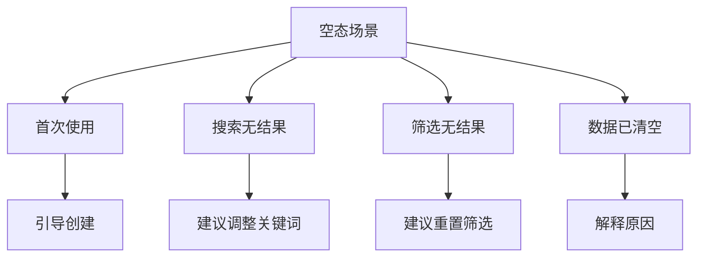

# 3.7.2 空态设计

### 一句话破题

空白不是终点，而是引导用户开始的机会。好的空态设计让用户知道该做什么。

### 核心价值

当列表为空、搜索无结果时，不要只显示"暂无数据"。空态页面应该解释为什么是空的，并引导用户进行下一步操作。

### 空态类型



| 场景 | 用户心理 | 设计要点 |
|-----|---------|---------|
| 首次使用 | 好奇期待 | 强调价值，引导开始 |
| 搜索无结果 | 轻微失望 | 提供替代建议 |
| 筛选无结果 | 困惑 | 显示重置按钮 |
| 数据已清空 | 可能误操作 | 提供恢复途径 |

### 基础空态组件

```tsx
// components/Empty.tsx
import { ReactNode } from 'react'

interface EmptyProps {
  icon?: ReactNode
  title: string
  description?: string
  action?: ReactNode
}

export function Empty({ icon, title, description, action }: EmptyProps) {
  return (
    <div className="flex flex-col items-center justify-center py-12">
      {icon && (
        <div className="text-gray-400 mb-4">
          {icon}
        </div>
      )}
      <h3 className="text-lg font-medium text-gray-900 mb-2">
        {title}
      </h3>
      {description && (
        <p className="text-sm text-gray-500 mb-4 text-center max-w-sm">
          {description}
        </p>
      )}
      {action && (
        <div className="mt-4">
          {action}
        </div>
      )}
    </div>
  )
}
```

### 场景化空态

**首次使用**：

```tsx
<Empty
  icon={<FileIcon className="w-12 h-12" />}
  title="还没有任何文档"
  description="创建你的第一个文档，开始记录你的想法"
  action={
    <Button onClick={openCreateDialog}>
      <PlusIcon className="w-4 h-4 mr-2" />
      创建文档
    </Button>
  }
/>
```

**搜索无结果**：

```tsx
function SearchEmpty({ query }: { query: string }) {
  return (
    <Empty
      icon={<SearchIcon className="w-12 h-12" />}
      title={`找不到 "${query}" 相关内容`}
      description="试试其他关键词，或检查是否有拼写错误"
      action={
        <div className="space-y-2 text-center">
          <p className="text-sm text-gray-500">你可以试试：</p>
          <div className="flex gap-2 justify-center">
            <Button variant="outline" size="sm">React</Button>
            <Button variant="outline" size="sm">Next.js</Button>
            <Button variant="outline" size="sm">TypeScript</Button>
          </div>
        </div>
      }
    />
  )
}
```

**筛选无结果**：

```tsx
function FilterEmpty({ onReset }: { onReset: () => void }) {
  return (
    <Empty
      icon={<FilterIcon className="w-12 h-12" />}
      title="没有符合条件的结果"
      description="当前筛选条件下没有匹配的数据"
      action={
        <Button variant="outline" onClick={onReset}>
          重置筛选条件
        </Button>
      }
    />
  )
}
```

### 列表组件封装

```tsx
// components/List.tsx
interface ListProps<T> {
  data: T[]
  loading?: boolean
  empty?: ReactNode
  renderItem: (item: T, index: number) => ReactNode
}

export function List<T>({ data, loading, empty, renderItem }: ListProps<T>) {
  if (loading) {
    return <ListSkeleton />
  }
  
  if (data.length === 0) {
    return empty || <Empty title="暂无数据" />
  }
  
  return (
    <ul className="divide-y">
      {data.map((item, index) => (
        <li key={index}>{renderItem(item, index)}</li>
      ))}
    </ul>
  )
}

// 使用
<List
  data={posts}
  loading={isLoading}
  empty={
    <Empty
      title="还没有文章"
      action={<Button>写第一篇</Button>}
    />
  }
  renderItem={(post) => <PostCard post={post} />}
/>
```

### 带插图的空态

```tsx
// components/EmptyWithIllustration.tsx
interface EmptyWithIllustrationProps {
  illustration: 'inbox' | 'search' | 'error' | 'success'
  title: string
  description?: string
  action?: ReactNode
}

const illustrations = {
  inbox: '/illustrations/empty-inbox.svg',
  search: '/illustrations/empty-search.svg',
  error: '/illustrations/error.svg',
  success: '/illustrations/success.svg',
}

export function EmptyWithIllustration({
  illustration,
  title,
  description,
  action,
}: EmptyWithIllustrationProps) {
  return (
    <div className="flex flex-col items-center py-16">
      
      <h3 className="text-xl font-medium mb-2">{title}</h3>
      {description && (
        <p className="text-gray-500 mb-6 text-center max-w-md">
          {description}
        </p>
      )}
      {action}
    </div>
  )
}
```

### 动态空态

根据上下文显示不同的空态：

```tsx
function PostList({ category }: { category?: string }) {
  const { data: posts, isLoading } = usePosts({ category })
  
  const emptyState = useMemo(() => {
    if (category) {
      return (
        <Empty
          title={`"${category}" 分类下暂无文章`}
          action={
            <Link href="/posts">查看全部文章</Link>
          }
        />
      )
    }
    
    return (
      <Empty
        title="还没有任何文章"
        description="开始写你的第一篇文章吧"
        action={
          <Button asChild>
            <Link href="/posts/new">写文章</Link>
          </Button>
        }
      />
    )
  }, [category])
  
  return (
    <List
      data={posts}
      loading={isLoading}
      empty={emptyState}
      renderItem={(post) => <PostCard post={post} />}
    />
  )
}
```

### 空态设计原则

**1. 解释原因**：告诉用户为什么是空的

```tsx
// 差
<p>暂无数据</p>

// 好
<p>你还没有创建任何项目</p>
```

**2. 提供出路**：给用户一个明确的行动

```tsx
// 差
<Empty title="没有收藏" />

// 好
<Empty 
  title="没有收藏" 
  action={<Link href="/explore">发现内容</Link>}
/>
```

**3. 保持品牌一致性**：使用统一的插图风格和语气

### AI 协作指南

**核心意图**：让 AI 帮你设计各种场景的空态页面。

**需求定义公式**：
- 场景描述：[页面/功能] 的空态设计
- 空态原因：[首次使用/无搜索结果/筛选为空]
- 引导目标：希望用户 [执行某操作]

**示例 Prompt**：

```
请设计电商收藏夹的空态页面：
1. 首次使用：引导用户去逛商品
2. 显示友好的插图和文案
3. 提供"去逛逛"按钮
4. 可以推荐热门商品
```

### 验收清单

- [ ] 所有列表都有空态处理
- [ ] 空态有明确的下一步引导
- [ ] 搜索/筛选有对应的空态
- [ ] 空态风格与品牌一致
