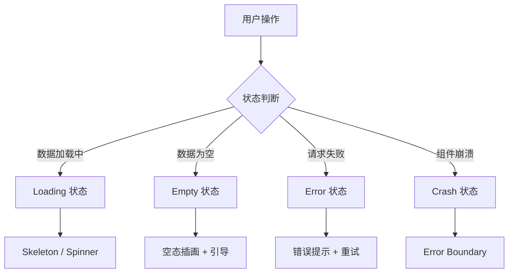

# 3.7 可用性设计

### 一句话破题

用户不怕等待，怕的是不知道发生了什么。优秀的可用性设计让每种状态都有恰当的反馈。

### 核心价值

一个应用会遇到四种非正常状态：加载中、数据为空、请求失败、组件崩溃。处理好这四种状态，用户体验就不会差。

### 状态全景图



### 四种状态对比

| 状态 | 用户感知 | 解决方案 | 本章节 |
|-----|---------|---------|-------|
| Loading | 等待焦虑 | Skeleton 减少感知时间 | 3.7.3 |
| Empty | 困惑迷茫 | 引导用户下一步操作 | 3.7.2 |
| Error | 沮丧愤怒 | 提供重试和帮助 | 3.7.4 |
| Crash | 恐慌无助 | 优雅降级，保护全局 | 3.7.1 |

### 本章目标

1. 学会用 Error Boundary 隔离组件崩溃
2. 设计有引导性的空态页面
3. 使用 Skeleton 提升加载体验
4. 实现用户友好的错误重试机制

### 设计原则

**1. 永远告诉用户发生了什么**
```tsx
// 差：无任何反馈
{loading && null}

// 好：明确的状态反馈
{loading && <Skeleton />}
```

**2. 提供可操作的下一步**
```tsx
// 差：只显示错误信息
<p>请求失败</p>

// 好：提供解决方案
<ErrorState 
  message="请求失败"
  action={<Button onClick={retry}>重试</Button>}
/>
```

**3. 优雅降级而非全面崩溃**
```tsx
// 差：一个组件出错，整页白屏
<App />

// 好：错误被隔离
<ErrorBoundary fallback={<ErrorFallback />}>
  <RiskyComponent />
</ErrorBoundary>
```

### 状态组件库

推荐使用统一的状态组件库管理各种状态：

```tsx
// components/states/index.ts
export { Loading, Skeleton } from './Loading'
export { Empty } from './Empty'
export { ErrorState } from './Error'
export { ErrorBoundary } from './ErrorBoundary'
```

### 本章内容

- [3.7.1 错误边界](./3.7.1-error-boundary.md) - 隔离组件崩溃
- [3.7.2 空态设计](./3.7.2-empty-state.md) - 引导用户操作
- [3.7.3 加载状态](./3.7.3-loading-state.md) - 减少等待焦虑
- [3.7.4 错误重试](./3.7.4-retry.md) - 优雅处理失败
