# 3.8.2 设计令牌

### 一句话破题

设计令牌是设计系统的"变量"，让颜色、字体、间距可以统一管理和主题切换。

### 核心价值

硬编码的颜色值散落在代码各处，改一个主色需要改几十个文件。设计令牌把设计决策抽象成变量，让维护和主题切换变得简单。

### 令牌层级

```mermaid
graph TD
    A["原始令牌"] --> B["语义令牌"]
    B --> C["组件令牌"]
    
    A1["blue-500: #3B82F6"] --> B1["primary: blue-500"]
    B1 --> C1["button-bg: primary"]
```



| 层级 | 作用 | 示例 |
|-----|------|-----|
| 原始令牌 | 基础颜色/尺寸值 | `blue-500`, `16px` |
| 语义令牌 | 表达用途 | `primary`, `error` |
| 组件令牌 | 特定组件样式 | `button-background` |

### 在 Tailwind 中定义

```js
// tailwind.config.js
module.exports = {
  theme: {
    extend: {
      colors: {
        // 原始令牌
        blue: {
          50: '#eff6ff',
          100: '#dbeafe',
          500: '#3b82f6',
          600: '#2563eb',
          900: '#1e3a8a',
        },
        // 语义令牌
        primary: {
          DEFAULT: '#3b82f6',
          hover: '#2563eb',
          light: '#dbeafe',
        },
        secondary: {
          DEFAULT: '#6b7280',
          hover: '#4b5563',
        },
        success: '#10b981',
        warning: '#f59e0b',
        error: '#ef4444',
        // 背景和文字
        background: {
          DEFAULT: '#ffffff',
          secondary: '#f9fafb',
        },
        foreground: {
          DEFAULT: '#111827',
          muted: '#6b7280',
        },
      },
      spacing: {
        // 间距令牌
        xs: '0.25rem',  // 4px
        sm: '0.5rem',   // 8px
        md: '1rem',     // 16px
        lg: '1.5rem',   // 24px
        xl: '2rem',     // 32px
      },
      fontSize: {
        // 字体令牌
        xs: ['0.75rem', { lineHeight: '1rem' }],
        sm: ['0.875rem', { lineHeight: '1.25rem' }],
        base: ['1rem', { lineHeight: '1.5rem' }],
        lg: ['1.125rem', { lineHeight: '1.75rem' }],
        xl: ['1.25rem', { lineHeight: '1.75rem' }],
      },
      borderRadius: {
        sm: '0.25rem',
        md: '0.375rem',
        lg: '0.5rem',
        full: '9999px',
      },
    },
  },
}
```

### CSS 变量方案

```css
/* styles/tokens.css */
:root {
  /* 颜色 */
  --color-primary: #3b82f6;
  --color-primary-hover: #2563eb;
  --color-secondary: #6b7280;
  --color-success: #10b981;
  --color-warning: #f59e0b;
  --color-error: #ef4444;
  
  /* 背景和前景 */
  --color-background: #ffffff;
  --color-background-secondary: #f9fafb;
  --color-foreground: #111827;
  --color-foreground-muted: #6b7280;
  
  /* 间距 */
  --space-1: 0.25rem;
  --space-2: 0.5rem;
  --space-3: 0.75rem;
  --space-4: 1rem;
  --space-6: 1.5rem;
  --space-8: 2rem;
  
  /* 字体 */
  --font-size-sm: 0.875rem;
  --font-size-base: 1rem;
  --font-size-lg: 1.125rem;
  
  /* 圆角 */
  --radius-sm: 0.25rem;
  --radius-md: 0.375rem;
  --radius-lg: 0.5rem;
  
  /* 阴影 */
  --shadow-sm: 0 1px 2px rgba(0, 0, 0, 0.05);
  --shadow-md: 0 4px 6px rgba(0, 0, 0, 0.1);
}

/* 暗色主题 */
[data-theme="dark"] {
  --color-background: #111827;
  --color-background-secondary: #1f2937;
  --color-foreground: #f9fafb;
  --color-foreground-muted: #9ca3af;
}
```

### 与 Tailwind 结合

```js
// tailwind.config.js
module.exports = {
  theme: {
    extend: {
      colors: {
        primary: 'var(--color-primary)',
        secondary: 'var(--color-secondary)',
        background: 'var(--color-background)',
        foreground: 'var(--color-foreground)',
      },
    },
  },
}
```

```tsx
// 使用时
<button className="bg-primary text-white">
  按钮
</button>

<div className="bg-background text-foreground">
  内容
</div>
```

### 暗色模式切换

```tsx
// hooks/useTheme.ts
'use client'

import { useEffect, useState } from 'react'

export function useTheme() {
  const [theme, setTheme] = useState<'light' | 'dark'>('light')
  
  useEffect(() => {
    const stored = localStorage.getItem('theme') as 'light' | 'dark' | null
    const systemPrefers = window.matchMedia('(prefers-color-scheme: dark)').matches
    
    setTheme(stored || (systemPrefers ? 'dark' : 'light'))
  }, [])
  
  useEffect(() => {
    document.documentElement.setAttribute('data-theme', theme)
    localStorage.setItem('theme', theme)
  }, [theme])
  
  const toggle = () => setTheme(theme === 'light' ? 'dark' : 'light')
  
  return { theme, toggle }
}

// 切换按钮
function ThemeToggle() {
  const { theme, toggle } = useTheme()
  
  return (
    <button onClick={toggle} aria-label={`切换到${theme === 'light' ? '暗色' : '亮色'}模式`}>
      {theme === 'light' ? '🌙' : '☀️'}
    </button>
  )
}
```

### 组件级令牌

```tsx
// components/Button.tsx
const buttonVariants = {
  primary: 'bg-primary text-white hover:bg-primary-hover',
  secondary: 'bg-secondary text-white hover:bg-secondary-hover',
  outline: 'border border-primary text-primary hover:bg-primary/10',
  ghost: 'text-foreground hover:bg-background-secondary',
}

const buttonSizes = {
  sm: 'px-3 py-1.5 text-sm',
  md: 'px-4 py-2 text-base',
  lg: 'px-6 py-3 text-lg',
}

interface ButtonProps extends React.ButtonHTMLAttributes<HTMLButtonElement> {
  variant?: keyof typeof buttonVariants
  size?: keyof typeof buttonSizes
}

export function Button({ 
  variant = 'primary', 
  size = 'md', 
  className,
  ...props 
}: ButtonProps) {
  return (
    <button
      className={cn(
        'rounded-md font-medium transition-colors',
        buttonVariants[variant],
        buttonSizes[size],
        className
      )}
      {...props}
    />
  )
}
```

### 设计令牌文档

```tsx
// 令牌展示页面
function DesignTokensDoc() {
  const colors = [
    { name: 'primary', value: '#3b82f6' },
    { name: 'secondary', value: '#6b7280' },
    { name: 'success', value: '#10b981' },
    { name: 'warning', value: '#f59e0b' },
    { name: 'error', value: '#ef4444' },
  ]
  
  return (
    <div>
      <h2>颜色令牌</h2>
      <div className="grid grid-cols-5 gap-4">
        {colors.map((color) => (
          <div key={color.name}>
            <div 
              className="w-full h-16 rounded-lg"
              style={{ backgroundColor: color.value }}
            />
            <p className="text-sm mt-1">{color.name}</p>
            <p className="text-xs text-muted">{color.value}</p>
          </div>
        ))}
      </div>
    </div>
  )
}
```

### AI 协作指南

**核心意图**：让 AI 帮你建立设计令牌系统。

**需求定义公式**：
- 项目类型：[企业应用/电商/社交]
- 品牌色：[主色/辅助色]
- 功能需求：[暗色模式/多主题]

**示例 Prompt**：

```
请为我的 SaaS 产品创建设计令牌系统：
1. 主色：蓝色系 (#3B82F6)
2. 包含成功/警告/错误状态色
3. 支持亮色/暗色主题切换
4. 使用 CSS 变量 + Tailwind 配置
5. 包含间距、字体、圆角令牌
```

### 验收清单

- [ ] 颜色使用语义化令牌
- [ ] 支持暗色模式切换
- [ ] 间距/字体使用统一令牌
- [ ] 有令牌文档或展示页
