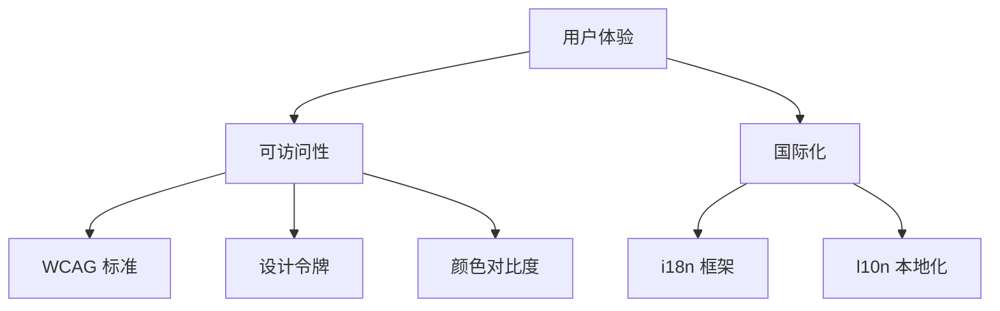

# 3.8 可访问性与国际化

### 一句话破题

可访问性不是可选项，而是让更多人能使用你产品的基本要求。国际化让你的产品走向世界。

### 核心价值

15% 的人口有某种形式的残障，还有更多人处于临时不便状态（比如抱着孩子只能单手操作）。可访问性设计让产品对所有人都友好。国际化让产品能触达全球用户。

### 本章全景



### 可访问性 vs 国际化

| 概念 | 目标 | 关注点 |
|-----|------|-------|
| 可访问性 (a11y) | 让残障用户能使用 | 视觉/听觉/运动/认知障碍 |
| 国际化 (i18n) | 让产品支持多语言 | 翻译/日期/货币格式 |
| 本地化 (l10n) | 让产品适应当地文化 | 习惯/法规/文化差异 |

### 为什么要关注

**商业价值**：
- 全球 10 亿+ 残障人士是潜在用户
- 多语言支持打开国际市场
- 许多地区有法律合规要求

**技术价值**：
- 语义化 HTML 对 SEO 有益
- 设计令牌提升开发效率
- i18n 架构让代码更模块化

### 本章目标

1. 了解 WCAG 2.1 核心要求
2. 建立设计令牌系统
3. 确保颜色对比度达标
4. 实现多语言支持
5. 掌握本地化最佳实践

### 快速自检

```bash
# 键盘可访问性测试
# 打开你的网站，拔掉鼠标，只用键盘操作

# 屏幕阅读器测试
# macOS: 开启 VoiceOver (Cmd+F5)
# Windows: 使用 NVDA (免费)

# 颜色对比度检查
# Chrome DevTools > Elements > 选择元素 > Accessibility
```

### 本章内容

- [3.8.1 WCAG 标准](./3.8.1-wcag.md) - 可访问性基础要求
- [3.8.2 设计令牌](./3.8.2-design-tokens.md) - 系统化管理设计
- [3.8.3 颜色对比度](./3.8.3-contrast.md) - 视觉障碍友好设计
- [3.8.4 国际化 i18n](./3.8.4-i18n.md) - 多语言支持
- [3.8.5 本地化 l10n](./3.8.5-l10n.md) - 文化适配
