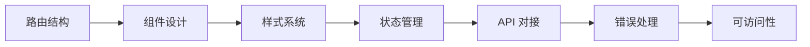

# 3 ｜前端到后端（把页面跑起来）

### 一句话破题

前端不是"画页面"，而是用组件化思维构建可交互、可维护的用户界面。

### 本章定位

在完成了技术选型和架构设计后，我们终于要动手写代码了。但在 Vibe Coding 体系下，"写代码"的含义发生了根本变化——你不再是逐行敲代码的程序员，而是**指挥 AI 搭建界面的架构师**。

本章将带你掌握 Next.js App Router 的前端开发全流程：

### 章节导航

| 章节 | 主题 | 核心能力 |
|------|------|----------|
| **3.1** | App Router 路由 | 文件系统路由、动态路由、路由组、数据获取 |
| **3.2** | 组件构建块 | Props、State、Effects、自定义 Hooks |
| **3.3** | Figma 集成 | 设计稿到代码的 AI 协作流程 |
| **3.4** | Tailwind + shadcn | 统一设计系统与组件库 |
| **3.5** | Debug 实战 | Network、Console、Performance、DevTools |
| **3.6** | API Route | 服务层分离、请求验证、错误处理 |
| **3.7** | 可用性设计 | Error Boundary、空态、加载状态 |
| **3.8** | 可访问性与国际化 | WCAG、设计令牌、i18n/l10n |

### Vibe Coding 视角

在传统开发中，前端工程师需要同时掌握 HTML 结构、CSS 样式、JavaScript 逻辑。但在 Vibe Coding 体系下，你的核心任务变成了：

1. **定义边界**：告诉 AI 组件的输入输出是什么
2. **描述交互**：用自然语言描述用户行为和系统响应
3. **验收结果**：检查 AI 生成的代码是否符合预期

这种转变并不意味着降低了技术门槛，反而对你的**架构思维**和**验收能力**提出了更高要求。只有真正理解了组件化、状态管理、渲染策略等核心概念，你才能有效地指挥 AI，并在它"胡说八道"时及时纠正。

### 学习建议

1. **先跑通，再优化**：每个小节都有"最小可行代码"，先让它跑起来
2. **边学边做**：打开你的项目，跟着教程一步步实践
3. **善用验收清单**：每节末尾都有 Checklist，完成后再进入下一节
