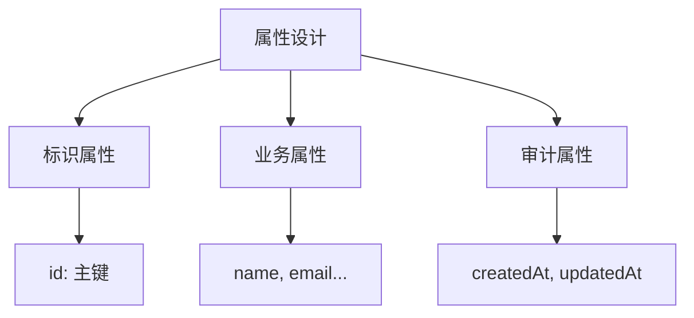

# 4.1.1 你的数据有哪些主角——实体识别：业务对象抽象与属性定义

### 一句话破题

实体就是业务中需要"记住"的核心对象——找对了实体，数据库设计就成功了一半。

### 什么是实体？

**实体**是业务领域中具有独立存在意义的事物。它可以是：

- **具体的人或物**：用户、商品、订单
- **抽象的概念**：角色、权限、分类
- **发生的事件**：交易记录、操作日志

### 如何从需求中识别实体？

**方法一：名词提取法**

从需求描述中提取核心名词：

> "用户可以发布文章，其他用户可以对文章进行评论和点赞"

提取的名词：`用户`、`文章`、`评论`、`点赞`

**方法二：问答验证法**

对每个候选实体问三个问题：

1. 它是否需要被独立存储？
2. 它是否有自己的属性？
3. 它是否会被其他实体引用？

| 候选 | 独立存储 | 有属性 | 被引用 | 结论 |
|------|----------|--------|--------|------|
| 用户 | ✓ | ✓ | ✓ | 实体 |
| 文章 | ✓ | ✓ | ✓ | 实体 |
| 评论 | ✓ | ✓ | ✓ | 实体 |
| 点赞 | ✓ | ✓ | ✗ | 实体或关系表 |

### 实体的属性设计

每个实体都有若干属性，属性设计需要考虑：



**标识属性**：唯一标识一条记录

```typescript
// 推荐使用 CUID 或 UUID
id: string  // cuid() 或 uuid()
```

**业务属性**：描述实体的核心特征

```typescript
// 用户实体的业务属性
email: string     // 必填，唯一
name: string      // 必填
avatar?: string   // 可选
bio?: string      // 可选
```

**审计属性**：记录数据变更历史

```typescript
createdAt: DateTime  // 创建时间
updatedAt: DateTime  // 更新时间
deletedAt?: DateTime // 软删除时间（可选）
```

### Prisma 中的实体定义

```prisma
model User {
  // 标识属性
  id        String   @id @default(cuid())
  
  // 业务属性
  email     String   @unique
  name      String
  avatar    String?
  bio       String?
  
  // 审计属性
  createdAt DateTime @default(now())
  updatedAt DateTime @updatedAt
  
  // 关系（下一节详细介绍）
  posts     Post[]
  comments  Comment[]
}
```

### 常见实体设计模式

**用户相关**：
- `User`：用户基本信息
- `Profile`：用户详细资料（一对一）
- `Account`：第三方登录账号（一对多）

**内容相关**：
- `Post`：文章/帖子
- `Comment`：评论
- `Tag`：标签
- `Category`：分类

**交易相关**：
- `Order`：订单
- `OrderItem`：订单项
- `Payment`：支付记录

### 避坑指南

1. **不要把所有东西都做成实体**：如果一个"东西"只是另一个实体的属性（如用户的地址），可以考虑嵌入到父实体中

2. **不要过度设计**：先满足当前需求，后续可以通过迁移来扩展

3. **命名要一致**：选择单数（`User`）或复数（`Users`）后保持统一，推荐单数

### AI 协作指南

让 AI 帮你识别实体时，可以这样提问：

```
我要做一个 [业务类型] 应用，主要功能包括：
1. [功能1]
2. [功能2]
3. [功能3]

请帮我识别需要哪些核心实体，并列出每个实体的主要属性。
```

### 本节小结

- 实体是业务中需要独立存储的核心对象
- 通过"名词提取 + 问答验证"识别实体
- 每个实体都应有标识、业务、审计三类属性
- 使用 Prisma model 定义实体
