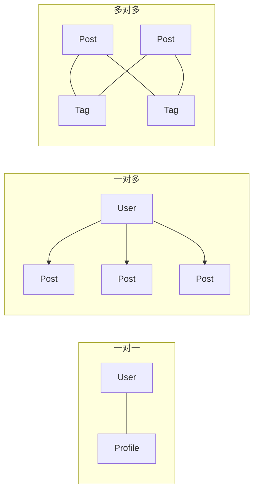
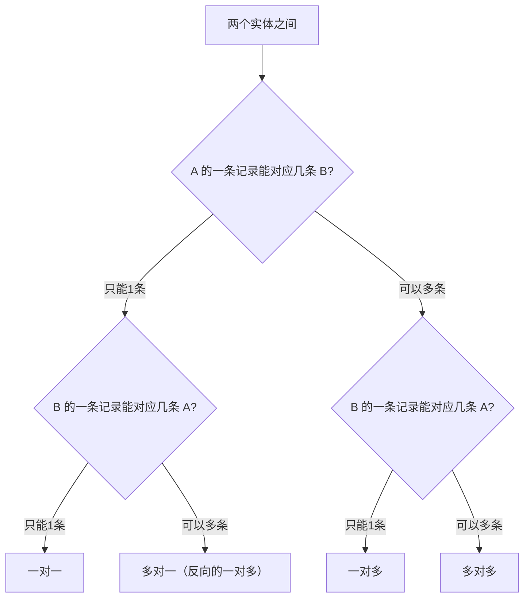

# 4.1.2 主角之间什么关系——关系设计：一对一/一对多/多对多

### 一句话破题

实体之间的关系决定了数据如何关联——选对关系类型，查询才能又快又准。

### 三种基本关系



| 关系类型 | 说明 | 典型场景 |
|----------|------|----------|
| **一对一** | A 只能对应一个 B，B 也只能对应一个 A | 用户-详情、订单-支付 |
| **一对多** | A 可以对应多个 B，但 B 只能对应一个 A | 用户-文章、分类-商品 |
| **多对多** | A 可以对应多个 B，B 也可以对应多个 A | 文章-标签、学生-课程 |

### 一对一关系

**场景**：用户和用户详情分表存储（主表轻量，详情表存大字段）

```prisma
model User {
  id       String   @id @default(cuid())
  email    String   @unique
  name     String
  profile  Profile?  // 可选的一对一关系
}

model Profile {
  id       String  @id @default(cuid())
  bio      String?
  avatar   String?
  userId   String  @unique  // 外键必须唯一
  user     User    @relation(fields: [userId], references: [id])
}
```

**查询示例**：

```typescript
// 查询用户时包含详情
const user = await prisma.user.findUnique({
  where: { id: userId },
  include: { profile: true }
})
```

### 一对多关系

**场景**：一个用户可以发布多篇文章

```prisma
model User {
  id     String @id @default(cuid())
  email  String @unique
  posts  Post[] // 一个用户有多篇文章
}

model Post {
  id       String @id @default(cuid())
  title    String
  content  String
  authorId String          // 外键
  author   User   @relation(fields: [authorId], references: [id])
}
```

**查询示例**：

```typescript
// 查询用户的所有文章
const userWithPosts = await prisma.user.findUnique({
  where: { id: userId },
  include: { posts: true }
})

// 查询文章时包含作者信息
const post = await prisma.post.findUnique({
  where: { id: postId },
  include: { author: true }
})
```

### 多对多关系

**场景**：文章可以有多个标签，标签可以被多篇文章使用

**方式一：隐式多对多（Prisma 自动创建中间表）**

```prisma
model Post {
  id    String @id @default(cuid())
  title String
  tags  Tag[]  // 多对多关系
}

model Tag {
  id    String @id @default(cuid())
  name  String @unique
  posts Post[] // 多对多关系
}
```

**方式二：显式多对多（自定义中间表，可存额外字段）**

```prisma
model Post {
  id       String    @id @default(cuid())
  title    String
  postTags PostTag[]
}

model Tag {
  id       String    @id @default(cuid())
  name     String    @unique
  postTags PostTag[]
}

// 中间表，可以存储额外信息
model PostTag {
  postId    String
  tagId     String
  createdAt DateTime @default(now())  // 额外字段
  
  post Post @relation(fields: [postId], references: [id])
  tag  Tag  @relation(fields: [tagId], references: [id])
  
  @@id([postId, tagId])  // 复合主键
}
```

### 如何选择关系类型？



### 关系设计的最佳实践

1. **外键命名规范**：使用 `关联模型名 + Id`，如 `authorId`、`categoryId`

2. **级联删除**：在 Prisma 中配置删除行为
   ```prisma
   author User @relation(fields: [authorId], references: [id], onDelete: Cascade)
   ```

3. **索引优化**：外键字段自动创建索引，但复杂查询可能需要额外索引

4. **避免循环依赖**：A 引用 B，B 引用 C，C 又引用 A 会导致问题

### 避坑指南

- **多对多选隐式还是显式**：如果中间关系不需要额外属性，用隐式；需要记录"关联时间"等信息，用显式

- **自引用关系**：如"用户关注用户"，需要特别处理
  ```prisma
  model User {
    id        String @id
    followers User[] @relation("UserFollows")
    following User[] @relation("UserFollows")
  }
  ```

### 本节小结

- 一对一：两边都唯一，外键加 `@unique`
- 一对多：最常见的关系，一方有数组，多方有外键
- 多对多：可以隐式（简单）或显式（灵活）
- 根据业务需求选择合适的关系类型
