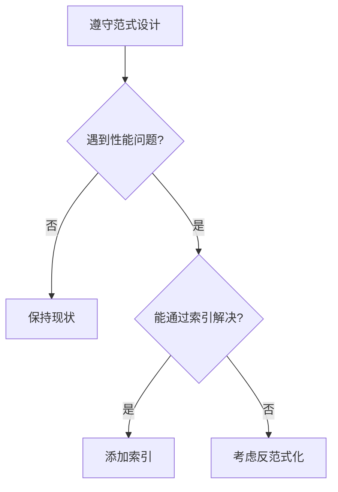

# 4.1.4 规则可以被打破吗——反规范化：性能优化的权衡考虑

### 一句话破题

反范式化是为了性能而"故意违规"——用数据冗余换取查询速度。

### 什么时候需要反范式化？



**反范式化的触发条件**：

1. 频繁的多表 JOIN 查询严重影响性能
2. 某些聚合数据需要实时计算，成本过高
3. 读多写少的场景，可以牺牲写入效率换取读取速度

### 常见反范式化策略

#### 策略一：冗余存储

**场景**：文章列表需要显示作者名称，每次都 JOIN 用户表成本高。

**规范化设计**：

```prisma
model Post {
  id       String @id
  title    String
  authorId String
  author   User   @relation(fields: [authorId], references: [id])
}
```

**反范式化设计**：

```prisma
model Post {
  id         String @id
  title      String
  authorId   String
  authorName String  // 冗余存储作者名称
  author     User    @relation(fields: [authorId], references: [id])
}
```

**代价**：用户改名时，需要同步更新所有相关文章。

#### 策略二：预计算聚合

**场景**：显示文章的评论数、点赞数。

**规范化做法**：每次查询时 COUNT

```typescript
const post = await prisma.post.findUnique({
  where: { id },
  include: {
    _count: {
      select: { comments: true, likes: true }
    }
  }
})
```

**反范式化做法**：存储计数器

```prisma
model Post {
  id           String @id
  title        String
  commentCount Int    @default(0)  // 冗余计数
  likeCount    Int    @default(0)  // 冗余计数
}
```

**维护方式**：评论/点赞时更新计数器

```typescript
await prisma.$transaction([
  prisma.comment.create({ data: { postId, content } }),
  prisma.post.update({
    where: { id: postId },
    data: { commentCount: { increment: 1 } }
  })
])
```

#### 策略三：物化视图/缓存表

**场景**：复杂的统计报表查询。

**做法**：定期生成汇总数据表

```prisma
// 每日销售汇总表
model DailySalesSummary {
  id        String   @id @default(cuid())
  date      DateTime @unique
  totalSales Decimal
  orderCount Int
  createdAt DateTime @default(now())
}
```

**更新策略**：
- 定时任务每天凌晨生成
- 或实时更新（通过触发器或应用层）

### 反范式化的代价

| 获得 | 付出 |
|------|------|
| 读取速度快 | 写入需要维护多处 |
| 减少 JOIN | 数据可能不一致 |
| 查询简单 | 存储空间增加 |

### 维护数据一致性的方法

**方法一：事务保证**

```typescript
await prisma.$transaction(async (tx) => {
  // 更新主数据
  await tx.user.update({
    where: { id: userId },
    data: { name: newName }
  })
  // 同步更新冗余数据
  await tx.post.updateMany({
    where: { authorId: userId },
    data: { authorName: newName }
  })
})
```

**方法二：最终一致性**

对于非关键数据，可以接受短暂的不一致：

```typescript
// 异步更新冗余数据
await queue.add('syncAuthorName', { userId, newName })
```

**方法三：数据库触发器**

在数据库层面自动同步（不推荐，会增加复杂度）。

### 决策检查清单

在决定反范式化之前，问自己：

- [ ] **确实有性能问题吗**？有实际的监控数据支撑吗？
- [ ] **其他方案试过了吗**？索引、缓存、查询优化？
- [ ] **能接受数据不一致的风险吗**？
- [ ] **有能力维护数据同步逻辑吗**？
- [ ] **未来数据量增长后还适用吗**？

### Vibe Coding 中的实践建议

1. **初期不要反范式化**：先按范式设计，保持简单
2. **用监控指导优化**：有数据支撑再做决策
3. **让 AI 帮你评估**：
   ```
   我的 Post 表每秒查询 1000 次，每次都需要 JOIN User 表获取作者名。
   你觉得我应该冗余存储 authorName 吗？有什么风险？
   ```

### 本节小结

- 反范式化是为性能而做的权衡
- 常见策略：冗余存储、预计算聚合、物化视图
- 代价是需要维护数据一致性
- 先遵守范式，遇到真实性能问题再反范式化
