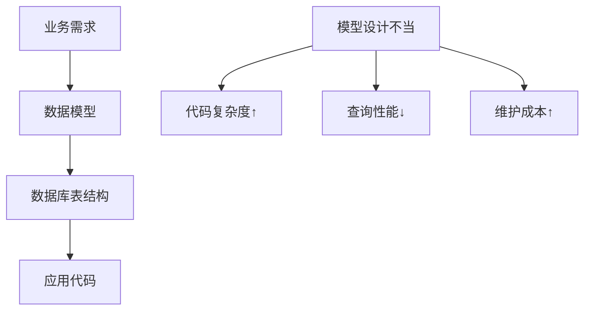
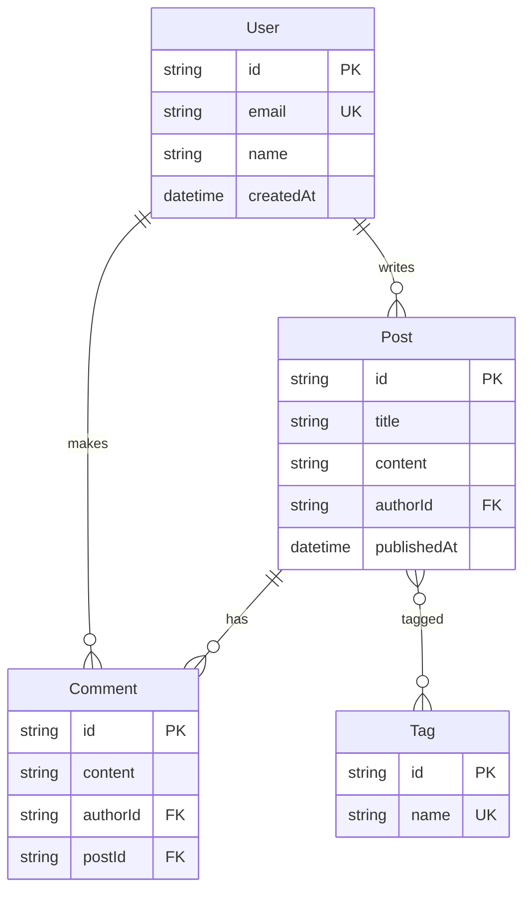

# 4.1 数据关系要先理清——数据建模与 ER 图：实体/关系/约束；面向变更与演进

### 认知重构

数据建模不是"画表格"，而是**用结构化的方式描述业务世界**。一个好的数据模型，能让复杂的业务逻辑变得清晰可控。

### 为什么数据建模很重要？



数据模型是业务需求到代码实现的**中间翻译层**：

- **设计得好**：代码简洁、查询高效、易于扩展
- **设计得差**：到处打补丁、查询慢、改一处动全身

### 本节核心概念

| 概念 | 说明 | 示例 |
|------|------|------|
| **实体** | 业务中的核心对象 | 用户、文章、订单 |
| **属性** | 实体的特征 | 用户名、邮箱、创建时间 |
| **关系** | 实体之间的关联 | 用户"拥有"多篇文章 |
| **约束** | 数据的规则限制 | 邮箱必须唯一 |

### 子章节导航

| 章节 | 主题 | 学习目标 |
|------|------|----------|
| 4.1.1 | 实体识别 | 从业务中提取核心对象 |
| 4.1.2 | 关系设计 | 一对一/一对多/多对多 |
| 4.1.3 | 范式理论 | 规范化的数据结构 |
| 4.1.4 | 反范式化 | 为性能做的合理妥协 |

### ER 图示例

以博客系统为例：



### AI 协作指南

**核心意图**：告诉 AI 你要设计什么业务的数据模型。

**需求定义公式**：
```
我需要为 [业务场景] 设计数据模型。
主要实体包括：[实体列表]
核心业务流程是：[流程描述]
请帮我设计 ER 图和 Prisma Schema。
```

**关键术语**：`实体`、`属性`、`关系`、`主键`、`外键`、`一对多`、`多对多`

### 下一步

学习如何从业务需求中识别实体 → 4.1.1 实体识别
