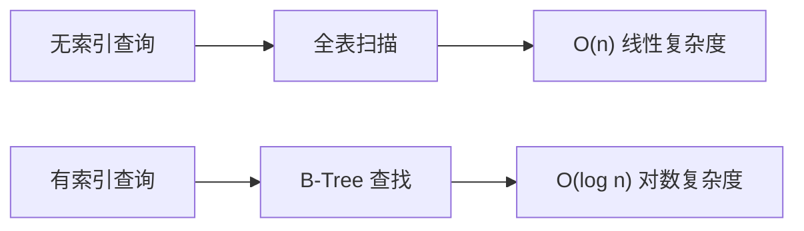

# 4.2.2 为什么查询这么快——索引原理：B-Tree 索引与查询优化

### 一句话破题

索引就像书的目录——没有它你只能一页页翻找，有了它可以直接跳到目标位置。

### 索引的本质



| 数据量 | 全表扫描 | 索引查询 |
|--------|----------|----------|
| 1,000 | 1,000 次 | 10 次 |
| 100,000 | 100,000 次 | 17 次 |
| 10,000,000 | 10,000,000 次 | 24 次 |

### B-Tree 索引的工作原理

B-Tree（平衡树）是数据库最常用的索引结构：

```
              [50]
             /    \
        [25,35]    [75,85]
        / | \       / | \
    [10] [30] [40] [60] [80] [90]
```

- 每个节点包含多个键值
- 数据按顺序排列
- 从根节点开始，每次排除一半数据

### 在 Prisma 中创建索引

**单字段索引**：
```prisma
model User {
  id    String @id
  email String @unique  // 唯一索引，自动创建
  name  String
  
  @@index([name])  // 普通索引
}
```

**复合索引**：
```prisma
model Post {
  id        String @id
  authorId  String
  status    String
  createdAt DateTime
  
  // 复合索引：authorId + status
  @@index([authorId, status])
}
```

**何时需要创建索引**：

| 场景 | 是否需要索引 |
|------|-------------|
| WHERE 条件字段 | 需要 |
| ORDER BY 排序字段 | 需要 |
| JOIN 关联字段 | 需要（外键自动创建） |
| 唯一约束字段 | 自动创建 |
| 很少查询的字段 | 不需要 |

### 复合索引的顺序

复合索引的字段顺序很重要，遵循**最左前缀原则**：

```prisma
@@index([authorId, status, createdAt])
```

- ✅ 支持 `WHERE authorId = ?`
- ✅ 支持 `WHERE authorId = ? AND status = ?`
- ✅ 支持 `WHERE authorId = ? AND status = ? AND createdAt > ?`
- ❌ 不支持 `WHERE status = ?`（跳过了 authorId）
- ❌ 不支持 `WHERE createdAt > ?`（跳过了前两个字段）

### 索引的代价

索引不是免费的：

| 获得 | 付出 |
|------|------|
| 查询变快 | 写入变慢（需要维护索引） |
| 范围查询高效 | 占用额外存储空间 |
| - | 索引过多会影响写入性能 |

### 查询优化实践

**查看查询执行计划**（PostgreSQL）：
```sql
EXPLAIN ANALYZE SELECT * FROM users WHERE email = 'test@example.com';
```

**Prisma 日志查看生成的 SQL**：
```typescript
const prisma = new PrismaClient({
  log: ['query']
})
```

**常见优化技巧**：

1. **只查询需要的字段**：
   ```typescript
   // 只选择需要的字段
   const users = await prisma.user.findMany({
     select: { id: true, name: true }
   })
   ```

2. **避免 SELECT ***：不要查询不需要的大字段

3. **合理使用分页**：
   ```typescript
   const users = await prisma.user.findMany({
     take: 20,
     skip: 0
   })
   ```

### 什么时候不用索引

即使有索引，数据库也可能选择不使用：

- 查询结果超过表数据的 20-30%
- 使用了函数计算（如 `LOWER(email)`）
- 使用了 `LIKE '%keyword'`（前缀通配符）

### 避坑指南

1. **不要给每个字段都加索引**：只给查询条件中的高频字段加

2. **注意索引失效场景**：
   - 对索引列使用函数
   - 隐式类型转换
   - LIKE 以通配符开头

3. **定期检查慢查询**：监控并优化慢 SQL

### 本节小结

- 索引通过 B-Tree 结构加速查询
- 外键和唯一约束会自动创建索引
- 复合索引遵循最左前缀原则
- 索引有代价，不是越多越好
