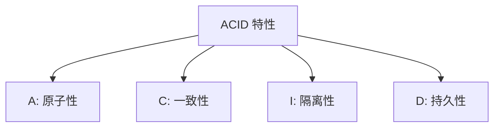

# 4.2.3 转账为什么是安全的——事务特性：ACID 属性与隔离级别

### 一句话破题

事务保证多个操作"要么全成功，要么全失败"——这是数据安全的基石。

### 经典案例：银行转账

张三给李四转账 100 元，需要两步操作：

1. 张三账户 -100 元
2. 李四账户 +100 元

**如果没有事务**：
- 第一步成功，第二步失败 → 张三少了 100，李四没收到
- 系统崩溃在中间 → 数据不一致

**有事务保护**：
- 两步要么都成功
- 要么都回滚到操作前的状态

### ACID 四大特性



| 特性 | 说明 | 保证什么 |
|------|------|----------|
| **A**tomicity | 原子性 | 全部成功或全部回滚 |
| **C**onsistency | 一致性 | 数据始终符合业务规则 |
| **I**solation | 隔离性 | 并发事务互不干扰 |
| **D**urability | 持久性 | 提交后数据永久保存 |

### Prisma 中使用事务

**方式一：顺序事务**

```typescript
// 所有操作在同一个事务中执行
const [user, post] = await prisma.$transaction([
  prisma.user.create({ data: { email: 'user@example.com' } }),
  prisma.post.create({ data: { title: '新文章', authorId: 'xxx' } })
])
```

**方式二：交互式事务（推荐）**

```typescript
// 更灵活，可以在事务中编写业务逻辑
const result = await prisma.$transaction(async (tx) => {
  // 1. 扣减张三余额
  const sender = await tx.account.update({
    where: { userId: 'zhangsan' },
    data: { balance: { decrement: 100 } }
  })
  
  // 2. 检查余额是否足够
  if (sender.balance < 0) {
    throw new Error('余额不足')  // 抛出异常会自动回滚
  }
  
  // 3. 增加李四余额
  const receiver = await tx.account.update({
    where: { userId: 'lisi' },
    data: { balance: { increment: 100 } }
  })
  
  return { sender, receiver }
})
```

### 事务的隔离级别

不同隔离级别决定了事务之间能"看到"彼此的多少：

| 隔离级别 | 脏读 | 不可重复读 | 幻读 | 性能 |
|----------|------|------------|------|------|
| Read Uncommitted | ✓ | ✓ | ✓ | 最高 |
| Read Committed | ✗ | ✓ | ✓ | 高 |
| Repeatable Read | ✗ | ✗ | ✓ | 中 |
| Serializable | ✗ | ✗ | ✗ | 低 |

**PostgreSQL 默认**：Read Committed

**设置隔离级别**（Prisma）：
```typescript
await prisma.$transaction(
  async (tx) => { /* ... */ },
  {
    isolationLevel: 'Serializable'
  }
)
```

### 常见问题解释

**脏读**：读到了其他事务未提交的数据

**不可重复读**：同一事务内，两次读取同一数据结果不同

**幻读**：同一事务内，两次查询记录数不同（有新增或删除）

### 事务的最佳实践

1. **事务要短**：长事务会占用数据库连接和锁资源

2. **避免事务中调用外部服务**：
   ```typescript
   // 错误示例
   await prisma.$transaction(async (tx) => {
     await tx.order.create({ ... })
     await callPaymentAPI()  // 外部调用可能很慢
   })
   
   // 正确做法：先调用外部服务，再在事务中更新数据库
   const paymentResult = await callPaymentAPI()
   await prisma.$transaction(async (tx) => {
     await tx.order.update({ data: { status: 'PAID' } })
   })
   ```

3. **设置超时时间**：
   ```typescript
   await prisma.$transaction(
     async (tx) => { /* ... */ },
     { timeout: 5000 }  // 5秒超时
   )
   ```

### 什么时候需要事务？

| 场景 | 是否需要事务 |
|------|-------------|
| 单条数据的 CRUD | 不需要（自带原子性） |
| 转账（多表更新） | 需要 |
| 创建订单 + 扣减库存 | 需要 |
| 级联删除 | 可用事务或数据库级联 |

### 本节小结

- 事务保证多个操作的原子性
- ACID 是事务的四大特性
- Prisma 提供两种事务写法
- 事务要短，避免在事务中调用外部服务
