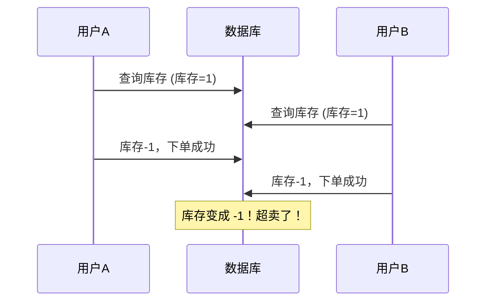
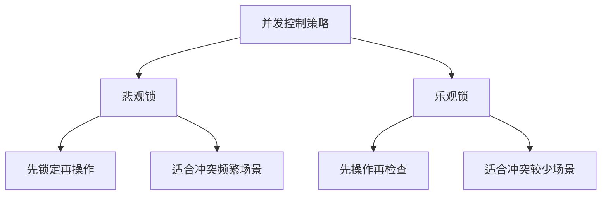
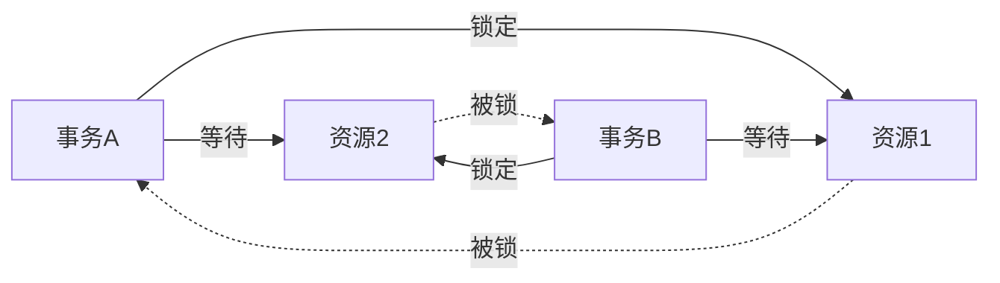

# 4.2.4 同时操作数据怎么办——并发控制：锁机制与死锁预防

### 一句话破题

当多个用户同时修改同一条数据时，锁机制决定了谁先谁后——理解它能帮你避免数据混乱和死锁。

### 并发问题场景

**场景**：商品库存只剩 1 件，两个用户同时下单



### 锁的类型

| 锁类型 | 说明 | 场景 |
|--------|------|------|
| **共享锁** | 多个事务可以同时读 | SELECT 查询 |
| **排他锁** | 只有一个事务能写 | UPDATE/DELETE |
| **行级锁** | 只锁定特定行 | 精确控制 |
| **表级锁** | 锁定整张表 | 批量操作 |

### 乐观锁 vs 悲观锁



**悲观锁**：假设一定会冲突，先锁住再说

```typescript
// Prisma 中使用悲观锁（需要原生 SQL）
await prisma.$queryRaw`
  SELECT * FROM products WHERE id = ${productId} FOR UPDATE
`
```

**乐观锁**：假设不会冲突，更新时检查版本

```prisma
model Product {
  id        String @id
  stock     Int
  version   Int    @default(0)  // 版本号字段
}
```

```typescript
// 乐观锁更新
const updated = await prisma.product.updateMany({
  where: { 
    id: productId, 
    version: currentVersion  // 检查版本号
  },
  data: { 
    stock: { decrement: 1 },
    version: { increment: 1 }  // 版本号+1
  }
})

if (updated.count === 0) {
  throw new Error('数据已被其他人修改，请重试')
}
```

### 解决库存超卖问题

**方案一：数据库约束**

```prisma
model Product {
  id    String @id
  stock Int    // 添加 CHECK 约束：stock >= 0
}
```

```sql
ALTER TABLE products ADD CONSTRAINT stock_non_negative CHECK (stock >= 0);
```

**方案二：原子操作 + 条件更新**

```typescript
const result = await prisma.product.updateMany({
  where: { 
    id: productId,
    stock: { gte: 1 }  // 只有库存 >= 1 才更新
  },
  data: { stock: { decrement: 1 } }
})

if (result.count === 0) {
  throw new Error('库存不足')
}
```

### 死锁及其预防

**死锁场景**：



事务 A 锁了资源 1，等待资源 2；事务 B 锁了资源 2，等待资源 1 → 互相等待，死锁！

**预防死锁的方法**：

1. **按固定顺序获取锁**：所有事务都先锁资源 1，再锁资源 2

2. **设置锁超时**：等待超时后自动放弃
   ```typescript
   await prisma.$transaction(
     async (tx) => { /* ... */ },
     { timeout: 5000 }
   )
   ```

3. **减少锁的范围和时间**：事务越短越好

4. **使用乐观锁**：不加锁，冲突时重试

### Prisma 中的并发处理

**推荐做法**：使用条件更新

```typescript
// 安全的库存扣减
async function decrementStock(productId: string, quantity: number) {
  const result = await prisma.product.updateMany({
    where: {
      id: productId,
      stock: { gte: quantity }
    },
    data: {
      stock: { decrement: quantity }
    }
  })
  
  if (result.count === 0) {
    throw new Error('库存不足或商品不存在')
  }
  
  return result
}
```

### 避坑指南

1. **不要在应用层判断后再更新**：
   ```typescript
   // 错误：存在并发问题
   const product = await prisma.product.findUnique({ where: { id } })
   if (product.stock >= 1) {
     await prisma.product.update({ data: { stock: product.stock - 1 } })
   }
   
   // 正确：使用原子操作
   await prisma.product.updateMany({
     where: { id, stock: { gte: 1 } },
     data: { stock: { decrement: 1 } }
   })
   ```

2. **避免长事务**：事务越长，持有锁的时间越长，死锁风险越高

3. **监控死锁**：PostgreSQL 会自动检测并回滚死锁中的一个事务

### 本节小结

- 并发控制防止多用户同时操作导致的数据混乱
- 悲观锁先锁再操作，乐观锁先操作再检查
- 使用条件更新（updateMany + where 条件）是 Prisma 中处理并发的推荐方式
- 避免死锁：按顺序加锁、设置超时、缩短事务
