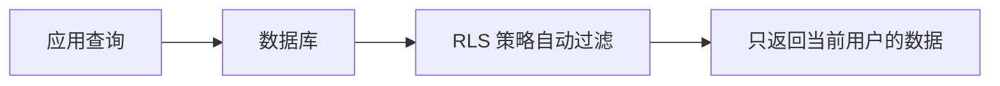
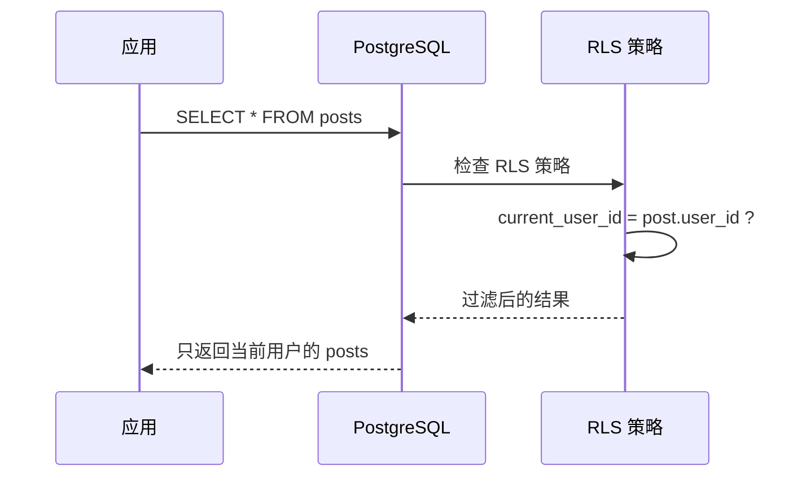

# 4.2.5 张三为什么看不了李四的数据——行级安全 ：PostgreSQL 核心安全特性

### 一句话破题

行级安全（RLS）让数据库自动过滤数据——用户只能看到属于自己的记录，无需在每个查询中手动添加 WHERE 条件。

### 为什么需要 RLS？

**传统做法**：每个查询都要手动添加用户过滤

```typescript
// 每次查询都要记得加 userId 条件
const posts = await prisma.post.findMany({
  where: { userId: currentUserId }  // 容易忘记！
})
```

**问题**：
- 开发者可能忘记添加过滤条件
- 一旦遗漏，用户就能看到其他人的数据
- 安全隐患巨大

**RLS 解决方案**：数据库层面自动过滤



### RLS 的工作原理



### 在 Supabase 中使用 RLS

Supabase 内置了 RLS 支持，这也是本课程推荐使用 Supabase 的原因之一。

**步骤一：启用 RLS**

```sql
-- 对表启用 RLS
ALTER TABLE posts ENABLE ROW LEVEL SECURITY;
```

**步骤二：创建策略**

```sql
-- 用户只能查看自己的文章
CREATE POLICY "Users can view own posts"
ON posts FOR SELECT
USING (user_id = auth.uid());

-- 用户只能创建属于自己的文章
CREATE POLICY "Users can create own posts"
ON posts FOR INSERT
WITH CHECK (user_id = auth.uid());

-- 用户只能更新自己的文章
CREATE POLICY "Users can update own posts"
ON posts FOR UPDATE
USING (user_id = auth.uid());

-- 用户只能删除自己的文章
CREATE POLICY "Users can delete own posts"
ON posts FOR DELETE
USING (user_id = auth.uid());
```

### 常见 RLS 策略模式

**模式一：用户隔离**

每个用户只能访问自己的数据：

```sql
CREATE POLICY "User isolation"
ON user_data FOR ALL
USING (user_id = auth.uid());
```

**模式二：公开 + 私有**

公开数据所有人可见，私有数据仅作者可见：

```sql
CREATE POLICY "Public or own posts"
ON posts FOR SELECT
USING (
  is_public = true 
  OR user_id = auth.uid()
);
```

**模式三：组织/团队隔离**

同一组织的成员可以互相访问：

```sql
CREATE POLICY "Team access"
ON documents FOR SELECT
USING (
  team_id IN (
    SELECT team_id FROM team_members 
    WHERE user_id = auth.uid()
  )
);
```

**模式四：角色权限**

管理员可以访问所有数据：

```sql
CREATE POLICY "Admin full access"
ON posts FOR ALL
USING (
  auth.jwt() ->> 'role' = 'admin'
  OR user_id = auth.uid()
);
```

### Prisma + Supabase 配合使用

虽然 Prisma 不直接支持 RLS，但可以配合 Supabase 使用：

**方案一：使用 Supabase Client 直接查询**

```typescript
import { createClient } from '@supabase/supabase-js'

const supabase = createClient(url, anonKey)

// RLS 会自动生效
const { data } = await supabase
  .from('posts')
  .select('*')  // 自动过滤，只返回当前用户的数据
```

**方案二：Prisma + 手动过滤（非敏感数据）**

```typescript
// 对于非核心安全数据，可以在应用层过滤
const posts = await prisma.post.findMany({
  where: { userId: session.user.id }
})
```

### RLS vs 应用层过滤

| 特性 | RLS | 应用层过滤 |
|------|-----|-----------|
| **安全性** | 数据库层面强制执行 | 依赖开发者不遗漏 |
| **性能** | 数据库优化 | 可能多查数据再过滤 |
| **复杂度** | 需要学习 SQL 策略 | 简单直观 |
| **灵活性** | 策略固定 | 可动态调整 |

**建议**：
- 敏感数据（用户隐私、财务数据）→ 使用 RLS
- 一般数据 → 应用层过滤即可

### 避坑指南

1. **忘记启用 RLS**：创建表后记得执行 `ALTER TABLE ... ENABLE ROW LEVEL SECURITY`

2. **策略过于严格**：如果没有创建任何策略，启用 RLS 后所有查询都会返回空

3. **服务端绕过 RLS**：使用 service_role key 会绕过 RLS，只在后端使用
   ```typescript
   // 后端管理操作，绕过 RLS
   const adminClient = createClient(url, serviceRoleKey)
   ```

4. **性能考虑**：复杂的 RLS 策略可能影响查询性能，注意优化

### 本节小结

- RLS 让数据库自动过滤数据，防止数据泄露
- Supabase 内置 RLS 支持，配置简单
- 常见策略：用户隔离、公开/私有、团队访问、角色权限
- 敏感数据建议使用 RLS，一般数据可用应用层过滤
