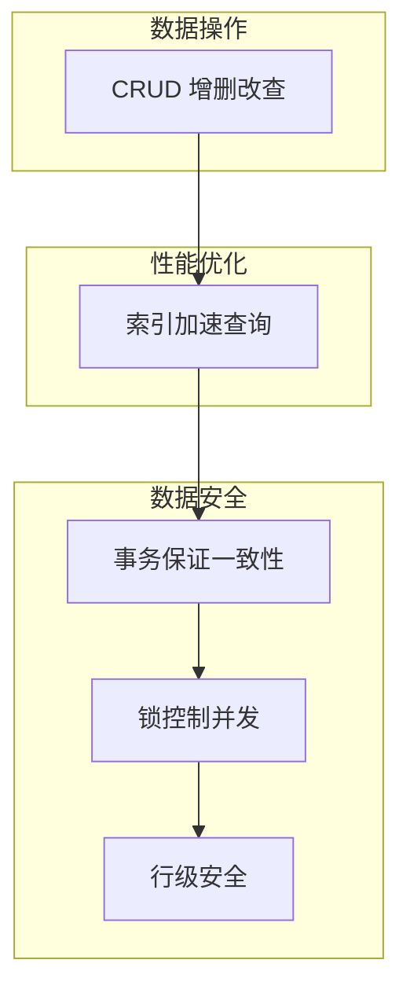
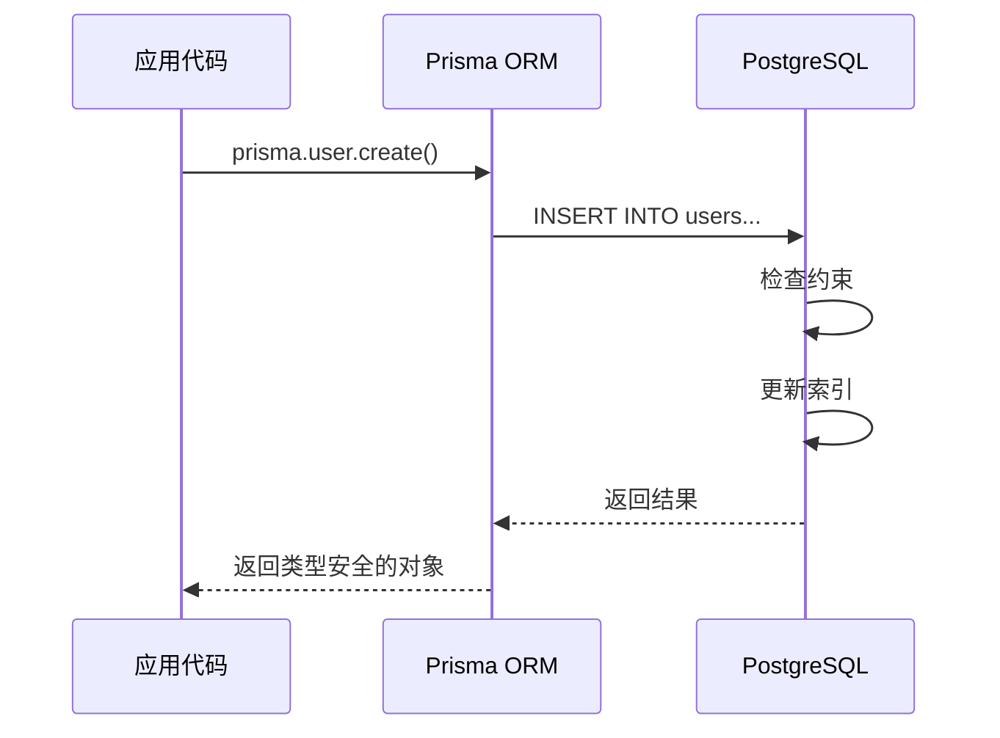

# 4.2 数据库到底在忙什么——关系型数据库：CRUD/索引/事务

### 认知重构

关系型数据库不仅仅是"存数据的地方"，它是一个**保证数据正确性和一致性的系统**。理解它的工作原理，能帮你写出更高效、更安全的代码。

### 关系型数据库核心概念



| 概念 | 作用 | 解决的问题 |
|------|------|------------|
| **CRUD** | 基本数据操作 | 如何读写数据 |
| **索引** | 加速查询 | 查询太慢怎么办 |
| **事务** | 保证一致性 | 多步操作如何原子执行 |
| **并发控制** | 处理冲突 | 多人同时操作怎么办 |
| **RLS** | 数据隔离 | 如何限制用户只看自己的数据 |

### 子章节导航

| 章节 | 主题 | 核心问题 |
|------|------|----------|
| 4.2.1 | CRUD 操作 | 增删改查的本质是什么？ |
| 4.2.2 | 索引原理 | 为什么加了索引查询就快了？ |
| 4.2.3 | 事务特性 | 转账为什么是安全的？ |
| 4.2.4 | 并发控制 | 同时修改数据怎么办？ |
| 4.2.5 | 行级安全 | 张三为什么看不了李四的数据？ |

### 为什么选择关系型数据库？

| 特性 | 关系型数据库 | NoSQL |
|------|-------------|-------|
| **数据结构** | 结构化表格 | 灵活文档/键值 |
| **数据一致性** | 强一致性（ACID） | 最终一致性 |
| **查询能力** | 强大的 SQL | 简单查询 |
| **适用场景** | 事务性应用 | 大数据/实时应用 |

**本课程选择 PostgreSQL 的原因**：

1. 功能最全面的开源关系型数据库
2. 原生支持 JSON，兼顾灵活性
3. 与 Prisma 配合最佳
4. 内置行级安全（RLS），适合多租户应用

### 数据库操作的全景图



### AI 协作指南

**核心意图**：让 AI 帮你理解数据库概念或优化查询。

**常用提问模板**：
```
我的查询很慢：[查询代码]
表结构是：[表结构]
数据量大约 [X] 条
请帮我分析原因并给出优化建议。
```

**关键术语**：`索引`、`事务`、`ACID`、`锁`、`死锁`、`RLS`

### 学习建议

- 如果你只用 Prisma，可以快速浏览本节，重点理解概念
- 如果你需要优化性能，重点学习 4.2.2 索引原理
- 如果你处理支付等敏感操作，重点学习 4.2.3 事务特性
