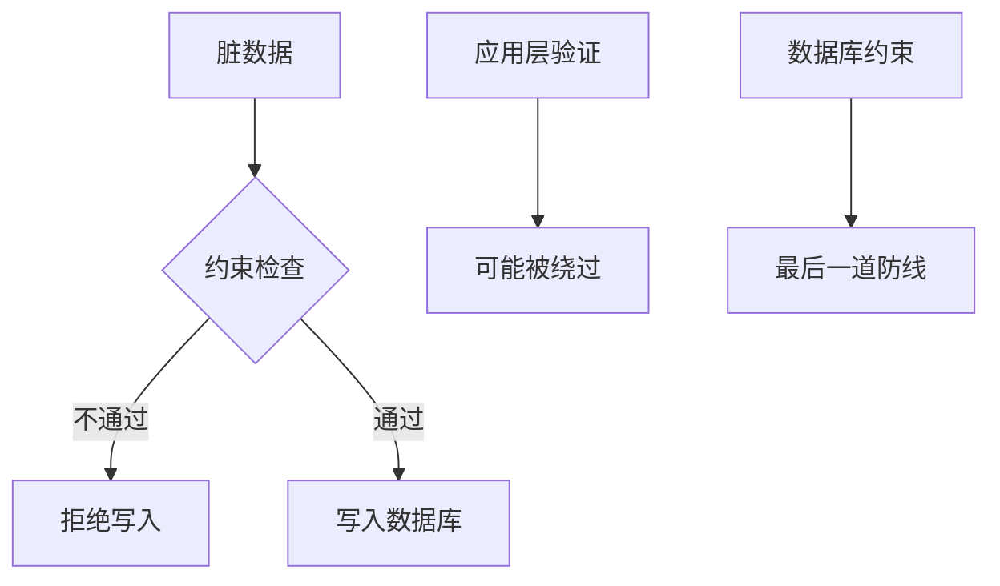

# 4.3.3 如何给数据上规矩——约束定义：主键/外键/唯一/检查约束

### 一句话破题

约束是数据库的"规矩"——它在数据层面强制执行业务规则，防止脏数据进入系统。

### 约束类型概览

| 约束 | 作用 | SQL | Prisma |
|------|------|-----|--------|
| **主键** | 唯一标识每一行 | `PRIMARY KEY` | `@id` |
| **外键** | 关联其他表 | `FOREIGN KEY` | `@relation` |
| **唯一** | 值不能重复 | `UNIQUE` | `@unique` |
| **非空** | 值不能为 NULL | `NOT NULL` | 字段不加 `?` |
| **检查** | 自定义条件 | `CHECK` | 需原生 SQL |
| **默认值** | 未指定时的默认值 | `DEFAULT` | `@default()` |

### 主键约束（Primary Key）

**作用**：唯一标识表中的每一行

**SQL**：
```sql
CREATE TABLE users (
  id VARCHAR(36) PRIMARY KEY,
  email VARCHAR(255)
);
```

**Prisma**：
```prisma
model User {
  id    String @id @default(cuid())
  email String
}
```

**主键特点**：
- 必须唯一
- 不能为 NULL
- 一个表只能有一个主键

### 外键约束（Foreign Key）

**作用**：保证关联数据的完整性

**SQL**：
```sql
CREATE TABLE posts (
  id VARCHAR(36) PRIMARY KEY,
  author_id VARCHAR(36) REFERENCES users(id)
);
```

**Prisma**：
```prisma
model Post {
  id       String @id
  authorId String
  author   User   @relation(fields: [authorId], references: [id])
}
```

**外键行为选项**：

| 行为 | 说明 | Prisma |
|------|------|--------|
| **CASCADE** | 父记录删除，子记录也删除 | `onDelete: Cascade` |
| **SET NULL** | 父记录删除，子记录外键设为 NULL | `onDelete: SetNull` |
| **RESTRICT** | 有子记录时禁止删除父记录 | `onDelete: Restrict` |

```prisma
model Post {
  id       String @id
  authorId String
  author   User   @relation(fields: [authorId], references: [id], onDelete: Cascade)
}
```

### 唯一约束（Unique）

**作用**：保证字段值不重复

**SQL**：
```sql
CREATE TABLE users (
  id VARCHAR(36) PRIMARY KEY,
  email VARCHAR(255) UNIQUE
);
```

**Prisma**：
```prisma
model User {
  id    String @id
  email String @unique
}
```

**复合唯一约束**：多个字段组合唯一
```prisma
model TeamMember {
  id     String @id
  userId String
  teamId String
  
  @@unique([userId, teamId])  // 一个用户在一个团队只能有一条记录
}
```

### 非空约束（Not Null）

**作用**：字段不能为空

**SQL**：
```sql
CREATE TABLE users (
  id VARCHAR(36) PRIMARY KEY,
  email VARCHAR(255) NOT NULL
);
```

**Prisma**：
```prisma
model User {
  id    String @id
  email String      // 不加 ? 就是 NOT NULL
  name  String?     // 加 ? 表示可以为 NULL
}
```

### 检查约束（Check）

**作用**：自定义数据验证规则

**SQL**：
```sql
CREATE TABLE products (
  id VARCHAR(36) PRIMARY KEY,
  price DECIMAL(10,2) CHECK (price > 0),
  stock INTEGER CHECK (stock >= 0)
);
```

**Prisma 不直接支持，需要用原生 SQL**：
```sql
ALTER TABLE products ADD CONSTRAINT price_positive CHECK (price > 0);
```

### 默认值约束（Default）

**作用**：未指定值时使用默认值

**SQL**：
```sql
CREATE TABLE users (
  id VARCHAR(36) PRIMARY KEY,
  status VARCHAR(20) DEFAULT 'ACTIVE',
  created_at TIMESTAMP DEFAULT CURRENT_TIMESTAMP
);
```

**Prisma**：
```prisma
model User {
  id        String   @id @default(cuid())
  status    String   @default("ACTIVE")
  createdAt DateTime @default(now())
}
```

### 约束的价值



**为什么要用约束**：
1. 应用层验证可能被绕过（API 直接调用、SQL 注入）
2. 数据库约束是最后一道防线
3. 约束能提供更好的错误信息

### 本节小结

- 约束在数据库层面强制执行规则
- 主键唯一标识记录，外键保证关联完整性
- 唯一约束防止重复，检查约束自定义规则
- 应用层验证 + 数据库约束 = 双重保障
