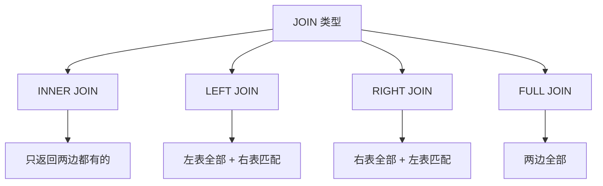

# 4.3.4 如何关联多张表——JOIN 查询：INNER/LEFT/RIGHT/FULL JOIN

### 一句话破题

JOIN 把多张表"拼"在一起查询——当数据分散在不同表中时，这是获取完整信息的唯一方式。

### 为什么需要 JOIN？

**场景**：查询文章列表，需要显示作者名称

```
posts 表              users 表
┌────┬────────────┐   ┌────┬──────┐
│ id │ author_id  │   │ id │ name │
├────┼────────────┤   ├────┼──────┤
│ 1  │ u1         │   │ u1 │ 张三 │
│ 2  │ u2         │   │ u2 │ 李四 │
└────┴────────────┘   └────┴──────┘

需要的结果：
┌────┬────────────┬──────┐
│ id │ author_id  │ name │
├────┼────────────┼──────┤
│ 1  │ u1         │ 张三 │
│ 2  │ u2         │ 李四 │
└────┴────────────┴──────┘
```

### JOIN 类型一览



### INNER JOIN：内连接

**只返回两边都匹配的记录**

```sql
SELECT posts.id, posts.title, users.name
FROM posts
INNER JOIN users ON posts.author_id = users.id;
```

```
posts          users          结果
┌──┬────┐     ┌──┬────┐     ┌──┬──────┬────┐
│1 │ u1 │     │u1│张三│  →  │1 │title1│张三│
│2 │ u2 │     │u2│李四│     │2 │title2│李四│
│3 │ u9 │     └──┴────┘     └──┴──────┴────┘
└──┴────┘     (u9 不存在，所以 post 3 不在结果中)
```

### LEFT JOIN：左连接

**左表全部 + 右表匹配的记录（无匹配则为 NULL）**

```sql
SELECT posts.id, posts.title, users.name
FROM posts
LEFT JOIN users ON posts.author_id = users.id;
```

```
posts          users          结果
┌──┬────┐     ┌──┬────┐     ┌──┬──────┬────┐
│1 │ u1 │     │u1│张三│  →  │1 │title1│张三│
│2 │ u2 │     │u2│李四│     │2 │title2│李四│
│3 │ u9 │     └──┴────┘     │3 │title3│NULL│
└──┴────┘                   └──┴──────┴────┘
                            (即使 u9 不存在，post 3 也保留)
```

**最常用的 JOIN 类型**，保证左表数据完整。

### RIGHT JOIN：右连接

**右表全部 + 左表匹配的记录**

```sql
SELECT posts.id, users.name
FROM posts
RIGHT JOIN users ON posts.author_id = users.id;
```

实际开发中很少用，一般用 LEFT JOIN 调换表顺序代替。

### FULL JOIN：全连接

**两边全部记录，无匹配则为 NULL**

```sql
SELECT posts.id, users.name
FROM posts
FULL JOIN users ON posts.author_id = users.id;
```

使用场景较少。

### Prisma 中的 JOIN

Prisma 用 `include` 实现 JOIN：

```typescript
// 相当于 LEFT JOIN
const posts = await prisma.post.findMany({
  include: {
    author: true  // 自动 JOIN users 表
  }
})

// 结果
// { id: '1', title: 'xxx', author: { id: 'u1', name: '张三' } }
```

**多层嵌套**：
```typescript
const posts = await prisma.post.findMany({
  include: {
    author: true,
    comments: {
      include: {
        author: true
      }
    }
  }
})
```

### JOIN 性能注意事项

1. **确保关联字段有索引**：外键通常自动创建索引

2. **避免过多 JOIN**：JOIN 太多会影响性能
   ```sql
   -- 不推荐：太多 JOIN
   SELECT * FROM posts
   JOIN users ON ...
   JOIN comments ON ...
   JOIN likes ON ...
   JOIN categories ON ...
   ```

3. **只选择需要的字段**：
   ```typescript
   const posts = await prisma.post.findMany({
     select: {
       id: true,
       title: true,
       author: {
         select: { name: true }  // 只要 name
       }
     }
   })
   ```

### 本节小结

- JOIN 用于关联多张表查询
- LEFT JOIN 最常用，保证左表数据完整
- Prisma 用 `include` 实现 JOIN
- 注意 JOIN 的性能影响，确保有索引
