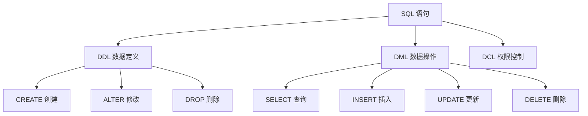

# 4.3 如何命令数据库干活——SQL 基础操作：表/行/列、主键/外键、索引、事务、JOIN、CRUD

### 认知重构

SQL（Structured Query Language）是与数据库对话的语言。虽然 Prisma 帮我们生成了大部分 SQL，但理解 SQL 基础能让你更好地调试问题和优化性能。

### SQL 语句分类



| 分类 | 说明 | 常用语句 |
|------|------|----------|
| **DDL** | 定义数据库结构 | CREATE, ALTER, DROP |
| **DML** | 操作数据 | SELECT, INSERT, UPDATE, DELETE |
| **DCL** | 控制权限 | GRANT, REVOKE |

### 子章节导航

| 章节 | 主题 | 核心问题 |
|------|------|----------|
| 4.3.1 | DDL 数据定义 | 如何创建和修改表结构？ |
| 4.3.2 | DML 数据操作 | 如何增删改查数据？ |
| 4.3.3 | 约束定义 | 如何保证数据质量？ |
| 4.3.4 | JOIN 查询 | 如何关联多张表？ |
| 4.3.5 | 聚合函数 | 如何统计和汇总数据？ |

### SQL vs Prisma 对照

| 操作 | SQL | Prisma |
|------|-----|--------|
| 创建表 | `CREATE TABLE` | `prisma migrate dev` |
| 插入 | `INSERT INTO` | `prisma.model.create()` |
| 查询 | `SELECT` | `prisma.model.findMany()` |
| 更新 | `UPDATE` | `prisma.model.update()` |
| 删除 | `DELETE` | `prisma.model.delete()` |
| 关联查询 | `JOIN` | `include: {}` |

### 学习建议

**如果你只用 Prisma**：
- 快速浏览本节，了解 SQL 基本概念
- 重点学习 JOIN（4.3.4）和聚合函数（4.3.5）的概念

**如果你需要写原生 SQL**：
- 仔细学习每个子章节
- 练习在 Prisma 中执行原生 SQL

### 在 Prisma 中执行原生 SQL

```typescript
// 执行原生查询
const result = await prisma.$queryRaw`
  SELECT * FROM users WHERE email LIKE '%@gmail.com'
`

// 执行原生命令（无返回值）
await prisma.$executeRaw`
  UPDATE users SET status = 'ACTIVE' WHERE last_login > NOW() - INTERVAL '30 days'
`
```

### AI 协作指南

**核心意图**：让 AI 帮你生成或解释 SQL。

**常用提问模板**：
```
帮我写一个 SQL 查询：
- 表结构：[表结构]
- 需求：[查询需求]
- 数据库：PostgreSQL
```

```
这个 SQL 是什么意思？请用中文解释：
[SQL 语句]
```
