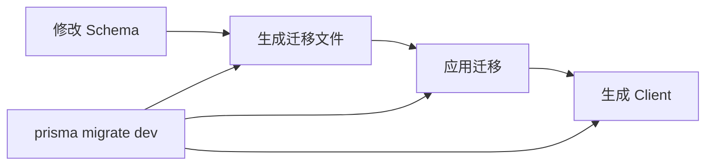

# 4.4.5 迁移与类型生成：db:generate / db:migrate

### 一句话破题

迁移是数据库的"版本控制"——它记录了每次结构变更，让你能够安全地演进数据库。

### 迁移工作流程



### 开发环境迁移

**创建并应用迁移**：

```bash
npx prisma migrate dev --name init
```

这个命令会：
1. 检测 Schema 变更
2. 生成 SQL 迁移文件
3. 应用迁移到数据库
4. 重新生成 Prisma Client

**迁移文件结构**：

```
prisma/
├── migrations/
│   ├── 20240101120000_init/
│   │   └── migration.sql
│   ├── 20240102130000_add_posts/
│   │   └── migration.sql
│   └── migration_lock.toml
└── schema.prisma
```

**查看迁移文件内容**：

```sql
-- 20240101120000_init/migration.sql
CREATE TABLE "User" (
    "id" TEXT NOT NULL,
    "email" TEXT NOT NULL,
    "name" TEXT,
    "createdAt" TIMESTAMP(3) NOT NULL DEFAULT CURRENT_TIMESTAMP,
    
    CONSTRAINT "User_pkey" PRIMARY KEY ("id")
);

CREATE UNIQUE INDEX "User_email_key" ON "User"("email");
```

### 生成 Prisma Client

```bash
npx prisma generate
```

**何时需要运行**：
- 修改 schema.prisma 后
- 安装依赖后（配合 `postinstall` 脚本）
- CI/CD 构建时

**自动生成配置**：

```json
// package.json
{
  "scripts": {
    "postinstall": "prisma generate"
  }
}
```

### db push vs migrate

| 命令 | 用途 | 场景 |
|------|------|------|
| `prisma db push` | 直接同步 Schema 到数据库 | 原型开发、快速迭代 |
| `prisma migrate dev` | 生成迁移文件再应用 | 正式开发、团队协作 |

```bash
# 原型阶段：快速迭代，不生成迁移文件
npx prisma db push

# 正式开发：生成迁移文件，记录变更历史
npx prisma migrate dev --name add_user_role
```

### 生产环境迁移

```bash
# 只应用已有的迁移文件，不生成新的
npx prisma migrate deploy
```

**CI/CD 配置示例**：

```yaml
# .github/workflows/deploy.yml
- name: Apply migrations
  run: npx prisma migrate deploy
  env:
    DATABASE_URL: ${{ secrets.DATABASE_URL }}
```

### 迁移状态管理

**查看迁移状态**：

```bash
npx prisma migrate status
```

**重置数据库**（开发环境）：

```bash
# 删除所有数据，重新应用所有迁移
npx prisma migrate reset
```

::: danger 警告
`migrate reset` 会删除所有数据！只在开发环境使用。
:::

### 处理迁移冲突

**场景**：团队成员同时修改 Schema

```bash
# 1. 拉取最新代码
git pull

# 2. 应用他人的迁移
npx prisma migrate dev

# 3. 如有冲突，手动解决后重新迁移
npx prisma migrate dev --name resolve_conflict
```

### 自定义迁移

**创建空迁移**（用于手动编写 SQL）：

```bash
npx prisma migrate dev --create-only --name custom_migration
```

然后编辑生成的 `migration.sql` 文件：

```sql
-- 添加自定义 SQL
ALTER TABLE "User" ADD CONSTRAINT "email_format" 
CHECK (email ~* '^[A-Za-z0-9._%+-]+@[A-Za-z0-9.-]+\.[A-Za-z]{2,}$');
```

再应用：

```bash
npx prisma migrate dev
```

### 常用命令速查

| 命令 | 作用 |
|------|------|
| `prisma migrate dev` | 开发环境：生成并应用迁移 |
| `prisma migrate deploy` | 生产环境：应用迁移 |
| `prisma migrate reset` | 重置数据库 |
| `prisma migrate status` | 查看迁移状态 |
| `prisma db push` | 直接同步 Schema |
| `prisma generate` | 生成 Prisma Client |
| `prisma db pull` | 从数据库生成 Schema |

### 避坑指南

1. **不要手动修改已应用的迁移文件**：会导致状态不一致

2. **迁移文件要提交到 Git**：确保团队成员的数据库结构一致

3. **生产环境只用 `migrate deploy`**：不要在生产环境运行 `migrate dev`

4. **大型迁移分批执行**：避免锁表时间过长

### 本节小结

- `prisma migrate dev` 用于开发环境迁移
- `prisma migrate deploy` 用于生产环境部署
- 迁移文件需要提交到版本控制
- `prisma generate` 生成类型安全的 Client
